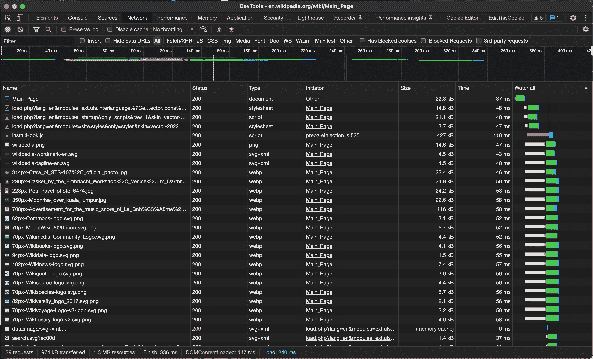
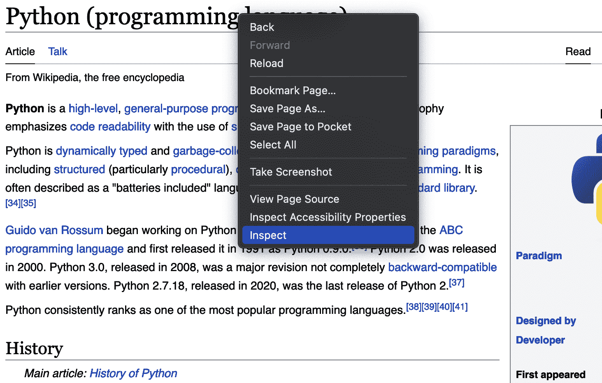
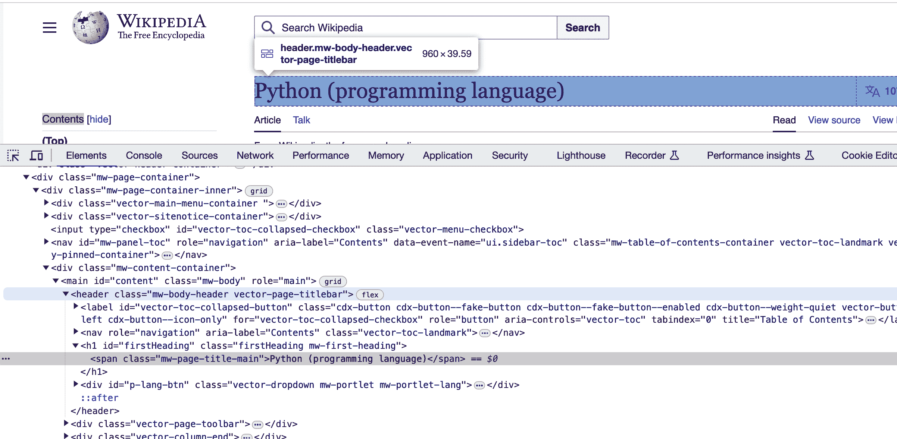

# 第一章 如何运作互联网

在我生命中，我很少遇到真正了解互联网运作原理的人，而我肯定不是其中之一。

我们大多数人都在利用一套精神抽象来使用互联网，这些抽象使我们能够如需求一般使用它。即使对于程序员来说，这些抽象可能只涉及到解决一次特别棘手问题所需的内容。

由于页数限制和作者知识的局限性，这一章也必须依赖这些抽象。它描述了互联网和 Web 应用程序的运作机制，以足够的深度来进行网页抓取（也许还要多一点）。

这一章在某种程度上描述了网络爬虫运行的世界：本书中将反复讨论的习俗、惯例、协议和标准。

当你在网页浏览器的地址栏中输入 URL 并按下回车时，互动文本、图像和媒体如魔法般地出现。每天数十亿人都在经历同样的魔法。他们访问相同的网站，使用相同的应用程序，通常获取专门为他们定制的媒体和文本内容。

而这数十亿人使用不同类型的设备和软件应用程序，这些设备和应用程序由不同公司的不同开发者编写（通常是竞争对手！）。

令人惊讶的是，没有一个全能的管理机构以法律强制力协调互联网的发展。相反，互联网的不同部分由不同的组织管理，这些组织随着时间的推移以一种相对特别的和自愿的方式进化。

当然，选择*不*参与这些组织发布的标准可能会导致您在互联网上的贡献根本无法使用。如果您的网站无法在流行的网页浏览器中显示，人们可能就不会访问它。如果您的路由器发送的数据无法被其他路由器解释，那么这些数据将被忽略。

网页抓取本质上是将一个自己设计的应用程序替换为网络浏览器的实践。因此，了解构建在 Web 浏览器之上的标准和框架至关重要。作为一个网络爬虫，你必须模仿并有时颠覆预期的互联网习俗和惯例。

# 网络

在电话系统的早期，每部电话通过一根物理电线连接到中央交换机。如果你想给附近的朋友打电话，你拿起电话，请求接线员连接你，接线员会通过插座和插孔物理地为你的电话和朋友的电话创建一个专用连接。

远程通话费用昂贵且可能需要几分钟才能连接。从波士顿打电话到西雅图将导致美国各地交换机操作员协调创建一个直接连接您的电话到接收者的巨大电缆。

如今，我们不再通过临时的专用连接打电话，而是可以从我们家通过持久的电缆网络向世界任何地方进行视频通话。电线不告诉数据要去哪里，数据自己引导，这个过程称为*分组交换*。尽管多年来的许多技术都为我们所谓的“互联网”做出了贡献，但分组交换确实是唯一一种开启这一切的技术。

在分组交换网络中，要发送的消息被分成离散的有序分组，每个分组都有自己的发送者和目的地地址。这些分组根据该地址动态路由到网络上的任何目标。与被迫盲目穿越从接收者到发送者的单一专用连接不同，分组可以沿着网络选择的任何路径传输。事实上，同一消息传输中的分组可能会在网络中采取不同的路径，并在到达接收计算机时被重新排序。

如果旧的电话网络就像滑索——从山顶的单一目的地到山脚的单一目的地运送乘客——那么分组交换网络就像是高速公路系统，多个目的地的汽车都能使用相同的道路。

现代分组交换网络通常使用开放系统互联模型（OSI 模型）来描述，该模型由七层路由、编码和错误处理组成：

1.  物理层

1.  数据链路层

1.  网络层

1.  传输层

1.  会话层

1.  展示层

1.  应用层

大多数 Web 应用程序开发者在第 7 层，即应用层中度过他们的一天。这也是本书中花费最多时间的层次。然而，当进行网络爬取时，了解其他层至少具有概念性知识是很重要的。例如，传输层中讨论的 TLS 指纹识别是一种网络爬取检测方法。

此外，了解数据封装和传输的所有层可以帮助排查网络应用程序和网络爬虫中的错误。

## 物理层

*物理层* 指定了信息如何通过你家的以太网电线（或任何局域网）以电流物理传输。它定义了诸如编码 1 和 0 的电压级别，以及这些电压可以脉冲的速度。它还定义了如何解释蓝牙和 WiFi 上的无线电波。

这一层不涉及任何编程或数字指令，而完全基于物理和电气标准。

## 数据链路层

*数据链路层* 指定了在本地网络中两个节点之间如何传输信息，例如，在你的计算机和路由器之间。它定义了单个传输的开始和结束，并提供了如果传输丢失或混乱时的纠错功能。

在这一层，数据包被包裹在一个额外的“数字信封”中，其中包含路由信息，并被称为 *帧*。当帧中的信息不再需要时，它会被解开并作为数据包发送到网络上。

值得注意的是，在数据链路层，网络上的所有设备始终接收相同的数据—没有实际的“交换”或对数据流向的控制。但是，数据未被寻址到的设备通常会忽略数据，并等待直到它们收到发送给它们的数据为止。

## 网络层

*网络层* 是数据包交换和因此“互联网”发生的地方。这一层允许你计算机上的数据包被路由器转发并达到其直接网络之外的设备。

网络层涉及传输控制协议/互联网协议（TCP/IP）的互联网协议（IP）部分。IP 是我们获取 IP 地址的地方。例如，我在全球互联网上的 IP 地址目前是 173.48.178.92。这允许世界上的任何计算机向我发送数据，并且我可以从自己的地址发送数据到任何其他地址。

## 传输层

第 4 层，*传输层*，关注的是将运行在一台计算机上的特定服务或应用程序连接到另一台计算机上运行的特定应用程序，而不仅仅是连接计算机本身。它还负责在数据流中进行任何必要的错误校正或重试。

例如，TCP 非常挑剔，会一直请求任何丢失的数据包，直到所有数据包都正确接收。TCP 常用于文件传输，其中所有数据包必须以正确的顺序正确接收才能使文件正常工作。

相比之下，用户数据报协议（UDP）将乐意跳过丢失的数据包以保持数据流畅进行。它通常用于视频会议或音频会议，其中临时的传输质量下降比对话延迟更可取。

因为你计算机上的不同应用程序可以同时具有不同的数据可靠性需求（例如，在下载文件的同时进行电话呼叫），所以传输层也是端口号的用武之地。操作系统将运行在计算机上的每个应用程序或服务分配给一个特定的端口，从这个端口发送和接收数据。

这个端口通常在 IP 地址之后用冒号分隔的数字来表示。例如，71.245.238.173:8080 表示由操作系统分配给 IP 地址 71.245.238.173 的网络上端口 8080 的应用程序。

## 会话层

*会话层*负责在两个应用程序之间打开和关闭会话。此会话允许关于已发送和未发送数据的有状态信息，并且明确计算机正在与谁通信。会话通常保持打开状态，直到完成数据请求，然后关闭。

会话层允许在短暂崩溃或断开连接的情况下重试传输。

# 会话与会话

OSI 模型的会话层中的会话与 Web 开发人员通常谈论的会话和会话数据是不同的。Web 应用程序中的会话变量是应用程序层的概念，由 Web 浏览器软件实现。

会话变量在应用程序层中会在浏览器中保留，直到它们不再需要或者用户关闭浏览器窗口。在 OSI 模型的会话层中，会话通常只持续足以传输单个文件的时间！

## 演示层

*演示层*将输入数据从字符字符串转换为应用程序可以理解和使用的格式。它还负责字符编码和数据压缩。演示层关心应用程序接收到的输入数据是否表示 PNG 文件还是 HTML 文件，并相应地将此文件传递给应用程序层。

## 应用程序层

*应用程序层*解释由演示层编码的数据并适当地使用它。我认为演示层负责转换和识别事物，而应用程序层负责“做”事情。例如，HTTP 及其方法和状态是应用程序层协议。更乏味的 JSON 和 HTML（因为它们是定义数据编码方式的文件类型）是演示层协议。

# HTML

Web 浏览器的主要功能是显示 HTML（超文本标记语言）文档。HTML 文档是以*.html*或者较少见的*.htm*结尾的文件。

像文本文件一样，HTML 文件使用纯文本字符编码，通常是 ASCII（参见“文本编码和全球互联网”）。这意味着它们可以用任何文本编辑器打开和阅读。

这是一个简单 HTML 文件的例子：

```py
<html>
  <head>
    <title>A Simple Webpage</title>
  </head>
  <body>
    <!-- This comment text is not displayed in the browser -->
    <h1>Hello, World!</h1>
  </body>
</html> 
```

HTML 文件是一种特殊类型的 XML（可扩展标记语言）文件。每个以`<`开头且以`>`结尾的字符串称为*标签*。

XML 标准定义了开放或*起始标签*（如`<html>`）和以`</`开头的*结束标签*，如`</html>`的概念。在起始和结束标签之间是标签的*内容*。

在不需要标签有任何内容的情况下，您可能会看到一个标签，它充当自己的闭合标签。这称为空元素标签或自闭合标签，看起来像：

```py
<p />
```

标签也可以具有`attributeKey="attribute value"`形式的属性，例如：

```py
<div class="content">
  Lorem ipsum dolor sit amet, consectetur adipiscing elit
</div>

```

在这里，`div`标签具有`class`属性，其值为`main-content`。

HTML *元素*具有起始标记和一些可选属性、一些内容以及结束标记。元素还可以包含多个其他元素，此时它们是*嵌套*元素。

虽然 XML 定义了标签、内容、属性和值的基本概念，但 HTML 定义了这些标签可以和不能是什么，它们可以和不能包含什么，以及它们必须如何由浏览器解释和显示。

例如，HTML 标准定义了`class` *属性*和`id` *属性*的使用，这些属性通常用于组织和控制 HTML 元素的显示：

```py
<h1 id="main-title">Some Title</h1>
<div class="content">
  Lorem ipsum dolor sit amet, consectetur adipiscing elit
</div>
```

作为规则，页面上的多个元素可以包含相同的`class`值；然而，`id`字段中的任何值在该页面上必须是唯一的。因此，多个元素可以具有`class content`，但只能有一个元素具有`id main-title`。

HTML 文档中元素在 Web 浏览器中的显示完全取决于作为软件的 Web 浏览器如何编程。如果一个 Web 浏览器被编程为以不同于另一个 Web 浏览器的方式显示元素，这将导致不同 Web 浏览器用户的不一致体验。

因此，协调 HTML 标签的确切功能并将其编码为单一标准非常重要。HTML 标准目前由万维网联盟（W3C）控制。所有 HTML 标签的当前规范可以在[*https://html.spec.whatwg.org/multipage/*](https://html.spec.whatwg.org/multipage/)找到。

然而，正式的 W3C HTML 标准可能不是学习 HTML 的最佳地方，如果你以前从未遇到过它。网页抓取的一个重要部分涉及阅读和解释在 Web 上找到的原始 HTML 文件。如果你以前没有处理过 HTML，我强烈推荐像[*HTML & CSS: The Good Parts*](https://www.oreilly.com/library/view/html-css/9781449381943/)这样的书籍来熟悉一些更常见的 HTML 标签。

# CSS

层叠样式表（CSS）定义了 Web 页面上 HTML 元素的外观。CSS 定义了布局、颜色、位置、大小以及其他属性，这些属性将无聊的具有浏览器定义默认样式的 HTML 页面转变为对现代 Web 观众更具吸引力的内容。

使用之前的 HTML 示例：

```py
<html>
  <head>
    <title>A Simple Webpage</title>
  </head>
  <body>
    <!-- This comment text is not displayed in the browser -->
    <h1>Hello, World!</h1>
  </body>
</html> 

```

一些相应的 CSS 可能是：

```py
h1 {
  font-size: 20px;
  color: green;
}
```

此 CSS 将设置`h1`标签的内容字体大小为 20 像素，并以绿色文本显示。

此 CSS 中的`h1`部分称为*选择器*或 CSS 选择器。此 CSS 选择器指示大括号内的 CSS 将应用于任何`h1`标签的内容。

CSS 选择器也可以写成仅适用于具有特定`class`或`id`属性的元素。例如，使用以下 HTML：

```py
<h1 id="main-title">Some Title</h1>
<div class="content">
  Lorem ipsum dolor sit amet, consectetur adipiscing elit
</div>
```

可能是相应的 CSS：

```py
h1#main-title {
  font-size: 20px;
}

div.content {
  color: green;
}

```

`#`用于指示`id`属性的值，`.`用于指示`class`属性的值。

如果标记的值不重要，可以完全省略标记名称。例如，这个 CSS 将使具有类 content 的任何元素的内容变绿：

```py
.content {
  color: green;
}
```

CSS 数据可以包含在 HTML 本身中，也可以包含在具有 *.css* 文件扩展名的单独 CSS 文件中。HTML 文件中的 CSS 放置在 HTML 文档的 head 中的`<style>`标记内：

```py
<html>
  <head>
    <style>
      .content {
        color: green;
      }
    </style>
...
```

更常见的是，在文档的 head 中使用`link`标记导入 CSS：

```py
<html>
  <head>
  <link rel="stylesheet" href="mystyle.css">
...

```

作为网络爬虫，您不太可能经常编写样式表来使 HTML 美观。但是，重要的是要能够阅读并识别 HTML 页面如何被 CSS 转换，以便将您在 Web 浏览器中看到的内容与代码中看到的内容相关联。

例如，当一个 HTML 元素不出现在页面上时，您可能会感到困惑。当您阅读元素的应用 CSS 时，您会看到：

```py
.mystery-element {
    display: none;
}
```

这将元素的`display`属性设置为`none`，从页面中隐藏它。

如果您以前从未遇到过 CSS，则可能不需要深入研究它以便进行 Web 抓取，但是您应该熟悉其语法并注意本书中提到的 CSS 规则。

# JavaScript

当客户端请求 Web 服务器的特定 Web 页面时，Web 服务器会执行一些代码以创建发送回的 Web 页面。这些代码称为*服务器端代码*，可以简单到检索静态 HTML 文件并将其发送出去。或者，它可以是用 Python（最好的语言）、Java、PHP 或任何常见的服务器端编程语言编写的复杂应用程序。

最终，这些服务器端代码会创建一些数据流，该数据流被发送到浏览器并显示出来。但是，如果您希望某种类型的交互或行为（例如文本更改或拖放元素）发生而无需返回服务器运行更多代码，该怎么办？为此，您使用*客户端代码*。

客户端代码是由 Web 服务器发送的任何代码，但实际上由客户端的浏览器执行。在互联网的早期（2000 年中期之前），客户端代码是用多种语言编写的。例如，您可能还记得 Java 小程序和 Flash 应用程序。但 JavaScript 出现为客户端代码提供了唯一的选择，原因很简单：它是浏览器本身支持的唯一语言，无需下载和更新单独的软件（如 Adobe Flash Player）即可运行程序。

JavaScript 在 90 年代中期作为 Netscape Navigator 的新功能而起源。它很快被 Internet Explorer 采纳，使其成为当时两个主要 Web 浏览器的标准。

尽管名字一样，JavaScript 几乎与服务器端编程语言 Java 毫无关系。除了一小部分表面上的语法相似之外，它们是极不相似的语言。

1996 年，Netscape（JavaScript 的创建者）和 Sun Microsystems（Java 的创建者）达成了许可协议，允许 Netscape 使用名称“JavaScript”，预计会有进一步的合作[（两种语言之间）](https://www.infoworld.com/article/2653798/javascript-creator-ponders-past--future.html)。然而，这种合作从未发生过，自那时以来一直是一个令人困惑的误称。

尽管它作为一个现在已不复存在的网页浏览器的脚本语言有一个不确定的开始，但 JavaScript 现在是世界上最流行的编程语言。这种流行程度得益于它还可以在服务器端使用，使用 Node.js。但它的流行无疑是因为它是唯一的客户端编程语言。

JavaScript 被嵌入到 HTML 页面中使用 `<script>` 标签。JavaScript 代码可以作为内容插入：

```py
<script>
  alert('Hello, world!');
</script>

```

或者可以使用 `src` 属性在单独的文件中引用：

```py
<script src="someprogram.js"></script>
```

与 HTML 和 CSS 不同，您在抓取网页时可能不需要阅读或编写 JavaScript，但至少了解其外观是很有用的。有时它可能包含有用的数据。例如：

```py
<script>
  const data = '{"some": 1, "data": 2, "here": 3}';
</script>
```

在这里，一个 JavaScript 变量正在用关键字 `const`（代表“常量”）声明，并被设置为包含一些数据的 JSON 格式字符串，这些数据可以直接由网页抓取器解析。

JSON（JavaScript 对象表示法）是一种文本格式，包含易于解析的人类可读数据，在网页上无处不在。我将在第十五章进一步讨论它。

您可能也会看到 JavaScript 向完全不同的源请求数据：

```py
<script>
  fetch('http://example.com/data.json')
    .then((response) => {
      console.log(response.json());
    });
</script>

```

在这里，JavaScript 正在创建一个请求到 `http://example.com/data.json`，并在接收到响应后将其记录到控制台中（有关“控制台”的更多信息，请参阅下一节）。

JavaScript 最初被创建为在否则静态的网页中提供动态互动和动画。然而，今天，并不是所有的动态行为都是由 JavaScript 创建的。HTML 和 CSS 也具有一些功能，允许它们在页面上改变内容。

例如，CSS 关键帧动画可以使元素在用户点击或悬停在元素上时移动、改变颜色、改变大小或进行其他转换。

理解网站（通常字面上的）如何组合起来可以帮助您在尝试定位数据时避免走了弯路。

# 使用开发者工具观察网站

像珠宝商的放大镜或心脏病医生的听诊器一样，您的浏览器的*开发者工具*对于网页抓取至关重要。要从网站收集数据，您必须了解它的构建方式。开发者工具正是为您展示这一切的。

在本书中，我将展示在 Google Chrome 中使用开发者工具。然而，Firefox、Microsoft Edge 和其他浏览器中的开发者工具都非常相似。

要访问浏览器菜单中的开发者工具，请按照以下说明进行操作：

**Chrome**

视图 → 开发者工具 → 开发者工具

**Safari**

Safari → 首选项 → 高级 → 勾选“在菜单栏中显示开发”菜单

接下来，使用开发菜单：开发 → 显示网页检查器

**Microsoft Edge**

使用菜单：工具 → 开发者 → 开发者工具

**Firefox**

工具 → 浏览器工具 → Web 开发者工具

在所有浏览器中，打开开发者工具的键盘快捷键都是相同的，具体取决于您的操作系统。

**Mac**

Option + Command + I

**Windows**

CTRL + Shift + I

在进行网页抓取时，你可能会大部分时间都在网络选项卡（如图 1-1 所示）和“Elements”选项卡中度过。



###### 图 1-1\. Chrome 开发者工具显示从维基百科加载的页面

网络选项卡显示页面加载过程中发出的所有请求。如果你以前没有使用过，可能会感到惊讶！复杂页面加载时常常会发出数十甚至数百个资源请求。有时，页面甚至会在您访问期间持续发送请求。例如，它们可能会向行动追踪软件发送数据，或者轮询更新。

# 在网络选项卡中看不到任何内容吗？

注意，开发者工具必须在页面发出请求时打开才能捕获这些请求。如果您加载页面时未打开开发者选项卡，然后决定通过打开开发者工具进行检查，可能需要刷新页面以重新加载并查看它正在发出的请求。

如果你在网络选项卡中点击单个网络请求，你会看到与该请求相关的所有数据。这个网络请求检查工具的布局在不同的浏览器中略有不同，但通常允许你查看：

+   请求发送的 URL

+   使用的 HTTP 方法

+   响应状态

+   与请求相关的所有标头和 Cookie

+   负载

+   响应

这些信息对于编写网页抓取器以复制这些请求以获取相同数据是有用的。

“Elements”选项卡（参见图 1-2 和 图 1-3）用于检查 HTML 文件的结构和内容。它非常方便，可以检查页面上特定数据的 HTML 标签，以便编写网页抓取器抓取这些数据。

当你在“Elements”选项卡上悬停在每个 HTML 元素的文本上时，你会在浏览器中看到相应的页面元素被视觉高亮显示。使用这个工具是探索页面并深入理解页面构建方式的好方法（参见图 1-3）。



###### 图 1-2\. 右键单击任何文本或数据，并选择“检查”以查看“Elements”选项卡中围绕该数据的元素



###### 图 1-3。在 HTML 中悬停在元素上将会突出显示页面上对应的结构。

你不需要成为互联网、网络甚至编程方面的专家就能开始网络爬虫。然而，对于这些组件如何组合以及你的浏览器的开发者工具如何显示这些组件有基本的了解是必不可少的。
