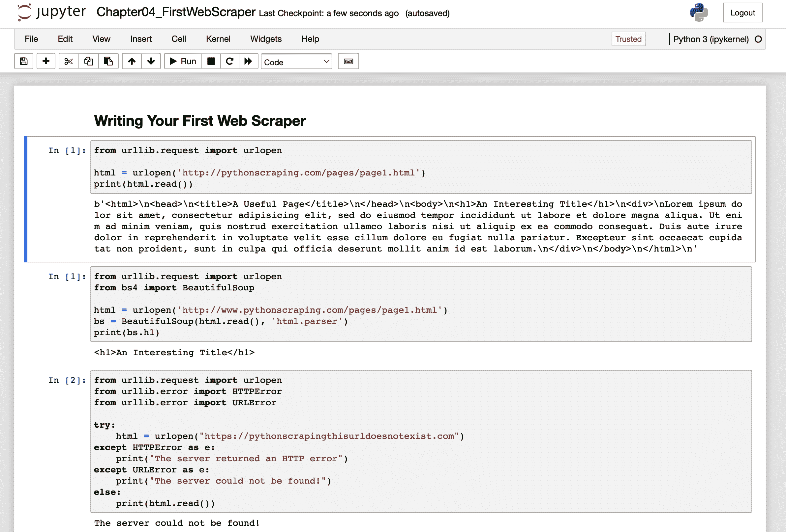

# 第四章：编写您的第一个 Web 爬虫

一旦您开始网页抓取，您会开始感激浏览器为您完成的所有小事情。初始阶段，没有 HTML 格式化、CSS 样式、JavaScript 执行和图像渲染的 Web 看起来可能有些令人望而却步。在本章中，我们将开始探讨如何在没有 Web 浏览器帮助的情况下格式化和解释这些裸数据。

本章从发送 `GET` 请求的基础开始（请求获取或“获取” Web 页面的内容），从 Web 服务器获取特定页面的 HTML 输出，并进行一些简单的数据提取，以便分离您寻找的内容。

# 安装并使用 Jupyter

此课程的代码可以在 [*https://github.com/REMitchell/python-scraping*](https://github.com/REMitchell/python-scraping) 找到。在大多数情况下，代码示例以 Jupyter Notebook 文件的形式展示，并使用 *.ipynb* 扩展名。

如果您还没有使用过，Jupyter Notebooks 是组织和处理许多小但相关 Python 代码片段的绝佳方式，如 图 4-1 所示。



###### 图 4-1：Jupyter Notebook 在浏览器中运行

每个代码片段都包含在称为 *cell* 的框中。可以通过键入 Shift + Enter 或单击页面顶部的“运行”按钮来运行每个单元格中的代码。

项目 Jupyter 在 2014 年从 IPython（交互式 Python）项目分支出来。这些笔记本设计用于在浏览器中以可访问和交互的方式运行 Python 代码，非常适合教学和演示。

安装 Jupyter Notebooks：

```py
$ pip install notebook
```

安装后，您应该可以访问 `jupyter` 命令，该命令将允许您启动 Web 服务器。导航到包含本书下载的练习文件的目录，并运行：

```py
$ jupyter notebook
```

这将在端口 8888 上启动 Web 服务器。如果您已经运行了 Web 浏览器，新标签页应该会自动打开。如果没有，请将终端中显示的带有提供的令牌的 URL 复制到您的 Web 浏览器中。

# 连接

在本书的第一部分中，我们深入探讨了互联网如何通过电缆将数据包从浏览器发送到 Web 服务器，然后再发送回来。当您打开浏览器，输入 `**google.com**`，然后按 Enter 键时，正是发生了这种情况——数据以 HTTP 请求的形式从您的计算机传输，Google 的 Web 服务器则以 HTML 文件的形式响应表示 *google.com* 的数据。

但是，在数据包和帧的交换中，Web 浏览器到底如何发挥作用？完全没有。事实上，ARPANET（第一个公共分组交换网络）比第一个 Web 浏览器 Nexus 至少早 20 年。

是的，网络浏览器是一个有用的应用程序，用于创建这些信息包，告诉您的操作系统将它们发送出去，并解释您收到的数据为漂亮的图片、声音、视频和文本。但是，网络浏览器只是代码，代码可以被拆解、分解为其基本组件、重写、重复使用，并使其执行任何您想要的操作。网络浏览器可以告诉处理您的无线（或有线）接口的应用程序发送数据到处理器，但您可以在 Python 中只用三行代码做同样的事情：

```py
from urllib.request import urlopen

html = urlopen('http://pythonscraping.com/pages/page1.html')
print(html.read())
```

要运行此命令，您可以在 GitHub 存储库的 第一章 中使用 [IPython 笔记本](https://github.com/REMitchell/python-scraping/blob/master/Chapter01_BeginningToScrape.ipynb)，或者您可以将其本地保存为 *scrapetest.py* 并在终端中使用以下命令运行它：

```py
$ python scrapetest.py
```

请注意，如果您的计算机上同时安装了 Python 2.x 并且并排运行了两个版本的 Python，则可能需要通过以下方式显式调用 Python 3.x 来运行命令：

```py
$ python3 scrapetest.py

```

此命令输出位于 URL *http://pythonscraping.com/pages/page1.html* 的 *page1* 的完整 HTML 代码。更准确地说，这输出位于域名 [*http://pythonscraping.com*](http://pythonscraping.com) 的服务器上的目录 *<web root>/pages* 中的 HTML 文件 *page1.html*。

为什么将这些地址视为“文件”而不是“页面”很重要？大多数现代网页都有许多与其关联的资源文件。这些可以是图像文件、JavaScript 文件、CSS 文件或您正在请求的页面链接到的任何其他内容。当网络浏览器命中诸如 `` 的标签时，浏览器知道它需要向服务器发出另一个请求，以获取位于位置 *cuteKitten.jpg* 的数据，以便为用户完全渲染页面。

当然，您的 Python 脚本目前还没有逻辑去回去请求多个文件；它只能读取您直接请求的单个 HTML 文件。

```py
from urllib.request import urlopen
```

这意味着看起来就像它的字面意思一样：它查看 Python 模块 request（在 *urllib* 库中找到）并仅导入函数 `urlopen`。

*urllib* 是一个标准的 Python 库（这意味着您不必安装任何额外的内容来运行此示例），包含了用于在网络上请求数据、处理 cookies 甚至更改元数据（如标头和用户代理）的函数。在本书中，我们将广泛使用 urllib，因此我建议您阅读该库的 [Python 文档](https://docs.python.org/3/library/urllib.html)。

`urlopen` 用于打开跨网络的远程对象并读取它。因为它是一个相当通用的函数（可以轻松读取 HTML 文件、图像文件或任何其他文件流），所以我们将在本书中经常使用它。

# BeautifulSoup 简介

> 美丽的汤，如此丰富而绿色，
> 
> 在一个热的碗里等待！
> 
> 为了这样的佳肴，谁不愿俯身？
> 
> 傍晚的浓汤，美丽的浓汤！

*BeautifulSoup* 库以同名的刘易斯·卡罗尔诗歌《爱丽丝漫游奇境记》中的一首诗命名。在故事中，这首诗是由一个叫做模拟海龟的角色唱的（这个名字本身就是对维多利亚时期流行的模拟海龟汤的一个双关）。

与其奇境中的同名者一样，BeautifulSoup 尝试理解荒谬之物；它通过修复糟糕的 HTML 并为我们提供易于遍历的 Python 对象来帮助格式化和组织混乱的网络。

## 安装 BeautifulSoup

因为 BeautifulSoup 库不是默认的 Python 库，所以必须安装它。如果你已经有经验安装 Python 库，请使用你喜欢的安装程序并跳到下一节，“运行 BeautifulSoup”。

对于那些尚未安装 Python 库（或需要复习的人），这个通用方法将用于在整本书中安装多个库，因此你可能想在未来参考这一部分。

我们将在整本书中使用 BeautifulSoup 4 库（也称为 BS4）。你可以在[Crummy.com](https://www.crummy.com/software/BeautifulSoup/bs4/doc/)找到完整的文档和 BeautifulSoup 4 的安装说明。

如果你花了很多时间写 Python，你可能已经使用过 Python 的包安装程序（[pip](https://pypi.org/project/pip/)）。如果还没有，我强烈建议你安装 pip，以便安装 BeautifulSoup 和本书中使用的其他 Python 包。

根据你使用的 Python 安装程序，pip 可能已经安装在你的计算机上。要检查，请尝试：

```py
$ pip
```

这个命令应该导致在你的终端打印出 pip 帮助文本。如果命令未被识别，你可能需要安装 pip。可以使用多种方式安装 pip，例如在 Linux 上使用`apt-get`或在 macOS 上使用`brew`。无论你的操作系统如何，你也可以在[*https://bootstrap.pypa.io/get-pip.py*](https://bootstrap.pypa.io/get-pip.py)下载 pip 引导文件，并将其保存为*get-pip.py*，然后用 Python 运行它：

```py
$ python get-pip.py

```

再次注意，如果你的机器上同时安装了 Python 2.x 和 3.x，你可能需要显式地调用`python3`：

```py
$ python3 get-pip.py
```

最后，使用 pip 安装 BeautifulSoup：

```py
$ pip install bs4
```

如果你同时拥有两个版本的 Python 和两个版本的 pip，则可能需要调用`pip3`来安装 Python 3.x 版本的包：

```py
$ pip3 install bs4

```

这就是全部啦！BeautifulSoup 现在将被识别为你机器上的 Python 库。你可以通过打开 Python 终端并导入它来测试：

```py
$ python
> from bs4 import BeautifulSoup

```

导入应该完成而没有错误。

## 运行 BeautifulSoup

BeautifulSoup 库中最常用的对象是适当地称为`BeautifulSoup`对象。让我们看看它在本章开头示例中的应用：

```py
from urllib.request import urlopen
from bs4 import BeautifulSoup

html = urlopen('http://www.pythonscraping.com/pages/page1.html')
bs = BeautifulSoup(html.read(), 'html.parser')
print(bs.h1)
```

输出如下：

```py
<h1>An Interesting Title</h1>

```

请注意，这仅返回页面上找到的第一个 `h1` 标签实例。按照惯例，单个页面上应仅使用一个 `h1` 标签，但通常会在网络上违反惯例，因此您应注意，这仅检索标签的第一个实例，并不一定是您要查找的实例。

与之前的网页抓取示例类似，您正在导入 `urlopen` 函数并调用 `html.read()` 获取页面的 HTML 内容。除了文本字符串外，BeautifulSoup 还可以直接使用由 `urlopen` 返回的文件对象，而不需要先调用 `.read()`：

```py
bs = BeautifulSoup(html, 'html.parser')
```

然后将此 HTML 内容转换为 `BeautifulSoup` 对象，其结构如下：

+   **html** → *<html><head>...</head><body>...</body></html>*

    +   **head** → *<head><title>A Useful Page<title></head>*

        +   **title** → *<title>A Useful Page</t**itle>*

    +   **body** → *<body><h1>An Int...</h1><div>Lorem ip...</div></body>*

        +   **h1** → *<h1>An Interesting Title</h1>*

        +   **div** → *<div>Lorem Ipsum dolor...</div>*

请注意，从页面中提取的 `h1` 标签嵌套在您的 `BeautifulSoup` 对象结构的两层深度内（`html` → `body` → `h1`）。但是，当您实际从对象中获取它时，直接调用 `h1` 标签：

```py
bs.h1
```

实际上，以下任何一个函数调用都会产生相同的输出：

```py
bs.html.body.h1
bs.body.h1
bs.html.h1
```

创建 `BeautifulSoup` 对象时，会传入两个参数：

```py
bs = BeautifulSoup(html.read(), 'html.parser')
```

第一个是基于对象的 HTML 字符串，第二个指定您希望 BeautifulSoup 使用的解析器来创建该对象。在大多数情况下，选择哪个解析器并不重要。

`html.parser` 是 Python 3 中附带的解析器，无需额外安装即可使用。除非另有要求，我们将在整本书中使用此解析器。

另一个流行的解析器是 [`lxml`](http://lxml.de/parsing.html)。可以通过 pip 安装它：

```py
$ pip install lxml
```

可通过更改提供的解析器字符串在 BeautifulSoup 中使用 `lxml` 解析器：

```py
bs = BeautifulSoup(html.read(), 'lxml')
```

`lxml` 在解析“混乱”或格式不正确的 HTML 代码方面比 `html.parser` 有一些优势。它是宽容的，并修复诸如未关闭标签、不正确嵌套的标签以及缺少 head 或 body 标签等问题。

`lxml` 在速度上也比 `html.parser` 稍快，尽管在网页抓取中，速度并不一定是优势，因为网络速度几乎总是最大的瓶颈。

# 避免过度优化网页抓取代码

优雅的算法很令人愉悦，但在网页抓取中，它们可能没有实际影响。处理时间的几微秒可能会被网络请求的秒级延迟所淹没。

良好的网页抓取代码通常侧重于健壮且易于阅读的实现，而不是巧妙的处理优化。

`lxml`的一个缺点是需要单独安装，并且依赖第三方 C 库来运行。与`html.parser`相比，这可能会导致可移植性和易用性问题。

另一个流行的 HTML 解析器是`html5lib`。与`lxml`类似，`html5lib`是一个非常宽容的解析器，甚至更主动地修复损坏的 HTML。它也依赖于外部依赖项，比`lxml`和`html.parser`都慢。尽管如此，如果您要处理混乱或手写的 HTML 网站，它可能是一个不错的选择。

它可以通过安装并将字符串`html5lib`传递给 BeautifulSoup 对象来使用：

```py
bs = BeautifulSoup(html.read(), 'html5lib')
```

我希望这个 BeautifulSoup 的简介让您对这个库的功能和简易性有了一些了解。几乎可以从任何 HTML（或 XML）文件中提取任何信息，只要它有一个标识性标签围绕它或靠近它。第五章更深入地探讨了更复杂的 BeautifulSoup 函数调用，并介绍了正则表达式及其如何与 BeautifulSoup 一起用于从网站提取信息。

## 可靠连接和异常处理

网络是混乱的。数据格式糟糕，网站宕机，闭合标签丢失。在网络爬取中最令人沮丧的经历之一是，当您在睡觉时让爬虫运行，梦想着第二天数据库中将拥有的所有数据，却发现爬虫在某些意外数据格式上出现错误，并在您停止查看屏幕后不久停止执行。

在这些情况下，您可能会被诱使诅咒创建网站的开发者的名字（以及奇怪的数据格式），但实际上应该踢的人是您自己，因为您没有预料到这个异常！

让我们看看我们的爬虫的第一行，在导入语句之后，找出如何处理可能引发的任何异常：

```py
html = urlopen('http://www.pythonscraping.com/pages/page1.html') 
```

这行代码可能会出现两个主要问题：

+   服务器上找不到页面（或者在检索时出错）。

+   根本找不到服务器。

在第一种情况下，将返回一个 HTTP 错误。这个 HTTP 错误可能是“404 页面未找到”，“500 内部服务器错误”等。在所有这些情况下，`urlopen`函数将抛出通用异常`HTTPError`。您可以通过以下方式处理此异常：

```py
from urllib.request import urlopen
from urllib.error import HTTPError

try:
    html = urlopen('http://www.pythonscraping.com/pages/page1.html')
except HTTPError as e:
    print(e)
    # return null, break, or do some other "Plan B"
else:
    # program continues. Note: If you return or break in the 
    # exception catch, you do not need to use the "else" statement
```

如果返回了 HTTP 错误代码，程序现在会打印错误，并且不会在`else`语句下执行程序的其余部分。

如果根本找不到服务器（例如，*http://www.pythonscraping.com* 不存在，或者 URL 输错了），`urlopen` 将抛出一个`URLError`。这表示根本无法连接到任何服务器，因为远程服务器负责返回 HTTP 状态代码，所以不会抛出`HTTPError`，而是必须捕获更严重的`URLError`。您可以添加检查以查看是否出现了这种情况：

```py
from urllib.request import urlopen
from urllib.error import HTTPError
from urllib.error import URLError

try:
    html = urlopen('https://pythonscrapingthisurldoesnotexist.com')
except HTTPError as e:
    print(e)
except URLError as e:
    print('The server could not be found!')
else:
    print('It Worked!')

```

当然，如果成功从服务器检索到页面，仍然存在页面内容不完全符合预期的问题。每次访问 `BeautifulSoup` 对象中的标签时，都应该智能地添加检查以确保标签确实存在。如果尝试访问不存在的标签，BeautifulSoup 将返回一个 `None` 对象。问题在于，尝试在 `None` 对象上访问标签本身将导致抛出 `AttributeError`。

下面这行代码（其中 `nonExistentTag` 是一个虚构的标签，不是 BeautifulSoup 中真实的函数名）：

```py
print(bs.nonExistentTag)
```

返回一个 `None` 对象。这个对象完全可以处理和检查。问题出现在如果您没有检查它，而是继续尝试在这个 `None` 对象上调用另一个函数，正如这里所示：

```py
print(bs.nonExistentTag.someTag)
```

这会导致异常抛出：

```py
AttributeError: 'NoneType' object has no attribute 'someTag'
```

那么如何防范这两种情况？最简单的方法是显式检查这两种情况：

```py
try:
    badContent = bs.nonExistingTag.anotherTag
except AttributeError as e:
    print('Tag was not found')
else:
    if badContent == None:
        print ('Tag was not found')
    else:
        print(badContent)
```

虽然最初每次错误的检查和处理都显得有些费力，但通过对代码稍作重新组织，可以使其更易于编写（更重要的是，更易于阅读）。例如，以下代码是稍微不同方式编写的同一个爬虫：

```py
from urllib.request import urlopen
from urllib.error import HTTPError
from bs4 import BeautifulSoup

def getTitle(url):
    try:
        html = urlopen(url)
    except HTTPError as e:
        return None
    try:
        bs = BeautifulSoup(html.read(), 'html.parser')
        title = bs.body.h1
    except AttributeError as e:
        return None
    return title

title = getTitle('http://www.pythonscraping.com/pages/page1.html')
if title == None:
    print('Title could not be found')
else:
    print(title)
```

在这个例子中，您正在创建一个名为 `getTitle` 的函数，它返回页面的标题或者如果检索时出现问题则返回一个 `None` 对象。在 `getTitle` 中，您检查了 `HTTPError`，就像前面的例子中一样，并将两行 BeautifulSoup 代码封装在一个 `try` 语句中。任何这些行都可能引发 `AttributeError`（如果服务器不存在，`html` 将是一个 `None` 对象，`html.read()` 将引发 `AttributeError`）。实际上，您可以在一个 `try` 语句中包含尽可能多的行或调用另一个可能在任何时候引发 `AttributeError` 的函数。

当编写爬虫时，重要的是要考虑代码的整体结构，以便处理异常并同时保持可读性。您可能还希望大量重用代码。具有通用函数如 `getSiteHTML` 和 `getTitle`（完备的异常处理）使得能够快速且可靠地进行网页抓取。
