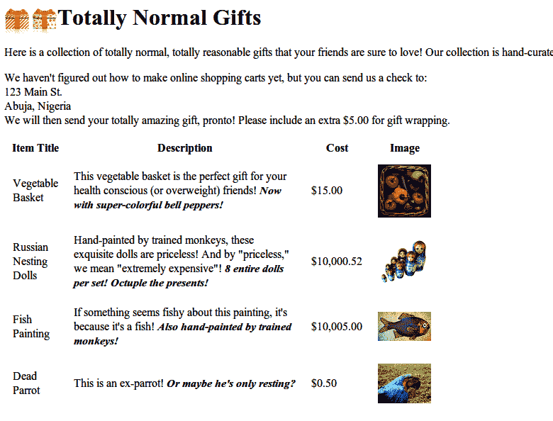

# 第五章：高级 HTML 解析

当有人问到米开朗基罗如何雕刻出像他的*大卫*那样精湛的艺术品时，据说他曾经说过：“很简单。你只需凿掉那些不像大卫的石头。”

尽管 Web 抓取在大多数其他方面不像大理石雕刻，但当你试图从复杂的网页中提取你想要的信息时，你必须采取类似的态度。在本章中，我们将探讨各种技术，逐步剔除任何不符合你想要的内容的内容，直到你找到你想要的信息。复杂的 HTML 页面可能一开始看起来令人生畏，但只要不断地削减！

# BeautifulSoup 再次登场

在第四章中，您快速了解了安装和运行 BeautifulSoup 以及逐个选择对象的方法。在本节中，我们将讨论通过属性搜索标记、处理标记列表以及导航解析树。

您遇到的几乎每个网站都包含样式表。样式表被创建为 Web 浏览器可以将 HTML 渲染成丰富多彩和美观的设计。您可能认为这个样式层对于网络爬虫来说至少是可以完全忽略的，但别那么快！实际上，CSS 对于网络爬虫来说是一个巨大的助益，因为它要求对 HTML 元素进行区分，以便以不同的方式对其进行样式设置。

CSS 为 Web 开发人员提供了一个激励，让他们为 HTML 元素添加标签，否则他们可能会使用完全相同的标记。有些标签可能是这样的：

```py
<span class="green"></span>
```

其他人可能是这样的：

```py
<span class="red"></span>
```

Web 爬虫可以根据它们的类轻松区分这两个标记；例如，它们可以使用 BeautifulSoup 抓取所有红色文本，但不包括任何绿色文本。由于 CSS 依赖这些标识属性来适当地设计网站的样式，几乎可以肯定，这些类和 id 属性在大多数现代网站上都是丰富的。

让我们创建一个示例网络爬虫，用于爬取位于[*http://www.pythonscraping.com/pages/warandpeace.html*](http://www.pythonscraping.com/pages/warandpeace.html)的页面。

在此页面上，故事中人物说的台词是红色的，而人物的名字是绿色的。您可以在以下页面源代码示例中看到引用适当 CSS 类的`span`标记：

```py
<span class="red">Heavens! what a virulent attack!</span> replied
<span class="green">the prince</span>, not in the least disconcerted
by this reception.
```

您可以抓取整个页面并使用它创建一个`BeautifulSoup`对象，方法与第四章中使用的程序类似：

```py
from urllib.request import urlopen
from bs4 import BeautifulSoup

html = urlopen('http://www.pythonscraping.com/pages/warandpeace.html')
bs = BeautifulSoup(html.read(), 'html.parser')

```

使用这个`BeautifulSoup`对象，您可以使用`find_all`函数提取一个 Python 列表，其中包含仅选择`<span class="green"></span>`标记内文本的专有名词（`find_all`是一个非常灵活的函数，您将在本书后面经常使用它）：

```py
nameList = bs.find_all('span', {'class':'green'})
for name in nameList:
    print(name.get_text())
```

当运行时，它应该按照 *战争与和平* 中的顺序列出文本中的所有专有名词。它是如何工作的？之前，你调用过 `bs.tagName` 来获取页面上该标签的第一个出现。现在，你调用 `bs.find_all(tagName, tagAttributes)` 来获取页面上所有该标签的列表，而不仅仅是第一个。

获取名称列表后，程序遍历列表中的所有名称，并打印 `name.get_text()` 以便将内容与标签分开。

# 何时使用 get_text() 和何时保留标签

`.get_text()` 从你正在处理的文档中去除所有标签，并返回一个只包含文本的 Unicode 字符串。例如，如果你正在处理一个包含许多超链接、段落和其他标签的大块文本，那么所有这些内容都将被去除，你将得到一个没有标签的文本块。

请记住，在 BeautifulSoup 对象中查找你要找的内容比在一块文本中要容易得多。调用 `.get_text()` 应该总是在最后一步操作之前，即在打印、存储或操作最终数据之前。一般来说，你应该尽量保持文档的标签结构尽可能长时间地存在。

## 使用 BeautifulSoup 的 find() 和 find_all()

BeautifulSoup 的 `find()` 和 `find_all()` 是你可能会经常使用的两个函数。使用它们可以轻松过滤 HTML 页面，找到所需标签的列表，或者根据它们的不同属性找到单个标签。

这两个函数在 BeautifulSoup 文档中的定义非常相似：

```py
find_all(tag, attrs, recursive, text, limit, **kwargs)
find(tag, attrs, recursive, text, **kwargs)
```

很可能，95% 的情况下你只需要使用前两个参数：`tag` 和 `attrs`。然而，我们来更详细地看一下所有参数。

`tag` 参数是你之前见过的；你可以传递一个标签的字符串名称，甚至是一个 Python 列表，其中包含多个标签名。例如，以下代码返回文档中所有标题标签的列表：¹

```py
.find_all(['h1','h2','h3','h4','h5','h6'])
```

与 `tag` 参数不同，`attrs` 参数必须是一个 Python 字典，包含属性和值。它匹配包含任何一个这些属性的标签。例如，以下函数将返回 HTML 文档中的 *绿色* 和 *红色* `span` 标签：

```py
.find_all('span', {'class': ['green', 'red']})
```

`recursive` 参数是一个布尔值。你想要深入文档多深？如果将 `recursive` 设置为 `True`，`find_all` 函数将深入到子级、子级的子级等，查找符合参数的标签。如果设置为 `False`，它将仅查找文档中的顶级标签。默认情况下，`find_all` 递归地工作（`recursive` 设置为 `True`）。通常情况下，除非你确切知道需要做什么并且性能是个问题，否则最好保持这个设置不变。

`text`参数不同之处在于它基于标签的文本内容进行匹配，而不是标签本身的属性。例如，如果您想要找到“王子”被标签包围的次数，在示例页面上，您可以用以下代码替换之前示例中的`.find_all()`函数：

```py
nameList = bs.find_all(text='the prince')
print(len(nameList))
```

输出结果为 7。

当然，`limit`参数仅在`find_all`方法中使用；`find`等同于使用限制为 1 的相同`find_all`调用。如果您只对从页面中检索的前*x*个项目感兴趣，则可以设置这个参数。请注意，这会按照文档中它们出现的顺序返回页面上的第一个项目，而不一定是您想要的第一个项目。

附加的`kwargs`参数允许您将任何其他命名参数传递给方法。`find`或`find_all`不识别的任何额外参数将用作标签属性匹配器。例如：

```py
title = bs.find_all(id='title', class_='text')

```

返回第一个标签，其`class`属性中包含“text”和`id`属性中包含“title”。请注意，按照惯例，每个`id`值在页面上应该只使用一次。因此，在实践中，像这样的一行可能并不特别有用，并且应等同于使用`find`函数：

```py
title = bs.find(id='title')
```

您可能已经注意到，BeautifulSoup 已经有了一种根据它们的属性和值查找标签的方法：`attr`参数。实际上，以下两行是相同的：

```py
bs.find(id='text')
bs.find(attrs={'id':'text'})
```

然而，第一行的语法更短，且在需要按特定属性获取标签的快速过滤器时更易于使用。当过滤器变得更复杂，或者当您需要将属性值选项作为参数列表传递时，可能需要使用`attrs`参数：

```py
bs.find(attrs={'class':['red', 'blue', 'green']})

```

## 其他 BeautifulSoup 对象

到目前为止，在这本书中，您已经看到 BeautifulSoup 库中的两种对象类型：

`BeautifulSoup`对象

在之前的代码示例中作为变量`bs`出现的实例

`Tag`对象

通过在`BeautifulSoup`对象上调用`find`和`find_all`或深入挖掘，以列表形式检索，或单独检索：

```py
bs.div.h1
```

然而，库中还有两个对象，虽然使用较少，但仍然很重要：

`NavigableString`对象

用于表示标签内的文本，而不是标签本身（某些函数操作并生成`NavigableStrings`，而不是标签对象）。

`Comment`对象

用于查找 HTML 注释中的注释标签，`<!--like this one-->`。

在撰写本文时，这些是 BeautifulSoup 包中唯一的四个对象。当 BeautifulSoup 包于 2004 年发布时，这些也是唯一的四个对象，因此在不久的将来可用对象的数量不太可能改变。

## 导航树

`find_all`函数负责根据名称和属性查找标签。但是，如果你需要根据文档中的位置查找标签呢？这就是树导航派上用场的地方。在第四章中，你看过如何在 BeautifulSoup 树中单向导航：

```py
bs.tag.subTag.anotherSubTag
```

现在让我们看看如何在 HTML 树中向上、横向和斜向导航。你将使用我们极具争议性的在线购物网站[*http://www.pythonscraping.com/pages/page3.html*](http://www.pythonscraping.com/pages/page3.html)作为抓取的示例页面，如图 5-1 所示。



###### 图 5-1\. 来自[*http://www.pythonscraping.com/pages/page3.html*](http://www.pythonscraping.com/pages/page3.html)的屏幕截图

此页面的 HTML，作为树形结构映射出来（为简洁起见，某些标签被省略），看起来像这样：

+   HTML

    +   `body`

        +   `div.wrapper`

            +   `h1`

            +   `div.content`

            +   `table#giftList`

                +   `tr`

                    +   `th`

                    +   `th`

                    +   `th`

                    +   `th`

                +   `tr.gift#gift1`

                    +   `td`

                    +   `td`

                        +   `span.excitingNote`

                    +   `td`

                    +   `td`

                        +   `img`

                +   ...表行继续...

            +   `div.footer`

你将会在接下来的几节中使用这个相同的 HTML 结构作为示例。

### 处理儿童和其他后代

在计算机科学和某些数学分支中，你经常会听说对子代进行的可怕操作：移动它们、存储它们、移除它们，甚至杀死它们。幸运的是，本节仅专注于选择它们！

在 BeautifulSoup 库以及许多其他库中，都区分*子代*和*后代*：就像人类家谱中的情况一样，子代始终位于父代的正下方，而后代可以位于树中父代的任何级别。例如，`tr`标签是`table`标签的子代，而`tr`、`th`、`td`、`img`和`span`都是`table`标签的后代（至少在我们的示例页面中是这样）。所有子代都是后代，但并非所有后代都是子代。

一般来说，BeautifulSoup 函数总是处理当前标签选定的后代。例如，`bs.body.h1`选择的是`body`标签的第一个`h1`标签后代。它不会找到位于 body 之外的标签。

同样地，`bs.div.find_all('img')`将会找到文档中第一个`div`标签，然后检索该`div`标签的所有后代`img`标签列表。

如果你只想找到作为子代的后代，你可以使用`.children`标签：

```py
from urllib.request import urlopen
from bs4 import BeautifulSoup

html = urlopen('http://www.pythonscraping.com/pages/page3.html')
bs = BeautifulSoup(html, 'html.parser')

for child in bs.find('table',{'id':'giftList'}).children:
    print(child)

```

这段代码打印出`giftList`表中的产品行列表，包括列标签的初始行。如果你使用`descendants()`函数而不是`children()`函数来编写它，将会在表中找到并打印大约二十多个标签，包括`img`标签、`span`标签和单独的`td`标签。区分子代和后代显然非常重要！

### 处理兄弟节点

BeautifulSoup 的`next_siblings()`函数使得从表格中收集数据变得轻松，特别是带有标题行的表格：

```py
from urllib.request import urlopen
from bs4 import BeautifulSoup

html = urlopen('http://www.pythonscraping.com/pages/page3.html')
bs = BeautifulSoup(html, 'html.parser')

for sibling in bs.find('table', {'id':'giftList'}).tr.next_siblings:
    print(sibling)

```

此代码的输出是打印产品表中除第一行标题行之外的所有产品行。为什么标题行被跳过了呢？对象不能与自身为兄弟。每当您获取对象的兄弟时，该对象本身不会包含在列表中。正如函数名称所示，它仅调用 *next* 兄弟。例如，如果您选择列表中间的一行，并在其上调用 `next_siblings`，那么只会返回随后的兄弟。因此，通过选择标题行并调用 `next_siblings`，您可以选择表中的所有行，而不选择标题行本身。

# 使选择更加具体

如果要选择表的第一行，上述代码同样有效，无论是选择 `bs.table.tr` 还是仅选择 `bs.tr`。但在代码中，我费力地以更长的形式写出了所有内容：

```py
bs.find('table',{'id':'giftList'}).tr
```

即使看起来页面上只有一个表（或其他目标标签），也很容易忽略事物。此外，页面布局随时都在变化。曾经是页面上第一个的东西，有一天可能成为页面上第二或第三种类型的标签。为了使您的爬虫更加健壮，最好在进行标签选择时尽可能具体。利用标签属性时要尽量具体。

作为 `next_siblings` 的补充，`previous_siblings` 函数通常在您希望获取兄弟标签列表末尾的易于选择的标签时非常有用。

当然，还有`next_sibling`和`previous_sibling`函数，它们执行的功能几乎与`next_siblings`和`previous_siblings`相同，只是它们返回单个标签而不是列表。

### 处理父元素

在抓取页面时，您可能会发现需要查找标签的父标签的频率比需要查找它们的子标签或兄弟标签的频率要少。通常，当您查看具有爬行目标的 HTML 页面时，您首先查看顶层标签，然后想办法深入到您想要的确切数据部分。然而，偶尔可能会遇到需要 BeautifulSoup 的父查找函数 `.parent` 和 `.parents` 的奇怪情况。例如：

```py
from urllib.request import urlopen
from bs4 import BeautifulSoup

html = urlopen('http://www.pythonscraping.com/pages/page3.html')
bs = BeautifulSoup(html, 'html.parser')
print(bs.find('img',
              {'src':'../img/gifts/img1.jpg'})
      .parent.previous_sibling.get_text())

```

此代码将打印由位置 *../img/gifts/img1.jpg* 表示的图像所代表的对象的价格（在本例中，价格为 $15.00）。

这是如何工作的？以下图示表示您正在处理的 HTML 页面部分的树形结构，带有编号步骤：

+   <tr>

    +   `td`

    +   `td`

    +   `td` 

        +   `"$15.00"` ****

    +   `td` 

        +   `` 


第一个选择了 `src="../img/gifts/img1.jpg"` 的图像标签。


您选择了该标签的父标签（在本例中为 `td` 标签）。


你选择`td`标签的`previous_sibling`（在这种情况下，包含产品价格的`td`标签）。


你选择标签内的文本 `"$15.00"`。

# 正则表达式

正如一个老的计算机科学笑话所说：“假设你有一个问题，并且你决定用正则表达式来解决它。好吧，现在你有两个问题。”

不幸的是，正则表达式（通常缩写为*regex*）通常是用大量随机符号组成的大表格来教授的，看起来像是一堆无意义的东西。这种方法往往会让人望而却步，后来他们进入职场时会编写不必要复杂的搜索和过滤函数以避免使用正则表达式。

当涉及到网页抓取时，正则表达式是一个非常宝贵的工具。幸运的是，你不必花费太多时间就能迅速掌握并且可以通过几个简单的例子来学习它们。

*正则表达式*之所以被这样称呼，是因为它们用于识别属于*正则语言*的字符串。这里的“语言”并不是指编程语言或者自然语言（比如英语或法语），而是数学上的意义，意味着“一组遵循某些规则的字符串”。

正则语言是一组可以通过一组线性规则生成的字符串，简单地沿着候选字符串移动并匹配规则。² 例如：

1.  至少写下字母*a*。

1.  在末尾添加字母*b*正好五次。

1.  在末尾追加字母*c*，偶数次。

1.  在末尾写下字母*d*或*e*。

正则表达式可以明确地确定：“是的，这个字符串符合规则”，或者“这个字符串不符合规则”。这对于快速扫描大文档以查找看起来像电话号码或电子邮件地址的字符串非常方便。

符合上述规则的字符串，例如*aaaabbbbbccccd*，*aabbbbbcce*等等，数学上来说，有无限多个符合这种模式的字符串。

正则表达式只是一种简写方式来表达这些规则集合。例如，这里就是刚才描述的一系列步骤的正则表达式：

```py
aa*bbbbb(cc)*(d|e)
```

虽然这个字符串一开始可能看起来有点吓人，但当你把它分解成其组成部分时就变得更清晰了：

*`aa*`*

首先写下字母*a*，然后是*a**（读作星号*），意思是“任意数量的 a，包括 0 个”。通过这种方式，你可以确保至少写下字母*a*。

*`bbbbb`*

这里没有特效，只是连续五个 b。

*`(cc)*`*

任何偶数个事物都可以成对分组，因此为了强制执行这个关于偶数事物的规则，你可以写两个 c，用括号括起来，并在其后写一个星号，表示你可以有任意数量的*c*对（注意这也可以意味着零对）。

*`(d|e)`*

在两个表达式中间添加一条竖线意味着它可以是“这个东西*或者*那个东西”。在这种情况下，你是在说“添加一个*d*或者一个*e*”。通过这种方式，你可以确保这两个字符中确切地有一个。

# 试验正则表达式

当学习如何编写正则表达式时，重要的是要尝试并了解它们的工作原理。如果你不想启动代码编辑器、写几行代码并运行你的程序来查看正则表达式是否按预期工作，你可以去[RegEx Pal](http://regexpal.com/)等网站上实时测试你的正则表达式。

表 5-1 列出了常用的正则表达式符号及简要解释和示例。这个列表并不完整，正如前面提到的，你可能会在不同的编程语言中遇到略有不同。然而，这 12 个符号是 Python 中最常用的正则表达式，几乎可以用来查找和收集任何类型的字符串。

表 5-1\. 常用正则表达式符号

| 符号 | 含义 | 示例 | 示例匹配 |
| --- | --- | --- | --- |
| * | 匹配前一个字符、子表达式或括号中的字符，0 次或更多次。 | a*b* | aaaaaaaa, aaabbbbb, bbbbbb |
| + | 匹配前一个字符、子表达式或括号中的字符，1 次或更多次。 | a+b+ | aaaaaaaab, aaabbbbb, abbbbbb |

| [] | 匹配括号中的任何字符（即“从这些内容中挑选任意一个”）。 | [A-Z]* | APPLE, CAPITALS,

QWERTY |

| () | 分组的子表达式（这些按照正则表达式的“运算顺序”首先进行计算）。 | (a*b)* | aaabaab, abaaab, ababaaaaab |
| --- | --- | --- | --- |
| {m, n} | 匹配前一个字符、子表达式或括号中的字符*m*到*n*次（包括*m*和*n*）。 | a{2,3}b{2,3} | aabbb, aaabbb, aabb |

| [^] | 匹配不在括号中的任何单个字符。 | [^A-Z]* | apple, lowercase,

qwerty |

| &#124; | 匹配任何字符、字符串或由`I`（注意这是一条竖线，或称为*管道*，而不是大写字母 i）分隔的子表达式。 | b(a&#124;i&#124;e)d | bad, bid, bed |
| --- | --- | --- | --- |
| . | 匹配任何单个字符（包括符号、数字、空格等）。 | b.d | bad, bzd, b$d, b d |
| ^ | 表示字符或子表达式出现在字符串的开头。 | ^a | apple, asdf, a |
| \ | 转义字符（这允许你将特殊字符用作它们的字面意义）。 | \^ \&#124; \\ | ^ &#124; \ |
| $ | 常用于正则表达式的末尾，表示“匹配直到字符串末尾”。如果没有它，每个正则表达式默认会以“.*”结尾，接受只匹配字符串第一部分的字符串。这可以类比为 ^ 符号的作用。 | [A-Z]*[a-z]*$ | ABCabc, zzzyx, Bob |
| ?! | “不包含”。这对奇怪的符号，紧跟在一个字符（或正则表达式）之前，表示在更大的字符串中，该特定位置不应出现该字符。这可能会有些棘手；毕竟，该字符可能出现在字符串的其他部分。如果想要完全排除某个字符，可以与开头的 ^ 和末尾的 $ 结合使用。 | ^((?![A-Z]).)*$ | no-caps-here, $ymb0ls a4e f!ne |

正则表达式的一个经典示例是识别电子邮件地址的实践。尽管确切的电子邮件地址规则略有不同，但我们可以制定几个通用规则。每个规则对应的正则表达式如下所示：

|

规则 1

电子邮件地址的第一部分至少包含以下内容之一：大写字母、小写字母、数字 0–9、句点（.）、加号（+）或下划线（_）。

|

**[A-Za-z0-9._+]+**

正则表达式的简写是非常聪明的。例如，它知道“A-Z”意味着“从 A 到 Z 的任何大写字母”。通过将所有可能的序列和符号放在方括号中（而不是圆括号中），您在说：“这个符号可以是我们在方括号中列出的任何一个。”还要注意，加号（+）号表示“这些字符可以出现任意次数，但必须至少出现一次。”

|

|

规则 2

在此之后，电子邮件地址包含 @ 符号。

|

**@**

这相当简单：@ 符号必须出现在中间，并且必须恰好出现一次。

|

|

规则 3

邮件地址必须包含至少一个大写或小写字母。

|

**[A-Za-z]+**

在 @ 符号后的域名的第一部分中只能使用字母，并且必须至少有一个字符。

|

|

规则 4

这之后跟着一个句点（.）。

|

**.**

在顶级域名前必须包含一个句点（.）。

|

|

规则 5

最后，电子邮件地址以 *com*, *org*, *edu* 或 *net* 结尾（实际上，顶级域名有很多可能，但这四个例子足够说明问题）。

|

**(com&#124;org&#124;edu&#124;net)**

这列出了电子邮件地址第二部分中句点后可能出现的字母序列。

|

将所有规则连接起来，可以得到这个正则表达式：

```py
[A-Za-z0-9._+]+@[A-Za-z]+.(com|org|edu|net)
```

当试图从头开始编写任何正则表达式时，最好首先列出一系列具体步骤，明确说明你的目标字符串的样子。注意边缘情况。例如，如果你正在识别电话号码，你是否考虑了国家代码和分机号码？

# 正则表达式：并非总是规则的！

正则表达式的标准版本（本书涵盖的版本并由 Python 和 BeautifulSoup 使用）基于 Perl 使用的语法。大多数现代编程语言使用这个或类似的语法。然而，请注意，如果您在另一种语言中使用正则表达式，可能会遇到问题。甚至一些现代语言，如 Java，在处理正则表达式时也有细微差异。如果有疑问，请阅读文档！

# 正则表达式和 BeautifulSoup

如果前一节关于正则表达式的内容似乎与本书的任务有些脱节，那么这就是它们之间的联系。BeautifulSoup 和正则表达式在网页抓取方面是密不可分的。事实上，大多数接受字符串参数的函数（例如 `find(id="aTagIdHere")`）同样也可以接受正则表达式。

让我们来看一些例子，抓取[*http://www.pythonscraping.com/pages/page3.html*](http://www.pythonscraping.com/pages/page3.html) 所找到的页面。

请注意，该网站有许多产品图片，其形式如下：

```py

```

如果你想要抓取所有产品图片的 URL，一开始似乎相当简单：只需使用 `.find_all("img")` 来抓取所有图像标签，对吗？但是有一个问题。除了明显的“额外”图像（例如标志），现代网站经常还有隐藏的图像，用于间隔和对齐元素的空白图像，以及其他您可能不知道的随机图像标签。当然，你不能指望页面上唯一的图像是产品图像。

假设页面的布局可能会发生变化，或者出于某种原因，你不想依赖于图像在页面中的*位置*来找到正确的标签。当你试图抓取分散在网站各处的特定元素或数据片段时，情况可能是这样的。例如，一个特色产品图片可能会出现在某些页面顶部的特殊布局中，但在其他页面中则不会。

解决方案是查找标签本身的某些特征。在这种情况下，你可以查看产品图片的文件路径：

```py
from urllib.request import urlopen
from bs4 import BeautifulSoup
import re

html = urlopen('http://www.pythonscraping.com/pages/page3.html')
bs = BeautifulSoup(html, 'html.parser')
images = bs.find_all('img',
    {'src':re.compile('..\/img\/gifts/img.*.jpg')})
for image in images: 
    print(image['src'])

```

这将仅打印以*../img/gifts/img*开头并以*.jpg*结尾的相对图像路径，其输出为：

```py
../img/gifts/img1.jpg
../img/gifts/img2.jpg
../img/gifts/img3.jpg
../img/gifts/img4.jpg
../img/gifts/img6.jpg

```

正则表达式可以作为 BeautifulSoup 表达式中的任何参数插入，从而允许你以很大的灵活性来找到目标元素。

# 访问属性

到目前为止，你已经学会了如何访问和过滤标签以及访问其中的内容。然而，在网页抓取中，通常你不是在寻找标签的内容，而是在寻找它们的属性。这对于诸如`a`标签特别有用，它指向的 URL 包含在`href`属性中；或者`img`标签，其中目标图像包含在`src`属性中。

对于标签对象，可以通过调用这个来自动访问 Python 列表的属性：

```py
myTag.attrs

```

请记住，这实际上返回一个 Python 字典对象，这使得检索和操作这些属性变得轻而易举。例如，可以使用以下行找到图像的源位置：

```py
myImgTag.attrs['src']
```

# Lambda 表达式

*Lambda*是一个花哨的学术术语，在编程中，它简单地意味着“一种编写函数的简便方法”。在 Python 中，我们可以编写一个返回一个数的平方的函数如下：

```py
def square(n):
    return n**2

```

我们可以使用 lambda 表达式在一行内完成同样的事情：

```py
square = lambda n: n**2
```

此处将变量`square`直接分配给一个函数，该函数接受一个参数`n`并返回`n**2`。但并没有规定函数必须“命名”或者根本不分配给变量。我们可以将它们作为值来编写：

```py
>>> lambda r: r**2
<function <lambda> at 0x7f8f88223a60>

```

本质上，*lambda 表达式*是一个独立存在的函数，没有被命名或分配给变量。在 Python 中，lambda 函数不能超过一行代码（这是 Python 风格和良好品味的问题，而不是计算机科学的一项基本规则）。

lambda 表达式最常见的用途是作为传递给其他函数的参数。BeautifulSoup 允许你将某些类型的函数作为参数传递到`find_all`函数中。

唯一的限制是这些函数必须接受一个标签对象作为参数，并返回一个布尔值。BeautifulSoup 遇到的每个标签对象都在此函数中评估，评估为`True`的标签被返回，其余被丢弃。

例如，以下代码检索所有具有恰好两个属性的标签：

```py
bs.find_all(lambda tag: len(tag.attrs) == 2)
```

在这里，作为参数传递的函数是`len(tag.attrs) == 2`。当这个条件成立时，`find_all`函数将返回该标签。也就是说，它会找到具有两个属性的标签，例如：

```py
<div class="body" id="content"></div>
<span style="color:red" class="title"></span>
```

Lambda 函数非常有用，你甚至可以使用它们来替换现有的 BeautifulSoup 函数：

```py
bs.find_all(lambda tag: tag.get_text() ==
    'Or maybe he\'s only resting?')
```

这也可以不使用 lambda 函数来完成：

```py
bs.find_all('', text='Or maybe he\'s only resting?')
```

然而，如果你记得 lambda 函数的语法以及如何访问标签属性，你可能再也不需要记住任何其他 BeautifulSoup 语法了！

因为提供的 lambda 函数可以是返回`True`或`False`值的任何函数，你甚至可以将它们与正则表达式结合起来，以找到具有匹配特定字符串模式的属性的标签。

# 你不总是需要一把锤子

当面对一团复杂的标签时，直接潜入并使用多行语句来提取信息是很诱人的。然而，请记住，放任这一章节中使用的技术层叠可能会导致难以调试或脆弱的代码。让我们看看一些可以避免需要高级 HTML 解析的方法。

假设你有一些目标内容。也许是一个名字、统计数据或者一段文字。也许它被深深埋在 HTML 混乱中，没有有用的标签或者 HTML 属性。你可能会决定冒险一试，写下像以下这样的代码尝试提取：

```py
bs.find_all('table')[4].find_all('tr')[2].find('td').find_all('div')[1].find('a')
```

看起来不太好。除了行的美观度之外，即使网站管理员对网站进行了微小的更改，也可能会完全破坏你的网络爬虫。如果站点的 Web 开发人员决定添加另一个表或另一列数据，该怎么办？如果开发人员在页面顶部添加了另一个组件（带有几个`div`标签），前面的行就会变得岌岌可危，依赖于网站结构永远不会改变。

所以，你有哪些选择？

+   寻找任何可以用来直接跳到文档中间位置的“地标”，更接近你实际想要的内容。方便的 CSS 属性是一个明显的地标，但你也可以创造性地通过`.find_all(text='some tag content')`来获取标签的内容。

+   如果没有简单的方法来分离你想要的标签或其任何父级，你能找到一个兄弟节点吗？使用`.parent`方法，然后再深入到目标标签。

+   完全放弃这个文档，寻找“打印本页”链接，或者可能有更好格式的移动版网站（关于如何呈现自己为移动设备，并接收移动网站版本，请参见第十七章）。

+   不要忽视`<script>`标签中的内容或单独加载的 JavaScript 文件。JavaScript 通常包含你正在寻找的数据，并且格式更好！例如，我曾通过检查嵌入的 Google 地图应用程序的 JavaScript，从一个网站收集了格式良好的街道地址。有关此技术的更多信息，请参阅第十一章。

+   信息可能可以在页面的 URL 中找到。例如，页面标题和产品 ID 通常可以在那里找到。

+   如果你正在寻找的信息由于某种原因只在这个网站上唯一，那你就没戏了。如果不是，请考虑其他可能来源的信息。是否有另一个网站有相同的数据？这个网站是否展示了从另一个网站抓取或聚合的数据？

尤其是当面对埋藏或格式混乱的数据时，重要的是不要只是开始挖掘并把自己写入一个可能无法走出的困境中。深呼吸，考虑一些替代方案。

当正确使用时，这里介绍的技术将在很大程度上有助于编写更稳定可靠的网络爬虫。

¹ 如果你想要获取文档中所有`h<*some_level*>`标签的列表，有更简洁的编写这段代码以完成相同任务的方法。我们将在“正则表达式和 BeautifulSoup”一节中看看其他解决这类问题的方法。

² 也许你会问自己，“有‘不规则’的语言和不规则表达式吗？” 非正则表达式超出了本书的范围，但它们包括诸如“写下一串 a 的质数，然后是正好两倍于该数的 b”的字符串或“写下一个回文”。 使用正则表达式无法识别这种类型的字符串。 幸运的是，我从未遇到过我的网络爬虫需要识别这种字符串的情况。
