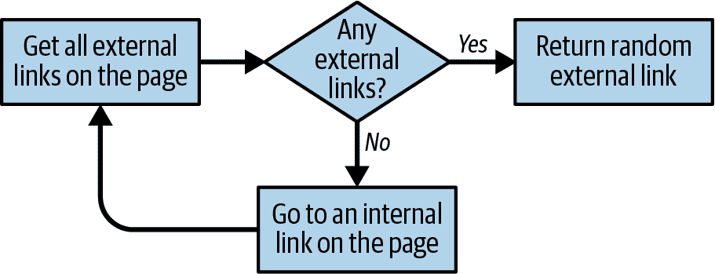
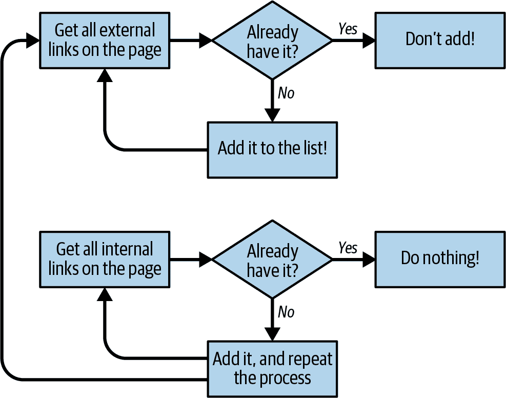

# 第六章：写作网络爬虫

到目前为止，你已经看到了一些带有人为干预的静态页面示例。在本章中，你将开始研究真实世界中的问题，使用爬虫来遍历多个页面，甚至是多个站点。

*网络爬虫*之所以被称为如此，是因为它们横跨整个网络。它们的核心是递归的元素。它们必须获取 URL 的页面内容，检查该页面中的其他 URL，并递归地获取*那些*页面。

但要注意：仅仅因为你可以爬取网页，并不意味着你总是应该这样做。在前面的示例中使用的爬虫在需要获取的数据都在单个页面上的情况下效果很好。使用网络爬虫时，你必须非常注意你使用了多少带宽，并且要尽一切努力确定是否有办法减轻目标服务器的负载。

# 遍历单个域

即使你没有听说过维基百科的六度分隔，你可能听说过它的名字起源，即凯文·贝肯的六度分隔¹。在这两个游戏中，目标是通过包含不超过六个总数的链条（包括两个初始主题）来链接两个不太可能的主题（在第一种情况下，是互相链接的维基百科文章；在第二种情况下，是出演同一部电影的演员）。

例如，埃里克·艾德尔与布伦丹·弗雷泽一起出演了*Dudley Do-Right*，而布伦丹·弗雷泽又与凯文·贝肯一起出演了*我呼吸的空气*²。在这种情况下，从埃里克·艾德尔到凯文·贝肯的链只有三个主题。

在本节中，你将开始一个项目，这个项目将成为一个维基百科六度分隔解决方案的发现者：你将能够从[埃里克·艾德尔页面](https://en.wikipedia.org/wiki/Eric_Idle)出发，找到需要最少的链接点击数将你带到[凯文·贝肯页面](https://en.wikipedia.org/wiki/Kevin_Bacon)。

你应该已经知道如何编写一个 Python 脚本，用于获取任意维基百科页面并生成该页面上的链接列表：

```py
from urllib.request import urlopen
from bs4 import BeautifulSoup 

html = urlopen('http://en.wikipedia.org/wiki/Kevin_Bacon')
bs = BeautifulSoup(html, 'html.parser')
for link in bs.find_all('a'):
    if 'href' in link.attrs:
        print(link.attrs['href'])

```

如果你查看生成的链接列表，你会注意到所有你期望的文章都在那里：*阿波罗 13 号*、*费城*、*黄金时段艾美奖*，以及凯文·贝肯出演的其他电影。然而，也有一些你可能不想要的东西：

```py
//foundation.wikimedia.org/wiki/Privacy_policy
//en.wikipedia.org/wiki/Wikipedia:Contact_us
```

实际上，维基百科中充满了侧边栏、页脚和页眉链接，这些链接出现在每个页面上，还有链接到分类页面、讨论页面以及不包含不同文章的其他页面：

```py
/wiki/Category:All_articles_with_unsourced_statements
/wiki/Talk:Kevin_Bacon
```

最近，我的一个朋友在进行类似的维基百科爬取项目时提到，他编写了一个大型的过滤函数，超过 100 行代码，用于确定内部维基百科链接是否是文章页面。不幸的是，他没有花太多时间在前期尝试找出“文章链接”和“其他链接”之间的模式，否则他可能已经发现了窍门。如果你检查指向文章页面的链接，你会发现它们有三个共同点：

+   它们位于`id`设置为`bodyContent`的`div`内。

+   这些 URL 不包含冒号。

+   这些 URL 以*/wiki/*开头。

你可以使用这些规则稍微修改代码，只检索所需的文章链接，方法是使用正则表达式`^(/wiki/)((?!:).)*$`：

```py
from urllib.request import urlopen 
from bs4 import BeautifulSoup 
import re

html = urlopen('http://en.wikipedia.org/wiki/Kevin_Bacon')
bs = BeautifulSoup(html, 'html.parser')
for link in bs.find('div', {'id':'bodyContent'}).find_all(
    'a', href=re.compile('^(/wiki/)((?!:).)*$')):
    print(link.attrs['href'])

```

运行此程序，你应该会看到维基百科关于 Kevin Bacon 的所有文章 URL 列表。

当然，拥有一个在一个硬编码的维基百科文章中找到所有文章链接的脚本，虽然很有趣，但在实践中却相当无用。你需要能够拿着这段代码，将其转换成更像下面这样的东西：

+   一个单独的函数，`getLinks`，它接受形式为`/wiki/<Article_Name>`的维基百科文章 URL，并返回相同形式的所有链接的文章 URL 列表。

+   一个调用`getLinks`的主函数，以一个起始文章作为参数，从返回的列表中选择一个随机文章链接，并再次调用`getLinks`，直到停止程序或者在新页面上找不到文章链接为止。

这是完成此操作的完整代码：

```py
from urllib.request import urlopen
from bs4 import BeautifulSoup
import datetime
import random
import re

random.seed(datetime.datetime.now())
def getLinks(articleUrl):
    html = urlopen('http://en.wikipedia.org{}'.format(articleUrl))
    bs = BeautifulSoup(html, 'html.parser')
    return bs.find('div', {'id':'bodyContent'}).find_all('a',
         href=re.compile('^(/wiki/)((?!:).)*$'))

links = getLinks('/wiki/Kevin_Bacon')
while len(links) > 0:
    newArticle = links[random.randint(0, len(links)-1)].attrs['href']
    print(newArticle)
    links = getLinks(newArticle)

```

程序导入所需的库后，第一件事是使用当前系统时间设置随机数生成器的种子。这实际上确保了每次运行程序时都会得到一个新的有趣的随机路径通过维基百科文章。

接下来，程序定义了`getLinks`函数，该函数接受形式为`/wiki/...`的文章 URL，加上维基百科域名`http://en.wikipedia.org`，并检索该域中 HTML 的`BeautifulSoup`对象。然后根据前面讨论的参数提取文章链接标签列表，并返回它们。

程序的主体从设置文章链接标签列表（`links`变量）为初始页面中的链接列表开始：*https://en.wikipedia.org/wiki/Kevin_Bacon*。然后进入循环，找到页面中的一个随机文章链接标签，提取其中的`href`属性，打印页面，并从提取的 URL 获取一个新的链接列表。

当然，解决维基百科的六度问题比构建一个从页面到页面的爬虫更多一些。你还必须能够存储和分析所得到的数据。要继续解决此问题的解决方案，请参见第九章。

# 处理你的异常！

尽管这些代码示例为简洁起见省略了大部分异常处理，但请注意可能会出现许多潜在问题。例如，如果维基百科更改了`bodyContent`标签的名称会怎样？当程序尝试从标签中提取文本时，它会抛出`AttributeError`。

因此，虽然这些脚本可能很适合作为密切观察的例子运行，但自主生产代码需要比本书中所能容纳的异常处理要多得多。查看第四章了解更多信息。

# 爬取整个站点

在前一节中，你随机地浏览了一个网站，从一个链接跳到另一个链接。但是如果你需要系统地编目或搜索站点上的每一页呢？爬行整个站点，特别是大型站点，是一个占用内存的过程，最适合于那些可以轻松存储爬行结果的应用程序。然而，即使不是全面运行，你也可以探索这些类型应用程序的行为。要了解更多关于使用数据库运行这些应用程序的信息，请参见第九章。

什么时候爬整个网站可能有用，什么时候可能有害？遍历整个站点的网页抓取器适合于许多用途，包括：

*生成站点地图*

几年前，我面临一个问题：一个重要的客户想要对网站重新设计提供估价，但不愿向我的公司提供其当前内容管理系统的内部访问权限，也没有公开的站点地图。我能够使用爬虫覆盖整个站点，收集所有内部链接，并将页面组织成实际在站点上使用的文件夹结构。这让我能够快速找到我甚至不知道存在的站点部分，并准确计算所需的页面设计数量以及需要迁移的内容量。

*收集数据*

另一个客户想要收集文章（故事、博客文章、新闻文章等），以创建一个专业搜索平台的工作原型。虽然这些网站爬行不需要详尽，但它们确实需要相当广泛（我们只对从几个站点获取数据感兴趣）。我能够创建爬虫，递归地遍历每个站点，并仅收集在文章页面上找到的数据。

对于详尽的网站爬行，一般的方法是从顶级页面（比如首页）开始，并搜索该页面上的所有内部链接列表。然后对每个链接进行爬行，并在每个链接上找到其他链接列表，触发另一轮爬行。

显然，这是一个可能迅速扩展的情况。如果每页有 10 个内部链接，而网站深度为 5 页（对于中等大小的网站来说是一个相当典型的深度），那么你需要爬行的页面数为 10⁵，即 100,000 页，才能确保你已经详尽地覆盖了整个网站。奇怪的是，虽然“每页 5 个深度和每页 10 个内部链接”是网站的相当典型的维度，但很少有网站拥有 100,000 页或更多页面。当然，原因在于绝大多数的内部链接是重复的。

为了避免两次爬取同一页，非常重要的是，发现的所有内部链接都要一致地格式化，并在程序运行时保持在一个运行集合中进行简单查找。*集合* 类似于列表，但元素没有特定的顺序，并且只存储唯一的元素，这对我们的需求是理想的。只有“新”的链接应该被爬取，并搜索其他链接：

```py
from urllib.request import urlopen
from bs4 import BeautifulSoup
import re

pages = set()
def getLinks(pageUrl):
    html = urlopen('http://en.wikipedia.org{}'.format(pageUrl))
    bs = BeautifulSoup(html, 'html.parser')
    for link in bs.find_all('a', href=re.compile('^(/wiki/)')):
        if 'href' in link.attrs:
            if link.attrs['href'] not in pages:
                #We have encountered a new page
                newPage = link.attrs['href']
                print(newPage)
                pages.add(newPage)
                getLinks(newPage)
getLinks('')

```

为了向你展示这种网络爬行业务的完整效果，我放宽了什么构成内部链接的标准（来自之前的示例）。不再将爬虫限制于文章页面，而是查找所有以 */wiki/* 开头的链接，无论它们在页面的何处，也无论它们是否包含冒号。请记住：文章页面不包含冒号，但文件上传页面、讨论页面等在 URL 中包含冒号。

最初，使用空 URL 调用 `getLinks`。这被翻译为“维基百科的首页”，因为空 URL 在函数内部以 `http://en.wikipedia.org` 开头。然后，对首页上的每个链接进行迭代，并检查它是否在脚本已遇到的页面集合中。如果没有，将其添加到列表中，打印到屏幕上，并递归调用 `getLinks`。

# 递归的警告

这是在软件书籍中很少见的警告，但我认为你应该知道：如果运行时间足够长，前面的程序几乎肯定会崩溃。

Python 的默认递归限制（程序可以递归调用自身的次数）为 1,000。由于维基百科的链接网络非常庞大，这个程序最终会达到递归限制并停止，除非你在其中加入递归计数器或其他东西以防止这种情况发生。

对于少于 1,000 个链接深度的“平”站点，这种方法通常效果良好，但也有一些特殊情况。例如，我曾经遇到过一个动态生成的 URL 的 bug，它依赖于当前页面的地址来在该页面上写入链接。这导致了无限重复的路径，如 */blogs/blogs.../blogs/blog-post.php*。

大多数情况下，这种递归技术对于你可能遇到的任何典型网站应该都没问题。

## 在整个站点收集数据

如果网络爬虫只是从一个页面跳到另一个页面，那么它们会变得相当无聊。为了使它们有用，你需要在访问页面时能够做些事情。让我们看看如何构建一个爬虫，收集标题、内容的第一个段落，并且（如果有的话）编辑页面的链接。

与往常一样，确定最佳方法的第一步是查看站点的几个页面并确定一个模式。通过查看一些维基百科页面（包括文章和非文章页面，如隐私政策页面），应该清楚以下几点：

+   所有标题（无论其是否作为文章页面、编辑历史页面或任何其他页面存在）都在`h1` → `span`标签下，这些是页面上唯一的`h1`标签。

+   正如之前提到的，所有正文文本都位于`div#bodyContent`标签下。然而，如果你想更加具体并且只访问文本的第一个段落，那么最好使用`div#mw-content-text` → `​p`（仅选择第一个段落标签）。这对所有内容页面都适用，但不适用于文件页面（例如，[*https://en.wikipedia.org/wiki/File:Orbit_of_274301_Wikipedia.svg*](https://en.wikipedia.org/wiki/File:Orbit_of_274301_Wikipedia.svg)），因为这些页面没有内容文本的部分。

+   编辑链接仅出现在文章页面上。如果它们存在，它们将在`li#ca-edit`标签下找到，位于`li#ca-edit` →​ `span` →​ `a`。

通过修改您的基本爬取代码，您可以创建一个组合爬虫/数据收集（或至少是数据打印）程序：

```py
from urllib.request import urlopen
from bs4 import BeautifulSoup
import re

pages = set()
def getLinks(pageUrl):
    html = urlopen('http://en.wikipedia.org{}'.format(pageUrl))
    bs = BeautifulSoup(html, 'html.parser')
    try:
        print(bs.h1.get_text())
        print(bs.find(id ='mw-content-text').find_all('p')[0])
        print(bs.find(id='ca-edit').find('span')
             .find('a').attrs['href'])
    except AttributeError:
        print('This page is missing something! Continuing.')

    for link in bs.find_all('a', href=re.compile('^(/wiki/)')):
        if 'href' in link.attrs:
            if link.attrs['href'] not in pages:
                #We have encountered a new page
                newPage = link.attrs['href']
                print('-'*20)
                print(newPage)
                pages.add(newPage)
                getLinks(newPage)
getLinks('') 

```

该程序中的`for`循环基本上与原始爬虫程序中的相同（增加了打印内容之间的打印破折号以增加清晰度）。

由于你永远不能完全确定每个页面上是否有所有数据，因此每个`print`语句都按照最有可能出现在页面上的顺序排列。也就是说，`h1`标题标签似乎出现在每个页面上（至少在我所知的范围内），因此首先尝试获取该数据。文本内容出现在大多数页面上（除了文件页面），因此这是第二个检索到的数据片段。编辑按钮仅出现在已经存在标题和文本内容的页面上，但并非所有这些页面都有该按钮。

# 不同的需求有不同的模式

显然，将多行包装在异常处理程序中存在一些危险。例如，你无法判断是哪一行抛出了异常。此外，如果某个页面包含编辑按钮但没有标题，编辑按钮将永远不会被记录。然而，在许多实例中，这足以满足页面上物品出现的可能顺序，并且无意中漏掉一些数据点或保留详细日志并不是问题。

你可能会注意到，在此及之前的所有示例中，你不是“收集”数据，而是“打印”它。显然，在终端中操作数据是很困难的。有关存储信息和创建数据库的更多信息，请参阅第九章。

# 横跨互联网的爬虫

每当我在网页抓取方面发表演讲时，总会有人不可避免地问：“你怎么建造 Google？”我的答案总是双重的：“首先，你需要获得数十亿美元，这样你就能购买世界上最大的数据仓库，并将它们放置在世界各地的隐藏位置。其次，你需要构建一个网络爬虫。”

当 Google 于 1996 年开始时，只是两位斯坦福大学研究生和一台旧服务器以及一个 Python 网络爬虫。现在，你已经知道如何抓取网络，只需一些风险投资，你就可能成为下一个科技亿万富翁！

网络爬虫是许多现代网络技术的核心，不一定需要大型数据仓库来使用它们。要进行跨域数据分析，确实需要构建能够解释和存储互联网上大量页面数据的爬虫。

正如前面的例子一样，你将要构建的网络爬虫将跟随页面到页面的链接，构建出网络的地图。但是这次，它们不会忽略外部链接；它们将会跟随它们。

# 未知的前方

请记住，下一节中的代码可以放在互联网的*任何地方*。如果我们从《维基百科的六度》中学到了什么，那就是从[*http://www.sesamestreet.org/*](http://www.sesamestreet.org/)这样的网站到一些不那么愉快的地方只需几个跳转。

孩子们，在运行此代码之前，请征得父母的同意。对于那些有敏感情绪或因宗教限制而禁止查看淫秽网站文本的人，请通过阅读代码示例跟随进行，但在运行时要小心。

在你开始编写任意跟踪所有出站链接的爬虫之前，请先问自己几个问题：

+   我试图收集哪些数据？这是否可以通过仅抓取几个预定义的网站（几乎总是更简单的选项）来完成，还是我的爬虫需要能够发现我可能不知道的新网站？

+   当我的爬虫到达特定网站时，它会立即跟随下一个出站链接到一个新的网站，还是会停留一段时间并深入到当前网站？

+   是否存在任何条件使我不想抓取特定网站？我对非英语内容感兴趣吗？

+   如果我的网络爬虫引起某个网站管理员的注意，我如何保护自己免受法律行动？（查看第二章获取更多信息。）

可以轻松编写一组灵活的 Python 函数，这些函数可以组合执行各种类型的网络抓取，代码行数少于 60 行。这里，出于简洁考虑，我省略了库导入，并将代码分成多个部分进行讨论。然而，完整的工作版本可以在本书的[GitHub 存储库](https://github.com/REMitchell/python-scraping)中找到：

```py
#Retrieves a list of all Internal links found on a page
def getInternalLinks(bs, url):
    netloc = urlparse(url).netloc
    scheme = urlparse(url).scheme
    internalLinks = set()
    for link in bs.find_all('a'):
        if not link.attrs.get('href'):
            continue
        parsed = urlparse(link.attrs['href'])
        if parsed.netloc == '':
            l = f'{scheme}://{netloc}/{link.attrs["href"].strip("/")}'
            internalLinks.add(l)
        elif parsed.netloc == internal_netloc:
            internalLinks.add(link.attrs['href'])
    return list(internalLinks)

```

第一个函数是`getInternalLinks`。它以 BeautifulSoup 对象和页面的 URL 作为参数。此 URL 仅用于标识内部站点的`netloc`（网络位置）和`scheme`（通常为`http`或`https`），因此重要的是要注意，可以在此处使用目标站点的任何内部 URL——不需要是传入的 BeautifulSoup 对象的确切 URL。

这个函数创建了一个名为`internalLinks`的集合，用于跟踪页面上找到的所有内部链接。它检查所有锚标签的`href`属性，如果`href`属性不包含`netloc`（即像“/careers/”这样的相对 URL）或者具有与传入的 URL 相匹配的`netloc`，则会检查：

```py
#Retrieves a list of all external links found on a page
def getExternalLinks(bs, url):
    internal_netloc = urlparse(url).netloc
    externalLinks = set()
    for link in bs.find_all('a'):
        if not link.attrs.get('href'):
            continue
        parsed = urlparse(link.attrs['href'])
        if parsed.netloc != '' and parsed.netloc != internal_netloc:
            externalLinks.add(link.attrs['href'])
    return list(externalLinks)

```

函数`getExternalLinks`的工作方式与`getInternalLinks`类似。它检查所有带有`href`属性的锚标签，并寻找那些具有不与传入的 URL 相匹配的填充`netloc`的标签：

```py
def getRandomExternalLink(startingPage):
    bs = BeautifulSoup(urlopen(startingPage), 'html.parser')
    externalLinks = getExternalLinks(bs, startingPage)
    if not len(externalLinks):
        print('No external links, looking around the site for one')
        internalLinks = getInternalLinks(bs, startingPage)
        return getRandomExternalLink(random.choice(internalLinks))
    else:
        return random.choice(externalLinks)

```

函数`getRandomExternalLink`使用函数`getExternalLinks`获取页面上所有外部链接的列表。如果找到至少一个链接，则从列表中选择一个随机链接并返回：

```py
def followExternalOnly(startingSite):
    externalLink = getRandomExternalLink(startingSite)
    print(f'Random external link is: {externalLink}')
    followExternalOnly(externalLink)

```

函数`followExternalOnly`使用`getRandomExternalLink`然后递归地遍历整个互联网。你可以这样调用它：

```py
followExternalOnly('https://www.oreilly.com/')

```

这个程序从[*http://oreilly.com*](http://oreilly.com)开始，然后随机跳转到外部链接。以下是它产生的输出示例：

```py
http://igniteshow.com/
http://feeds.feedburner.com/oreilly/news
http://hire.jobvite.com/CompanyJobs/Careers.aspx?c=q319
http://makerfaire.com/
```

外部链接并不总是能在网站的第一页找到。在这种情况下查找外部链接，会采用类似于前面爬虫示例中使用的方法，递归地深入网站，直到找到外部链接。

图 6-1 以流程图形式说明了其操作。



###### 图 6-1\. 爬取互联网站点的脚本流程图

# 不要将示例程序投入生产

我一直强调这一点，但为了节省空间和提高可读性，本书中的示例程序并不总是包含生产级代码所需的必要检查和异常处理。例如，如果在此爬虫遇到的网站上未找到任何外部链接（这不太可能，但如果你运行足够长的时间，总会发生），这个程序将继续运行，直到达到 Python 的递归限制。

增加此爬虫的健壮性的一种简单方法是将其与第四章中的连接异常处理代码结合起来。这将允许代码在检索页面时遇到 HTTP 错误或服务器异常时选择不同的 URL 进行跳转。

在为任何严肃的目的运行此代码之前，请确保您正在采取措施来处理潜在的陷阱。

将任务分解为简单函数（如“查找此页面上的所有外部链接”）的好处在于，稍后可以重构代码以执行不同的爬虫任务。例如，如果你的目标是爬取整个站点的外部链接并记录每一个，可以添加以下函数：

```py
# Collects a list of all external URLs found on the site
allExtLinks = []
allIntLinks = []

def getAllExternalLinks(url):
    bs = BeautifulSoup(urlopen(url), 'html.parser')
    internalLinks = getInternalLinks(bs, url)
    externalLinks = getExternalLinks(bs, url)
    for link in externalLinks:
        if link not in allExtLinks:
            allExtLinks.append(link)
            print(link)

    for link in internalLinks:
        if link not in allIntLinks:
            allIntLinks.append(link)
            getAllExternalLinks(link)

allIntLinks.append('https://oreilly.com')
getAllExternalLinks('https://www.oreilly.com/')

```

这段代码可以看作是两个循环的组合——一个收集内部链接，一个收集外部链接。流程图看起来类似于图 6-2。



###### 图 6-2\. 收集所有外部链接的网站爬虫流程图

在编写代码之前记下或制作代码应该完成的内容的图表是一个极好的习惯，并且可以在爬虫变得更加复杂时为你节省大量时间和烦恼。

¹ 1990 年代创造的一种流行的客厅游戏，[*https://en.wikipedia.org/wiki/Six_Degrees_of_Kevin_Bacon*](https://en.wikipedia.org/wiki/Six_Degrees_of_Kevin_Bacon)。

² 感谢[培根的神谕](http://oracleofbacon.org) 满足了我对这一特定链条的好奇心。

³ 参见[“探索谷歌无法理解的‘深网’”](http://nyti.ms/2pohZmu) 由亚历克斯·赖特撰写。

⁴ 参见[“黑客词汇表：什么是暗网？”](http://bit.ly/2psIw2M) 由安迪·格林伯格撰写。
