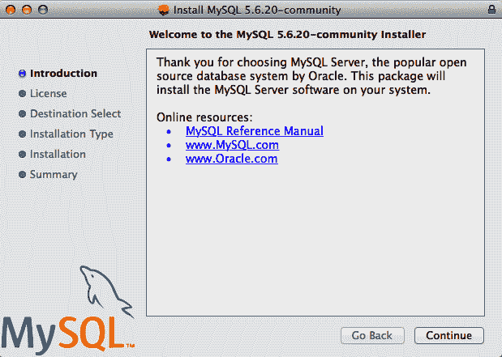
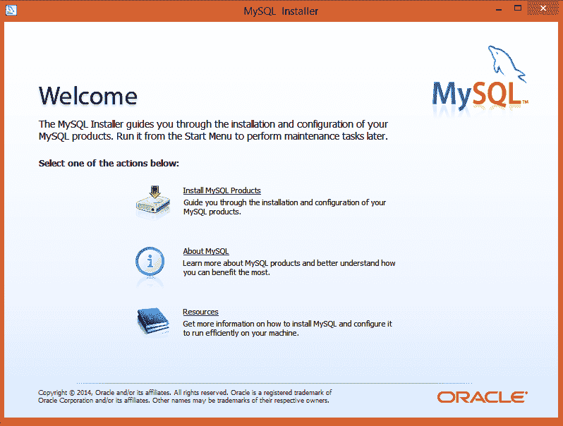

# 第九章：存储数据

尽管在终端打印输出很有趣，但在数据聚合和分析方面却不是非常有用。要使大多数网络爬虫实用，你需要能够保存它们抓取的信息。

本章涵盖了三种主要的数据管理方法，几乎适用于任何想象得到的应用程序。需要支持网站的后端或创建自己的 API 吗？你可能希望你的爬虫将数据写入数据库。需要快速简便地从互联网上收集文档并将它们存储到硬盘吗？你可能需要为此创建文件流。需要偶尔的提醒或每天的聚合数据吗？给自己发送邮件吧！

除了网页抓取之外，存储和处理大量数据的能力对于几乎任何现代编程应用都非常重要。事实上，本章的信息对于实现书后部分示例中的许多示例是必要的。如果你对自动化数据存储不熟悉，我强烈建议你至少浏览一下本章。

# 媒体文件

你可以通过两种主要方式存储媒体文件：通过引用和通过下载文件本身。将文件存储为引用只需保存主机服务器上文件所在位置的文本 URL，而不实际下载文件。这有几个优点：

+   当爬虫无需下载文件时，其运行速度更快，需要的带宽更少。

+   通过仅存储 URL，你可以节省自己机器上的空间。

+   编写仅存储 URL 并且不需要处理额外文件下载的代码更容易。

+   避免下载大文件可以减轻主机服务器的负载。

以下是缺点：

+   在你自己的网站或应用程序中嵌入这些 URL 被称为*热链接*，这样做是在互联网上迅速陷入麻烦的一种方式。

+   你不希望使用别人的服务器周期来为自己的应用程序托管媒体文件。

+   存储在特定 URL 上的文件可能会发生变化。如果例如你在公共博客上嵌入了热链接图像，博客所有者发现并决定将图像更改为不良内容，可能会导致尴尬的影响。虽然不严重但仍然不便的是，如果你打算稍后使用它们，存储的 URL 可能在以后某个时候消失。

+   真正的网络浏览器不仅仅请求页面的 HTML 然后离开。它们还下载页面所需的所有资产。下载文件可以使你的爬虫看起来像是人类在浏览网站，这是比仅仅记录链接更具优势的地方。

如果您在考虑是将文件还是文件的 URL 存储到文件中，则应自问您是否有可能多次查看或阅读该文件，或者这个文件的数据库是否将在其生命周期的大部分时间内闲置。如果答案是后者，则最好只存储 URL。如果是前者，请继续阅读！

用于检索网页内容的 urllib 库还包含用于检索文件内容的功能。以下程序使用`urllib.request.urlretrieve`从远程 URL 下载图像：

```py
from urllib.request import urlretrieve, urlopen
from bs4 import BeautifulSoup

html = urlopen('http://www.pythonscraping.com')
bs = BeautifulSoup(html, 'html.parser')
imageLocation = bs.find('img', {'alt': 'python-logo'})['src']
urlretrieve (imageLocation, 'logo.jpg')

```

这将从 *http://pythonscraping.com* 下载 Python 标志并将其存储为*logo.jpg*在脚本运行的同一目录中。

如果您只需要下载单个文件并知道如何命名它以及文件扩展名是什么，则此方法效果很好。但大多数爬虫不会只下载一个文件并结束。以下内容将从 *http://pythonscraping.com* 的主页下载所有内部文件，这些文件由任何标签的`src`属性链接到：

```py
import os
from urllib.request import urlretrieve, urlopen
from urllib.parse import urlparse
from bs4 import BeautifulSoup

downloadDir = 'downloaded'
baseUrl = 'https://pythonscraping.com/'
baseNetloc = urlparse(baseUrl).netloc

def getAbsoluteURL(source):
    if urlparse(baseUrl).netloc == '':
        return baseUrl + source
    return source

def getDownloadPath(fileUrl):
    parsed = urlparse(fileUrl)
    netloc = parsed.netloc.strip('/')
    path = parsed.path.strip('/')
    localfile = f'{downloadDir}/{netloc}/{path}'

    # Remove the filename from the path in order to 
    # make the directory structure leading up to it
    localpath = '/'.join(localfile.split('/')[:-1])
    if not os.path.exists(localpath):
        os.makedirs(localpath)
    return localfile

html = urlopen(baseUrl)
bs = BeautifulSoup(html, 'html.parser')
downloadList = bs.findAll(src=True)

for download in downloadList:
    fileUrl = getAbsoluteURL(download['src'])
    if fileUrl is not None:
        try:
            urlretrieve(fileUrl, getDownloadPath(fileUrl))
            print(fileUrl)
        except Exception as e:
            print(f'Could not retrieve {fileUrl} Error: {e}')

```

# 谨慎运行

你知道那些关于从互联网下载未知文件的警告吗？这个脚本会将它遇到的一切都下载到您计算机的硬盘上。这包括随机的 bash 脚本、*.exe*文件和其他可能的恶意软件。

你以为自己是安全的，因为你从未真正执行过发送到你的下载文件夹的任何内容吗？特别是如果您以管理员身份运行此程序，您就在自找麻烦。如果您遇到一个发送自身到*../../../../usr/bin/python*的网站文件会发生什么？下次您从命令行运行 Python 脚本时，您可能会在您的机器上部署恶意软件！

本程序仅供示例目的编写；不应随意部署而没有更广泛的文件名检查，并且只应在具有有限权限的帐户中运行。一如既往，备份您的文件，不要将敏感信息存储在硬盘上，并且运用一些常识会事半功倍。

此脚本使用了一个 lambda 函数（在第五章介绍）来选择首页上具有`src`属性的所有标签，然后清理和规范化 URL 以获取每个下载的绝对路径（确保丢弃外部链接）。然后，每个文件都将下载到本地文件夹*downloaded*中的自己的路径上。

注意，Python 的`os`模块被简要用于检索每个下载的目标目录，并在需要时创建丢失的目录路径。`os`模块充当 Python 与操作系统之间的接口，允许它操作文件路径，创建目录，获取有关运行进程和环境变量的信息，以及许多其他有用的事情。

# 将数据存储到 CSV

*CSV*，或称为*逗号分隔值*，是存储电子表格数据的最流行的文件格式之一。由于其简单性，它受到 Microsoft Excel 和许多其他应用程序的支持。以下是一个完全有效的 CSV 文件示例：

```py
fruit,cost
apple,1.00
banana,0.30
pear,1.25
```

与 Python 一样，在这里空白字符很重要：每行由换行符分隔，而行内列则由逗号分隔（因此称为“逗号分隔”）。其他形式的 CSV 文件（有时称为*字符分隔值*文件）使用制表符或其他字符分隔行，但这些文件格式较不常见且支持较少。

如果您希望直接从网上下载 CSV 文件并将其存储在本地，而无需进行任何解析或修改，您不需要阅读这一部分。使用前一部分描述的方法下载它们，就像下载任何其他文件并使用 CSV 文件格式保存它们一样。

使用 Python 的*csv*库非常容易修改 CSV 文件，甚至可以从头开始创建一个：

```py
import csv

csvFile = open('test.csv', 'w+')
try:
    writer = csv.writer(csvFile)
    writer.writerow(('number', 'number plus 2', 'number times 2'))
    for i in range(10):
        writer.writerow( (i, i+2, i*2))
finally:
    csvFile.close()
```

预防性提醒：在 Python 中创建文件是相当防弹的。如果*test.csv*不存在，Python 将自动创建该文件（但不会创建目录）。如果已存在，则 Python 将用新数据覆盖*test.csv*。

运行后，您应该会看到一个 CSV 文件：

```py
number,number plus 2,number times 2
0,2,0
1,3,2
2,4,4
...
```

一个常见的网页抓取任务是检索 HTML 表格并将其写入 CSV 文件。[维基百科的麦当劳餐厅列表](https://en.wikipedia.org/wiki/List_of_countries_with_McDonald%27s_restaurants)提供了一个包含链接、排序和其他 HTML 垃圾的相当复杂的 HTML 表格，需要在写入 CSV 之前将其丢弃。使用 BeautifulSoup 和`get_text()`函数，您可以在不到 20 行的代码中完成这一任务：

```py
import csv
from urllib.request import urlopen
from bs4 import BeautifulSoup

html = urlopen('https://en.wikipedia.org/wiki/
       List_of_countries_with_McDonald%27s_restaurants')
bs = BeautifulSoup(html, 'html.parser')
# The main comparison table is currently the first table on the page
table = bs.find('table',{'class':'wikitable'})
rows = table.findAll('tr')
csvFile = open('countries.csv', 'wt+')
writer = csv.writer(csvFile)
try:
    for row in rows:
        csvRow = []
        for cell in row.findAll(['td', 'th']):
            csvRow.append(cell.get_text().strip())
        writer.writerow(csvRow)
finally:
    csvFile.close()

```

# 获取单个表格的更简单方法

如果您经常遇到需要将多个 HTML 表格转换为 CSV 文件，或者需要将多个 HTML 表格收集到单个 CSV 文件中，这段脚本非常适合集成到爬虫中。然而，如果您只需要做一次，还有更好的工具可用：复制和粘贴。选择并复制 HTML 表格的所有内容，然后将其粘贴到 Excel 或 Google 文档中，即可获得所需的 CSV 文件，而无需运行脚本！

结果应该是一个保存在本地的格式良好的 CSV 文件，命名为*countries.csv*。

# MySQL

*MySQL*（正式发音为“my es-kew-el”，尽管许多人说“my sequel”）是当今最流行的开源关系数据库管理系统。与其他大型竞争对手相比，它的流行度在历史上一直与两个其他主要的闭源数据库系统：Microsoft 的 SQL Server 和 Oracle 的 DBMS 齐头并进，这在开源项目中是相当不寻常的。

它的流行不是没有原因的。对于大多数应用程序来说，选择 MySQL 很难出错。它是一个可扩展的、强大的、功能齐全的数据库管理系统，被顶级网站使用：YouTube[¹]、Twitter[²] 和 Facebook[³]，以及许多其他网站。

因为 MySQL 的普及性、价格（“免费”是一个非常好的价格）和开箱即用性，它非常适合用于网络抓取项目，并且我们将在本书的余下部分中继续使用它。

## 安装 MySQL

如果你对 MySQL 还不熟悉，安装数据库可能听起来有点吓人（如果你已经很熟悉了，可以跳过这一部分）。实际上，它和安装其他类型的软件一样简单。在核心层面，MySQL 由一组数据文件驱动，存储在服务器或本地机器上，这些文件包含数据库中存储的所有信息。MySQL 软件层在此基础上提供了通过命令行界面方便地与数据交互的方式。例如，以下命令会浏览数据文件并返回数据库中所有名字为“Ryan”的用户的列表：

```py
SELECT * FROM users WHERE firstname = "Ryan"
```

如果你使用基于 Debian 的 Linux 发行版（或者任何带有 `apt-get` 的系统），安装 MySQL 就像这样简单：

```py
$ sudo apt-get install mysql-server
```

只需关注安装过程，批准内存要求，并在提示时为新的 root 用户输入新密码即可。

对于 macOS 和 Windows，情况会有些棘手。如果还没有，请先创建一个 Oracle 账户然后再下载安装包。

如果你在 macOS 上，首先需要获取[安装包](http://dev.mysql.com/downloads/mysql/)。

选择 *.dmg* 包，并使用或创建 Oracle 账户来下载文件。文件打开后，你应该会被引导通过一个相当简单的安装向导（参见图 9-1）。

默认的安装步骤应该足够，对于本书的目的，我假设你已经安装了默认的 MySQL。

在 macOS 上安装 MySQL 后，可以按照以下步骤启动 MySQL 服务器：

```py
$ cd /usr/local/mysql
$ sudo ./bin/mysqld_safe
```

在 Windows 上，安装和运行 MySQL 稍微复杂一些，但好消息是有[一个便捷的安装程序](http://dev.mysql.com/downloads/windows/installer/)简化了这个过程。一旦下载完成，它将指导你完成所需的步骤（参见图 9-2）。



###### 图 9-1\. macOS 上的 MySQL 安装程序



###### 图 9-2\. Windows 上的 MySQL 安装程序

你应该能够通过选择默认选项来安装 MySQL，只有一个例外：在设置类型页面上，我建议你选择仅安装服务器，以避免安装大量额外的 Microsoft 软件和库。接下来，你可以使用默认的安装设置并按照提示启动你的 MySQL 服务器。

安装并运行 MySQL 服务器后，您仍然需要能够使用命令行与其进行交互。在 Windows 上，您可以使用[MySQL Shell](https://dev.mysql.com/downloads/shell/)工具。在 Mac 上，我喜欢使用[Homebrew package manager](https://brew.sh)安装命令行工具：

```py
$ brew install mysql

```

安装命令行工具后，您应该能够连接到 MySQL 服务器：

```py
$ mysql -u root -p

```

这将提示您输入安装过程中创建的根密码。

## 一些基本命令

在 MySQL 服务器运行后，您有多种选项可以与数据库进行交互。许多软件工具作为中介，使您不必经常处理 MySQL 命令（或至少较少处理）。诸如 phpMyAdmin 和 MySQL Workbench 的工具可以使快速查看、排序和插入数据变得简单。但是，熟悉命令行操作仍然非常重要。

除了变量名外，MySQL 是不区分大小写的；例如，`SELECT` 和 `sElEcT` 是相同的。然而，按照惯例，编写 MySQL 语句时所有 MySQL 关键字都应为大写。相反，大多数开发者更喜欢将其表和数据库名称使用小写，尽管这种标准经常被忽略。

当您首次登录 MySQL 时，还没有数据库可以添加数据，但是您可以创建一个：

```py
> CREATE DATABASE scraping;
```

由于每个 MySQL 实例可以有多个数据库，在您开始与数据库交互之前，您需要告诉 MySQL 您要使用哪个数据库：

```py
> USE scraping;
```

从此时起（至少直到您关闭 MySQL 连接或切换到另一个数据库），所有输入的命令都将针对新创建的`scraping`数据库运行。

一切看起来都很简单。在数据库中创建表应该也同样简单吧？让我们试着创建一个用于存储抓取的网页集合的表：

```py
> CREATE TABLE pages;
```

这将导致错误：

```py
ERROR 1113 (42000): A table must have at least 1 column
```

与数据库可以不含任何表存在不同，MySQL 中的表不能没有列存在。要在 MySQL 中定义列，必须在`CREATE TABLE <tablename>`语句后的括号内输入以逗号分隔的列列表：

```py
> CREATE TABLE pages (id BIGINT(7) NOT NULL AUTO_INCREMENT,
title VARCHAR(200), content VARCHAR(10000),
created TIMESTAMP DEFAULT CURRENT_TIMESTAMP, PRIMARY KEY(id));
```

每个列定义有三个部分：

+   名称（`id`，`title`，`created`，等等）

+   变量类型（`BIGINT(7)`，`VARCHAR`，`TIMESTAMP`）

+   可选的任何其他属性（`NOT NULL AUTO_INCREMENT`）

在列列表的末尾，您必须定义表的*关键字*。MySQL 使用关键字来组织表中的内容，以便进行快速查找。在本章后面，我将描述如何利用这些关键字来加快数据库操作，但现在，通常将表的`id`列作为关键字是最佳选择。

执行查询后，您可以随时使用`DESCRIBE`命令查看表的结构：

```py
> DESCRIBE pages;
+---------+----------------+------+-----+-------------------+----------------+
| Field   | Type           | Null | Key | Default           | Extra          |
+---------+----------------+------+-----+-------------------+----------------+
| id      | bigint(7)      | NO   | PRI | NULL              | auto_increment |
| title   | varchar(200)   | YES  |     | NULL              |                |
| content | varchar(10000) | YES  |     | NULL              |                |
| created | timestamp      | NO   |     | CURRENT_TIMESTAMP |                |
+---------+----------------+------+-----+-------------------+----------------+
4 rows in set (0.01 sec)

```

当然，这仍然是一个空表。您可以使用以下命令将测试数据插入到*pages*表中：

```py
> INSERT INTO pages (title, content) VALUES ("Test page title",
"This is some test page content. It can be up to 10,000 characters
long.");
```

注意，尽管表有四列 (`id`, `title`, `content`, `created`), 但你只需定义其中两列 (`title` 和 `content`) 就可以插入一行数据。这是因为 `id` 列是自动增加的（每次插入新行时 MySQL 自动添加 1），通常可以自行处理。此外，`timestamp` 列设置为默认包含当前时间。

当然，你可以覆盖这些默认设置：

```py
> INSERT INTO pages (id, title, content, created) VALUES (3, 
"Test page title",
"This is some test page content. It can be up to 10,000 characters
long.", "2014-09-21 10:25:32");
```

只要你提供给 `id` 列的整数在数据库中不存在，这个覆盖就可以完美运行。然而，这通常不是一个好的做法；最好让 MySQL 自行处理 `id` 和 `timestamp` 列，除非有充分的理由要做出不同的处理。

现在你的表中有了一些数据，你可以使用多种方法来选择这些数据。以下是几个 `SELECT` 语句的示例：

```py
> SELECT * FROM pages WHERE id = 2;
```

这个语句告诉 MySQL，“从 `pages` 中选择所有 `id` 等于 2 的行。”星号 (*) 充当通配符，在 `where id equals 2` 条件为真时返回所有行。它返回表中的第二行，或者如果没有 `id` 等于 2 的行，则返回空结果。例如，以下不区分大小写的查询返回所有 `title` 字段包含 “test” 的行（% 符号在 MySQL 字符串中充当通配符）：

```py
> SELECT * FROM pages WHERE title LIKE "%test%";
```

但是如果你有一张有很多列的表，你只想返回特定的一部分数据怎么办？不必选择全部，你可以像这样做：

```py
> SELECT id, title FROM pages WHERE content LIKE "%page content%";
```

这将只返回包含短语 “page content” 的 `id` 和 `title`。

`DELETE` 语句与 `SELECT` 语句的语法基本相同：

```py
> DELETE FROM pages WHERE id = 1;
```

因此，特别是在处理不能轻易恢复的重要数据库时，最好将任何 `DELETE` 语句首先编写为 `SELECT` 语句（在本例中为 `SELECT * FROM pages WHERE  id = 1`），测试以确保只返回要删除的行，然后用 `DELETE` 替换 `SELECT *`。许多程序员有编写 `DELETE` 语句时错用了条件或更糟糕的是匆忙时完全忽略了它的恐怖故事，导致客户数据丢失。不要让这种情况发生在你身上！

对于 `UPDATE` 语句也应该采取类似的预防措施：

```py
> UPDATE pages SET title="A new title",
content="Some new content" WHERE id=2;
```

本书只涉及简单的 MySQL 语句，进行基本的选择、插入和更新。如果你有兴趣学习更多关于这个强大数据库工具的命令和技巧，我推荐 Paul DuBois 的 [*MySQL Cookbook*](http://shop.oreilly.com/product/0636920032274.do)（O’Reilly）。

## 与 Python 集成

不幸的是，Python 对于 MySQL 的支持不是内置的。然而，许多开源库允许你与 MySQL 数据库交互。其中最流行的之一是 [PyMySQL](https://pypi.python.org/pypi/PyMySQL)。

截至撰写本文时，PyMySQL 的当前版本是 1.0.3，可以使用 pip 安装：

```py
$ pip install PyMySQL

```

安装完成后，你应该自动拥有 PyMySQL 包的访问权限。当你的本地 MySQL 服务器运行时，你应该能够成功执行以下脚本（记得为你的数据库添加 root 密码）：

```py
import pymysql
conn = pymysql.connect(
    host='127.0.0.1',
​    unix_socket='/tmp/mysql.sock',
​    user='root',
​    passwd=None,
​    db='mysql'
)
cur = conn.cursor()
cur.execute('USE scraping')
cur.execute('SELECT * FROM pages WHERE id=1')
print(cur.fetchone())
cur.close()
conn.close()
```

在这个示例中，引入了两种新的对象类型：连接对象（`conn`）和游标对象（`cur`）。

连接/游标模型在数据库编程中常用，尽管一些用户可能起初会发现区分这两者有些棘手。连接负责连接数据库，当然，还负责发送数据库信息，处理回滚（当需要中止一个查询或一组查询，并且需要将数据库返回到之前的状态时），以及创建新的游标对象。

一个连接可以有多个游标。游标跟踪某些*状态*信息，比如它正在使用哪个数据库。如果你有多个数据库并且需要在所有数据库中写入信息，你可能需要多个游标来处理这个任务。游标还包含它执行的最新查询的结果。通过调用游标的函数，比如`cur.fetchone()`，你可以访问这些信息。

在使用完游标和连接后，重要的是要关闭它们。如果不这样做，可能会导致*连接泄漏*，即未关闭的连接会积累起来，虽然不再使用，但软件无法关闭，因为它认为你可能仍在使用它们。这是经常导致数据库故障的问题之一（我既写过也修复过许多连接泄漏的 bug），所以记得关闭你的连接！

最常见的事情，你可能一开始想做的就是能够将你的爬取结果存储在数据库中。让我们看看如何实现这一点，使用之前的示例：维基百科爬虫。

在网页抓取时处理 Unicode 文本可能会很棘手。默认情况下，MySQL 不处理 Unicode。幸运的是，你可以启用这个功能（只需记住这样做会增加数据库的大小）。因为你可能会在维基百科上遇到各种丰富多彩的字符，现在是告诉你的数据库期望一些 Unicode 字符的好时机：

```py
ALTER DATABASE scraping CHARACTER SET = utf8mb4 COLLATE = utf8mb4_unicode_ci;
ALTER TABLE pages CONVERT TO CHARACTER SET utf8mb4 COLLATE utf8mb4_unicode_ci;
ALTER TABLE pages CHANGE title title VARCHAR(200) CHARACTER SET utf8mb4 COLLATE 
utf8mb4_unicode_ci;
ALTER TABLE pages CHANGE content content VARCHAR(10000) CHARACTER SET utf8mb4 
COLLATE utf8mb4_unicode_ci;
```

这四行改变了数据库的默认字符集，表格的字符集，以及两列的字符集，从`utf8mb4`（仍然是 Unicode，但对大多数 Unicode 字符的支持非常糟糕）到`utf8mb4_unicode_ci`。

如果你尝试将几个 umlauts 或者汉字插入数据库中的`title`或`content`字段，并且成功执行而没有错误，那么你就知道你成功了。

现在数据库已经准备好接受维基百科可能投射给它的各种内容，你可以运行以下操作：

```py
conn = pymysql.connect(host='127.0.0.1', unix_socket='/tmp/mysql.sock',
                       user='root', passwd=None, db='mysql', charset='utf8')
cur = conn.cursor()
cur.execute('USE scraping')

random.seed(datetime.datetime.now())

def store(title, content):
    cur.execute('INSERT INTO pages (title, content) VALUES '
        '("%s", "%s")', (title, content))
    cur.connection.commit()

def getLinks(articleUrl):
    html = urlopen('http://en.wikipedia.org'+articleUrl)
    bs = BeautifulSoup(html, 'html.parser')
    title = bs.find('h1').get_text()
    content = bs.find('div', {'id':'mw-content-text'}).find('p')
        .get_text()
    store(title, content)
    return bs.find('div', {'id':'bodyContent'}).find_all('a',
        href=re.compile('^(/wiki/)((?!:).)*$'))

links = getLinks('/wiki/Kevin_Bacon')
try:
    while len(links) > 0:
         newArticle = links[random.randint(0, len(links)-1)].attrs['href']
         print(newArticle)
         links = getLinks(newArticle)
finally:
    cur.close()
    conn.close()

```

在这里需要注意几点：首先，在数据库连接字符串中添加了`"charset='utf8'"`。这告诉连接应将所有信息以 UTF-8 发送到数据库（当然，数据库应已配置为处理此信息）。

其次，注意添加了一个`store`函数。它接收两个字符串变量`title`和`content`，并将它们添加到一个`INSERT`语句中，该语句由游标执行，然后由游标的连接提交。这是游标和连接分离的一个很好的例子；虽然游标存储了关于数据库及其自身上下文的信息，但它需要通过连接操作才能将信息发送回数据库并插入信息。

最后，你会发现在程序的主循环底部添加了一个`finally`语句。这确保了无论程序如何被中断或其执行过程中可能抛出的异常（因为网络是混乱的，你应该始终假设会抛出异常），在程序结束之前光标和连接都会立即关闭。在进行网络爬取并且有开放的数据库连接时，包括像这样的`try...finally`语句是个好主意。

虽然 PyMySQL 不是一个庞大的包，但这本书无法涵盖大量有用的功能。你可以在 PyMySQL 网站的[文档](https://pymysql.readthedocs.io/en/latest/)中查看更多信息。

## 数据库技术和良好实践

有些人将他们整个职业生涯都花在研究、调优和发明数据库上。我不是这些人之一，这本书也不是那种类型的书。然而，就计算机科学中的许多主题而言，你可以快速学到一些技巧，至少能使你的数据库对大多数应用程序足够、而且足够快速。

首先，除了少数例外情况，始终向你的表中添加`id`列。MySQL 中的所有表都必须至少有一个主键（MySQL 用来排序的关键列），因此 MySQL 需要知道如何对其进行排序，而且通常难以明智地选择这些键。

关于是使用人工创建的`id`列作为此键还是像`username`这样的唯一属性的争论已经在数据科学家和软件工程师中持续了多年，虽然我倾向于创建`id`列。尤其是当你处理网页抓取和存储他人数据时，这一点尤为真实。你根本不知道什么是真正独特的或非独特的，我之前也曾感到惊讶。

你的`id`列应该是自增的，并且作为所有表的主键使用。

其次，使用智能索引。一个词典（就像书中的那种，而不是 Python 对象）是按字母顺序索引的单词列表。这样，每当你需要一个单词时，只要知道它的拼写方式，就可以快速查找。你还可以想象一个根据单词定义按字母顺序排列的词典。除非你在玩某种奇怪的*危险边缘*游戏，需要根据定义找出单词，否则这种词典几乎没有用处。但是在数据库查找中，这类情况确实会发生。例如，你的数据库中可能有一个经常需要查询的字段：

```py
>SELECT * FROM dictionary WHERE definition="A small furry animal that says meow";
+------+-------+-------------------------------------+
| id   | word  | definition                          |
+------+-------+-------------------------------------+
|  200 | cat   | A small furry animal that says meow |
+------+-------+-------------------------------------+
1 row in set (0.00 sec)
```

你很可能想要在这个表中添加一个索引（除了已经存在的`id`索引），以使对`definition`列的查找更快速。不过，请记住，添加索引会增加新索引的空间占用，并在插入新行时增加额外的处理时间。特别是当你处理大量数据时，你应仔细考虑索引的权衡以及你需要索引多少的问题。为了使这个“definitions”索引变得更加轻便，你可以告诉 MySQL 仅对列值中的前 16 个字符进行索引。这条命令将在`definition`字段的前 16 个字符上创建一个索引：

```py
CREATE INDEX definition ON dictionary (id, definition(16));
```

当你需要通过完整定义来搜索单词时（尤其是如果定义值的前 16 个字符彼此非常不同），这个索引将使你的查找速度大大加快，并且不会显著增加额外的空间和前期处理时间。

关于查询时间与数据库大小之间的平衡（数据库工程中的基本平衡之一），特别是在大量自然文本数据的网络抓取中，常见的一个错误是存储大量重复数据。例如，假设你想要测量出现在多个网站上的某些短语的频率。这些短语可以从给定列表中找到，也可以通过文本分析算法自动生成。也许你会被诱惑将数据存储为这样的格式：

```py
+--------+--------------+------+-----+---------+----------------+
| Field  | Type         | Null | Key | Default | Extra          |
+--------+--------------+------+-----+---------+----------------+
| id     | int(11)      | NO   | PRI | NULL    | auto_increment |
| url    | varchar(200) | YES  |     | NULL    |                |
| phrase | varchar(200) | YES  |     | NULL    |                |
+--------+--------------+------+-----+---------+----------------+
```

每次在网站上找到一个短语并记录它所在的 URL 时，这样会向数据库中添加一行。然而，通过将数据拆分为三个单独的表，你可以极大地减少数据集：

```py
>DESCRIBE phrases
+--------+--------------+------+-----+---------+----------------+
| Field  | Type         | Null | Key | Default | Extra          |
+--------+--------------+------+-----+---------+----------------+
| id     | int(11)      | NO   | PRI | NULL    | auto_increment |
| phrase | varchar(200) | YES  |     | NULL    |                |
+--------+--------------+------+-----+---------+----------------+

 >DESCRIBE urls
 +-------+--------------+------+-----+---------+----------------+
| Field | Type         | Null | Key | Default | Extra          |
+-------+--------------+------+-----+---------+----------------+
| id    | int(11)      | NO   | PRI | NULL    | auto_increment |
| url   | varchar(200) | YES  |     | NULL    |                |
+-------+--------------+------+-----+---------+----------------+

>DESCRIBE foundInstances
+-------------+---------+------+-----+---------+----------------+
| Field       | Type    | Null | Key | Default | Extra          |
+-------------+---------+------+-----+---------+----------------+
| id          | int(11) | NO   | PRI | NULL    | auto_increment |
| urlId       | int(11) | YES  |     | NULL    |                |
| phraseId    | int(11) | YES  |     | NULL    |                |
| occurrences | int(11) | YES  |     | NULL    |                |
+-------------+---------+------+-----+---------+----------------+
```

尽管表定义更大，但你可以看到大多数列只是整数`id`字段，它们占用的空间要少得多。此外，每个 URL 和短语的完整文本仅存储一次。

除非安装第三方包或保持详细的日志记录，否则无法确定数据何时添加、更新或从数据库中删除。根据数据的可用空间、更改的频率以及确定这些更改发生时间的重要性，你可能需要考虑保留多个时间戳：`created`、`updated`和`deleted`。

## MySQL 中的“六度” 

第六章介绍了维基百科的六度问题，即通过一系列链接找到任意两个维基百科文章之间的连接的目标（即，通过从一个页面点击链接到达下一个页面的方式找到一种方法）。要解决这个问题，不仅需要构建可以爬取网站的机器人（这一点你已经做到了），还需要以建筑上合理的方式存储信息，以便以后轻松进行数据分析。

自增的 `id` 列，时间戳，和多个表格：它们在这里都发挥作用。为了找出如何最好地存储这些信息，你需要抽象地思考。一个链接简单地是连接页面 A 和页面 B 的东西。它同样可以将页面 B 连接到页面 A，但这将是一个独立的链接。你可以通过说，“在页面 A 上存在一个连接到页面 B 的链接来唯一标识一个链接。也就是说，`INSERT INTO` links (`fromPageId`, `toPageId`) VALUES (A, B);（其中 A 和 B 是两个页面的唯一 ID）。”

一个旨在存储页面和链接、创建日期和唯一 ID 的两表系统可以按以下方式构建：

```py
CREATE DATABASE wikipedia;
USE wikipedia;

CREATE TABLE wikipedia.pages (
  id INT NOT NULL AUTO_INCREMENT,
  url VARCHAR(255) NOT NULL,
  created TIMESTAMP NOT NULL DEFAULT CURRENT_TIMESTAMP,
  PRIMARY KEY (id)
);

CREATE TABLE wikipedia.links (
  id INT NOT NULL AUTO_INCREMENT,
  fromPageId INT NULL,
  toPageId INT NULL,
  created TIMESTAMP NOT NULL DEFAULT CURRENT_TIMESTAMP,
  PRIMARY KEY (id)
);

```

请注意，与之前打印页面标题的爬虫不同，你甚至没有将页面标题存储在 `pages` 表中。为什么呢？嗯，记录页面标题需要访问页面以检索它。如果你想要构建一个高效的网络爬虫来填充这些表，你希望能够存储页面以及链接到它的链接，即使你还没有必要访问页面。

尽管这并不适用于所有网站，但维基百科链接和页面标题之间的好处在于，一个可以通过简单操作变成另一个。例如，*http://en.wikipedia.org/wiki/Monty_Python* 表示页面的标题是“蒙提·派森”。

以下将存储在维基百科上具有“Bacon 数”（与凯文·贝肯页面之间的链接数，包括）小于或等于 6 的所有页面：

```py
from urllib.request import urlopen
from bs4 import BeautifulSoup
import re
import pymysql
from random import shuffle

conn = pymysql.connect(host='127.0.0.1', unix_socket='/tmp/mysql.sock',
                       user='root', passwd='password', db='mysql', 
                             charset='utf8')
cur = conn.cursor()
cur.execute('USE wikipedia')

def insertPageIfNotExists(url):
    cur.execute('SELECT id FROM pages WHERE url = %s LIMIT 1', (url))
    page = cur.fetchone()
    if not page:
        cur.execute('INSERT INTO pages (url) VALUES (%s)', (url))
        conn.commit()
        return cur.lastrowid
    else:
        return page[0]

def loadPages():
    cur.execute('SELECT url FROM pages')
    return [row[0] for row in cur.fetchall()]

def insertLink(fromPageId, toPageId):
    cur.execute(
        'SELECT EXISTS(SELECT 1 FROM links WHERE fromPageId = %s\
 AND toPageId = %s)'
        ,(int(fromPageId),
        int(toPageId))
    )
    if not cur.fetchone()[0]:
        cur.execute('INSERT INTO links (fromPageId, toPageId) VALUES (%s, %s)', 
                    (int(fromPageId), int(toPageId)))
        conn.commit()

def pageHasLinks(pageId):
    cur.execute(
        'SELECT EXISTS(SELECT 1 FROM links WHERE fromPageId = %s)'
        , (int(pageId))
    )
    return cur.fetchone()[0]

def getLinks(pageUrl, recursionLevel, pages):
    if recursionLevel > 4:
        return

    pageId = insertPageIfNotExists(pageUrl)
    html = urlopen(f'http://en.wikipedia.org{pageUrl}')
    bs = BeautifulSoup(html, 'html.parser')
    links = bs.findAll('a', href=re.compile('^(/wiki/)((?!:).)*$'))
    links = [link.attrs['href'] for link in links]

    for link in links:
        linkId = insertPageIfNotExists(link)
        insertLink(pageId, linkId)
        if not pageHasLinks(linkId):
            print(f'Getting {link}')
            pages.append(link)
            getLinks(link, recursionLevel+1, pages)
        else:
            print(f'Already fetched {link}')

getLinks('/wiki/Kevin_Bacon', 0, loadPages()) 
cur.close()
conn.close()

```

这里的三个函数使用 PyMySQL 与数据库交互：

`insertPageIfNotExists`

正如其名称所示，如果页面记录尚不存在，此函数将插入一个新的页面记录。这与存储在 `pages` 中的所有收集页面的运行列表一起，确保页面记录不会重复。它还用于查找 `pageId` 数字以创建新的链接。

`insertLink`

这在数据库中创建一个新的链接记录。如果该链接已经存在，它将不会创建一个链接。即使页面上存在两个或多个相同的链接，对于我们的目的来说，它们是同一个链接，代表同一个关系，并且应该被计为一个记录。即使在同一页面上运行多次程序，这也有助于保持数据库的完整性。

`loadPages`

这会将数据库中所有当前页面加载到列表中，以便确定是否应该访问新页面。页面也会在运行时收集，因此如果此爬虫仅运行一次，从空数据库开始理论上不应该需要`loadPage`。然而，实际上可能会出现问题。网络可能会中断，或者您可能希望在几段时间内收集链接，因此爬虫能够重新加载自身并不会失去任何进展是非常重要的。

您应该注意使用`loadPages`和它生成的`pages`列表确定是否访问页面时可能出现的一个潜在问题：一旦加载每个页面，该页面上的所有链接都被存储为页面，即使它们尚未被访问——只是它们的链接已被看到。如果爬虫停止并重新启动，所有这些“已看到但未访问”的页面将永远不会被访问，并且来自它们的链接将不会被记录。可以通过向每个页面记录添加布尔变量`visited`并仅在该页面已加载并记录其自身的传出链接时将其设置为`True`来修复此问题。

然而，对于我们的目的来说，目前这个解决方案已经足够了。如果您可以确保相对较长的运行时间（或只需一次运行时间），并且没有必要确保完整的链接集（只需要一个大数据集进行实验），则不需要添加`visited`变量。

对于解决从[凯文·贝肯](https://en.wikipedia.org/wiki/Kevin_Bacon)到[埃里克·艾多](https://en.wikipedia.org/wiki/Eric_Idle)的问题的延续以及最终解决方案，请参阅解决有向图问题的“维基百科的六度：结论”。

# 电子邮件

就像网页通过 HTTP 发送一样，电子邮件通过 SMTP（简单邮件传输协议）发送。而且就像您使用 Web 服务器客户端处理通过 HTTP 发送网页一样，服务器使用各种电子邮件客户端（如 Sendmail、Postfix 或 Mailman）来发送和接收电子邮件。

尽管使用 Python 发送电子邮件相对简单，但确实需要您可以访问运行 SMTP 的服务器。在服务器或本地计算机上设置 SMTP 客户端很棘手，超出了本书的范围，但许多优秀的资源可以帮助完成此任务，特别是如果您正在运行 Linux 或 macOS。

以下代码示例假设您在本地运行 SMTP 客户端。（要将此代码修改为远程 SMTP 客户端，请将`localhost`更改为您的远程服务器地址。）

使用 Python 发送电子邮件仅需九行代码：

```py
import smtplib
from email.mime.text import MIMEText

msg = MIMEText('The body of the email is here')

msg['Subject'] = 'An Email Alert'
msg['From'] = 'ryan@pythonscraping.com'
msg['To'] = 'webmaster@pythonscraping.com'

s = smtplib.SMTP('localhost')
s.send_message(msg)
s.quit()

```

Python 包含两个重要的包用于发送电子邮件：*smtplib* 和 *email*。

Python 的 email 模块包含用于创建要发送的电子邮件包的有用格式化函数。这里使用的 `MIMEText` 对象创建了一个空的电子邮件，格式化为使用低级 MIME（多用途互联网邮件扩展）协议进行传输，高级别的 SMTP 连接是在此基础上建立的。`MIMEText` 对象 `msg` 包含了电子邮件的收件人和发件人地址，以及一个主体和一个头部，Python 使用这些信息来创建一个格式正确的电子邮件。

smtplib 包包含了处理与服务器连接的信息。就像连接到 MySQL 服务器一样，这个连接必须在每次创建时关闭，以避免创建过多的连接。

这个基本的电子邮件功能可以通过将其放在一个函数中来扩展并使其更有用：

```py
import smtplib
from email.mime.text import MIMEText
from bs4 import BeautifulSoup
from urllib.request import urlopen
import time

def sendMail(subject, body):
    msg = MIMEText(body)
    msg['Subject'] = subject
    msg['From'] ='christmas_alerts@pythonscraping.com'
    msg['To'] = 'ryan@pythonscraping.com'

    s = smtplib.SMTP('localhost')
    s.send_message(msg)
    s.quit()

bs = BeautifulSoup(urlopen('https://isitchristmas.com/'), 'html.parser')
while(bs.find('a', {'id':'answer'}).attrs['title'] == 'NO'):
    print('It is not Christmas yet.')
    time.sleep(3600)
    bs = BeautifulSoup(urlopen('https://isitchristmas.com/'), 'html.parser')

sendMail('It\'s Christmas!', 
         'According to http://itischristmas.com, it is Christmas!')

```

这个特定脚本每小时检查一次网站 [*https://isitchristmas.com*](https://isitchristmas.com)（其主要功能是根据一年中的日期显示一个巨大的 YES 或 NO）。如果它看到的不是 NO，它将发送给您一个警报邮件，提醒您现在是圣诞节。

尽管这个特定程序看起来可能比挂在墙上的日历没有多大用处，但它可以稍加调整，做出各种非常有用的事情。它可以在网站停机、测试失败，甚至是你在亚马逊等待的缺货产品出现时向你发送警报邮件——而你的墙挂日历都做不到这些。

¹ Joab Jackson，[“YouTube 用 Go 代码扩展 MySQL”](http://bit.ly/1LWVmc8)，*PCWorld*，2012 年 12 月 15 日。

² Jeremy Cole 和 Davi Arnaut，[“Twitter 上的 MySQL”](http://bit.ly/1KHDKns)，*Twitter 工程博客*，2012 年 4 月 9 日。

³ [“MySQL 和数据库工程：Mark Callaghan”](http://on.fb.me/1RFMqvw)，Facebook 工程师，2012 年 3 月 4 日。
