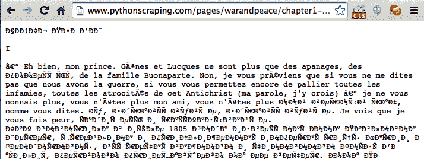
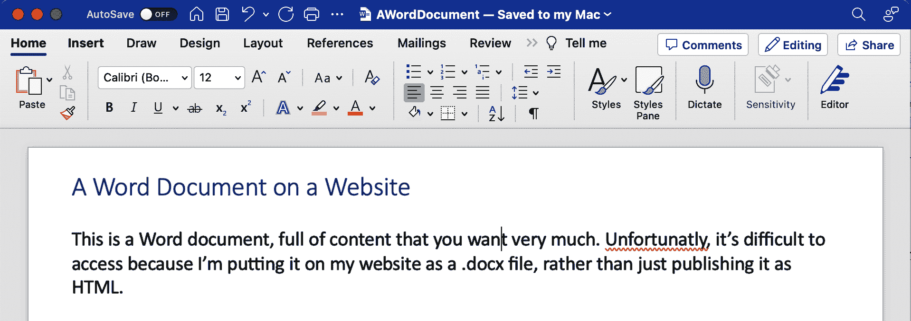

# 第十章：读取文档

现在很容易把互联网主要看作是由基于文本的网站和新型 Web 2.0 多媒体内容构成的集合，而这些内容大部分可以忽略不计以便进行网络抓取。然而，这忽略了互联网最根本的本质：作为传输文件的内容不可知的载体。

尽管互联网在上世纪 60 年代末已经存在，但 HTML 直到 1992 年才首次亮相。在此之前，互联网主要由电子邮件和文件传输组成；我们今天所知的网页概念并不存在。换句话说，互联网不是 HTML 文件的集合。它是许多类型文档的集合，其中 HTML 文件通常用作展示它们的框架。如果不能阅读各种类型的文档，包括文本、PDF、图像、视频、电子邮件等，我们将错过大量可用数据的一部分。

本章涵盖了处理文档的内容，无论是将它们下载到本地文件夹还是阅读它们并提取数据。您还将了解处理各种文本编码，这使得即使是阅读外语 HTML 页面也变得可能。

# 文档编码

文档的编码告诉应用程序——无论是您计算机的操作系统还是您自己的 Python 代码——如何读取它。这种编码通常可以从其文件扩展名中推断出来，尽管文件扩展名并不一定反映其编码。例如，我可以将*myImage.jpg*保存为*myImage.txt*而不会出现问题——至少直到我的文本编辑器试图打开它。幸运的是，这种情况很少见，通常文件扩展名就足够了解它以正确地阅读。

从根本上讲，所有文档都是用 0 和 1 编码的。此外，编码算法定义了诸如“每个字符多少位”或“每个像素颜色用多少位表示”（对于图像文件）之类的内容。此外，您可能还有一层压缩或某种空间减少算法，如 PNG 文件的情况。

尽管一开始处理非 HTML 文件可能看起来令人畏惧，但请放心，通过正确的库，Python 将能够适应处理任何格式的信息。文本文件、视频文件和图像文件之间唯一的区别在于它们的 0 和 1 的解释方式。本章涵盖了几种常见的文件类型：文本、CSV、PDF 和 Word 文档。

注意，这些从根本上讲都是存储文本的文件。关于处理图像的信息，请建议您阅读本章以熟悉处理和存储不同类型文件，然后转到第十六章获取更多有关图像处理的信息！

# 文本

在线存储纯文本文件有些不寻常，但它在极简或老式网站中很受欢迎，用于存储大量文本文件。例如，互联网工程任务组(IETF)将其所有已发布文档存储为 HTML、PDF 和文本文件（参见[*https://www.ietf.org/rfc/rfc1149.txt*](https://www.ietf.org/rfc/rfc1149.txt) 作为示例）。大多数浏览器将正常显示这些文本文件，你应该能够毫无问题地进行抓取。

对于大多数基本文本文档，比如位于[*http://www.pythonscraping.com/pages/warandpeace/chapter1.txt*](http://www.pythonscraping.com/pages/warandpeace/chapter1.txt) 的练习文件，你可以使用以下方法：

```py
from urllib.request import urlopen
textPage = urlopen('http://www.pythonscraping.com/'\
    'pages/warandpeace/chapter1.txt')
print(textPage.read())
```

通常，当你使用`urlopen`检索页面时，你会将其转换为`BeautifulSoup`对象以解析 HTML。在这种情况下，你可以直接读取页面。将其转换为 BeautifulSoup 对象，虽然完全可行，但却是适得其反的——没有 HTML 可解析，因此该库将变得无用。一旦将文本文件读取为字符串，你只需像处理其他读入 Python 的字符串一样分析它即可。当然，这里的缺点是你无法使用 HTML 标签作为上下文线索，指导你找到实际需要的文本，而非你不想要的文本。当你尝试从文本文件中提取特定信息时，这可能会带来挑战。

## 文本编码与全球互联网

大多数情况下，文件扩展名就足以告诉你如何正确读取文件。然而，最基本的所有文档——*.txt* 文件，奇怪的是，这个规则不适用。

使用上述描述的方法读取文本通常会很好地运行，成功率达到 10 次中的 9 次。然而，在处理互联网文本时可能会遇到一些棘手的问题。接下来，我们将介绍从 ASCII 到 Unicode 到 ISO 的英语和外语编码基础，以及如何处理它们。

### 文本编码的历史

ASCII 最早在 1960 年代开发，当时比特昂贵，除了拉丁字母和少数标点符号外，没有理由编码其他内容。因此，只使用 7 位来编码 128 个大写字母、小写字母和标点符号。即使有了所有这些创意，他们仍然有 33 个非打印字符，随着技术的变化，其中一些被使用、替换或变为过时。对每个人来说，都有足够的空间，对吧？

正如任何程序员所知道的那样，7 是一个奇怪的数字。它不是一个好看的 2 的幂，但它非常接近。20 世纪 60 年代的计算机科学家们争论是否应该添加一个额外的位，以便获得一个好看的圆整数，而不是为了减少文件占用的空间。最终，7 位赢得了。然而，在现代计算中，每个 7 位序列在开头填充了一个额外的 0¹，留下了我们两全其美的结果——文件增大了 14%，同时只有 128 个字符的灵活性。

在 1990 年代初期，人们意识到不仅仅是英语存在更多的语言，如果计算机能够显示它们将是非常好的。一个名为 Unicode 联盟的非营利组织尝试通过为每个需要在任何文本文档中使用的字符建立编码来实现一种通用的文本编码器。目标是包括从本书所写的拉丁字母到西里尔字母（кириллица）、汉字象形文字、数学和逻辑符号（⨊、≥），甚至是表情符号和其他符号，如生化危险标志（☣）和和平符号（☮）的所有内容。

最终产生的编码器，你可能已经知道，被称为*UTF-8*，这个名称令人困惑地指的是“通用字符集—转换格式 8 位”。这里的*8 位*并不是每个字符的大小，而是一个字符需要显示的最小大小。

UTF-8 字符的实际大小是灵活的。它可以从 1 字节到 4 字节不等，这取决于它在可能字符列表中的位置（更常见的字符用较少的字节编码；更晦涩的字符需要更多字节）。

这种灵活的编码是如何实现的？起初，使用 7 位和最终无用的前导 0 在 ASCII 中看起来像是一个设计缺陷，但证明对 UTF-8 是一个巨大的优势。因为 ASCII 如此流行，Unicode 决定利用这个前导 0 位，声明所有以 0 开头的字节表示该字符只使用一个字节，并使 ASCII 和 UTF-8 的两种编码方案相同。因此，以下字符在 UTF-8 和 ASCII 中都是有效的：

```py
01000001 - A
01000010 - B
01000011 - C

```

以下字符仅在 UTF-8 中有效，如果将文档解释为 ASCII 文档，则将呈现为不可打印字符。

```py
11000011 10000000 - À
11000011 10011111 - ß
11000011 10100111 - ç
```

除了 UTF-8 之外，还存在其他 UTF 标准，如 UTF-16、UTF-24 和 UTF-32，尽管在正常情况下很少遇到使用这些格式编码的文档，这超出了本书的范围。

尽管 ASCII 的这一原始“设计缺陷”对 UTF-8 有重大优势，但劣势并未完全消失。每个字符中的前 8 位信息仍然只能编码 128 个字符，而不是完整的 256 个。在需要多个字节的 UTF-8 字符中，额外的前导位被花费在校验位上，而不是字符编码上。在 4 字节字符的 32 位中，仅使用 21 位用于字符编码，共计 2,097,152 个可能的字符，其中目前已分配 1,114,112 个。

当然，所有通用语言编码标准的问题在于，任何单一外语编写的文档可能比其实际需要的要大得多。尽管您的语言可能只包含大约 100 个字符，但每个字符需要 16 位，而不像英语专用的 ASCII 那样只需 8 位。这使得 UTF-8 中的外语文本文档大约是英语文本文档的两倍大小，至少对于不使用拉丁字符集的外语而言。

ISO 通过为每种语言创建特定编码来解决这个问题。与 Unicode 类似，它使用与 ASCII 相同的编码，但在每个字符的开头使用填充 0 位，以便为所有需要的语言创建 128 个特殊字符。这对于欧洲语言尤其有利，这些语言也严重依赖拉丁字母表（保留在编码的位置 0-127），但需要额外的特殊字符。这使得 ISO-8859-1（为拉丁字母表设计）可以拥有分数（如½）或版权符号（©）等符号。

其他 ISO 字符集，比如 ISO-8859-9（土耳其语）、ISO-8859-2（德语等多种语言）和 ISO-8859-15（法语等多种语言），在互联网上也很常见。

尽管 ISO 编码文档的流行度近年来有所下降，但约有 9% 的互联网网站仍使用某种 ISO 格式²，因此在抓取网站前了解和检查编码是至关重要的。

### 编码的实际应用

在前一节中，您使用了 `urlopen` 的默认设置来读取可能在互联网上遇到的文本文档。这对大多数英文文本效果很好。然而，一旦遇到俄语、阿拉伯语，或者甚至像“résumé”这样的单词，可能会遇到问题。

例如，看下面的代码：

```py
from urllib.request import urlopen
textPage = urlopen('http://www.pythonscraping.com/'\
    'pages/warandpeace/chapter1-ru.txt')
print(textPage.read())
```

这读取了原版《战争与和平》的第一章（用俄语和法语写成），并将其打印到屏幕上。屏幕文本部分内容如下：

```py
b"\xd0\xa7\xd0\x90\xd0\xa1\xd0\xa2\xd0\xac \xd0\x9f\xd0\x95\xd0\xa0\xd0\x92\xd0\
x90\xd0\xaf\n\nI\n\n\xe2\x80\x94 Eh bien, mon prince.
```

此外，使用大多数浏览器访问该页面会导致乱码（见 Figure 10-1）。



###### 图 10-1\. 用 ISO-8859-1 编码的法语和西里尔文本，许多浏览器中的默认文本文档编码

即使对于母语为俄语的人来说，这可能会有些难以理解。问题在于 Python 试图将文档读取为 ASCII 文档，而浏览器试图将其读取为 ISO-8859-1 编码的文档。当然，两者都没有意识到它实际上是一个 UTF-8 文档。

您可以显式地定义字符串为 UTF-8，这样正确地将输出格式化为西里尔字符：

```py
from urllib.request import urlopen

textPage = urlopen('http://www.pythonscraping.com/'\
    'pages/warandpeace/chapter1-ru.txt')
print(str(textPage.read(), 'utf-8'))
```

使用 BeautifulSoup 实现这一概念如下：

```py
html = urlopen('http://en.wikipedia.org/wiki/Python_(programming_language)')
bs = BeautifulSoup(html, 'html.parser')
content = bs.find('div', {'id':'mw-content-text'}).get_text()
content = bytes(content, 'UTF-8')
content = content.decode('UTF-8')
```

Python 默认将所有字符编码为 UTF-8。您可能会倾向于不作更改，并为编写的每个网络抓取器使用 UTF-8 编码。毕竟，UTF-8 也能顺利处理 ASCII 字符以及外语字符。然而，重要的是要记住，有 9% 的网站使用某种 ISO 编码版本，因此您无法完全避免这个问题。

不幸的是，在处理文本文档时，无法确定文档具体使用的编码。一些库可以检查文档并做出最佳猜测（使用一些逻辑来认识到“рассказє可能不是一个单词），但很多时候它们会出错。

幸运的是，在 HTML 页面的情况下，编码通常包含在网站 `<head>` 部分的标签中。大多数网站，特别是英语网站，都有这样的标签：

```py
<meta charset="utf-8" />
```

而 [ECMA International 的网站](http://www.ecma-international.org) 就有这个标签:³

```py
<META HTTP-EQUIV="Content-Type" CONTENT="text/html; charset=iso-8859-1">
```

如果您计划大量进行网页抓取，特别是国际网站，最好查找这个元标签，并在读取页面内容时使用它推荐的编码方式。

# CSV

在进行网页抓取时，您可能会遇到 CSV 文件或喜欢以这种方式格式化数据的同事。幸运的是，Python 有一个 [出色的库](https://docs.python.org/3.4/library/csv.html) 既可以读取也可以写入 CSV 文件。虽然该库能处理多种 CSV 变体，但本节主要关注标准格式。如果您有特殊情况需要处理，请参考文档！

## 读取 CSV 文件

Python 的 *csv* 库主要用于处理本地文件，假设需要处理的 CSV 数据存储在您的计算机上。不幸的是，情况并非总是如此，特别是在进行网页抓取时。有几种方法可以解决这个问题：

+   手动下载文件并将 Python 指向本地文件位置。

+   编写一个 Python 脚本来下载文件，读取文件，并在检索后（可选）删除文件。

+   从网页中检索文件字符串，并将字符串包装在 `StringIO` 对象中，以便其像文件一样运行。

尽管前两种选项可行，但将文件保存在硬盘上会占用空间，而你完全可以将它们保存在内存中，这是不良实践。最好的做法是将文件作为字符串读入，并将其包装在一个对象中，使 Python 能够将其视为文件，而无需保存文件。以下脚本从互联网获取 CSV 文件（在本例中，是[*http://pythonscraping.com/files/MontyPythonAlbums.csv*](http://pythonscraping.com/files/MontyPythonAlbums.csv)上的 Monty Python 专辑列表），并逐行将其打印到终端：

```py
from urllib.request import urlopen
from io import StringIO
import csv

data = urlopen('http://pythonscraping.com/files/MontyPythonAlbums.csv')
              .read().decode('ascii', 'ignore')
dataFile = StringIO(data)
csvReader = csv.reader(dataFile)

for row in csvReader:
    print(row)
```

输出看起来像这样：

```py
['Name', 'Year']
["Monty Python's Flying Circus", '1970']
['Another Monty Python Record', '1971']
["Monty Python's Previous Record", '1972']
...
```

正如你从代码示例中看到的那样，`csv.reader`返回的读取器对象是可迭代的，并由 Python 列表对象组成。因此，`csvReader`对象中的每一行都可以通过以下方式访问：

```py
for row in csvReader:
    print('The album "'+row[0]+'" was released in '+str(row[1]))
```

这是输出：

```py
The album "Name" was released in Year
The album "Monty Python's Flying Circus" was released in 1970
The album "Another Monty Python Record" was released in 1971
The album "Monty Python's Previous Record" was released in 1972
...
```

注意第一行：`The album "Name" was released in Year`。尽管这可能是编写示例代码时容易忽略的结果，但在现实世界中，你不希望这些内容出现在你的数据中。一个不那么熟练的程序员可能只是跳过`csvReader`对象中的第一行，或者编写一个特殊情况来处理它。幸运的是，`csv.reader`函数的替代方案会自动处理所有这些。进入`DictReader`：

```py
from urllib.request import urlopen
from io import StringIO
import csv

data = urlopen('http://pythonscraping.com/files/MontyPythonAlbums.csv')
              .read().decode('ascii', 'ignore')
dataFile = StringIO(data)
dictReader = csv.DictReader(dataFile)

print(dictReader.fieldnames)

for row in dictReader:
    print(row)
```

`csv.DictReader`将 CSV 文件中每一行的值作为字典对象返回，而不是列表对象，字段名称存储在变量`dictReader.fieldnames`中，并作为每个字典对象的键：

```py
['Name', 'Year']
{'Name': 'Monty Python's Flying Circus', 'Year': '1970'}
{'Name': 'Another Monty Python Record', 'Year': '1971'}
{'Name': 'Monty Python's Previous Record', 'Year': '1972'}
```

当然，与`csvReader`相比，创建、处理和打印这些`DictReader`对象需要稍长时间，但其便利性和可用性往往超过了额外的开销。此外，请记住，在进行网页抓取时，从外部服务器请求和检索网站数据所需的开销几乎总是任何你编写的程序中不可避免的限制因素，因此担心哪种技术可以减少总运行时间的微秒级别问题通常是没有意义的！

# PDF

作为 Linux 用户，我深知收到一个*.docx*文件，而我的非微软软件将其搞乱的痛苦，还有努力寻找解析某些新的 Apple 媒体格式的解码器。在某些方面，Adobe 在 1993 年创建其便携式文档格式（PDF）方面具有革命性。PDF 允许不同平台的用户以完全相同的方式查看图像和文本文档，而不受查看平台的影响。

尽管将 PDF 存储在网络上有点过时（为什么要将内容存储在静态、加载缓慢的格式中，而不是编写 HTML 呢？），但 PDF 仍然是无处不在的，特别是在处理官方表格和文件时。

2009 年，英国人尼克·因斯（Nick Innes）因向巴克莱市议会根据英国版《信息自由法》请求公开学生测试结果信息而成为新闻人物。经过一些重复请求和拒绝后，他最终以 184 份 PDF 文档的形式收到了他寻找的信息。

虽然 Innes 坚持不懈，并最终获得了一个更合适格式的数据库，但如果他是一个专业的网络爬虫，他很可能本可以节省很多时间，并直接使用 Python 的许多 PDF 解析模块处理 PDF 文档。

不幸的是，由于 PDF 是一个相对简单和开放源码的文档格式，在 PDF 解析库方面竞争激烈。这些项目通常会在多年间建立、弃用、重建。目前最受欢迎、功能齐全且易于使用的库是 [pypdf](https://pypi.org/project/pypdf/)。

Pypdf 是一个免费的开源库，允许用户从 PDF 中提取文本和图像。它还允许您对 PDF 文件执行操作，并且如果您想生成 PDF 文件而不仅仅是阅读它们，也可以直接从 Python 进行操作。

您可以像往常一样使用 pip 进行安装：

```py
$ pip install pypdf

```

文档位于 [*https://pypdf.readthedocs.io/en/latest/index.html*](https://pypdf.readthedocs.io/en/latest/index.html)。

下面是一个基本的实现，允许您从本地文件对象中读取任意 PDF 到字符串：

```py
from urllib.request import urlretrieve
from pypdf import PdfReader

urlretrieve(
    'http://pythonscraping.com/pages/warandpeace/chapter1.pdf',
    'chapter1.pdf'
)
reader = PdfReader('chapter1.pdf')

for page in reader.pages:
    print(page.extract_text())

```

这提供了熟悉的纯文本输出：

```py
CHAPTER I

"Well, Prince, so Genoa and Lucca are now just family estates of
the Buonapartes. But I warn you, if you don't tell me that this
means war, if you still try to defend the infamies and horrors
perpetrated by that Antichrist- I really believe he is Antichrist- I will 

```

注意，PDF 文件参数必须是一个实际的文件对象。在将其传递给 `Pdfreader` 类之前，您必须先将文件下载到本地。然而，如果您处理大量的 PDF 文件，并且不希望保留原始文件，您可以在从文本中提取后，通过再次将相同文件名传递给 `urlretrieve` 来覆盖先前的文件。

Pypdf 的输出可能不完美，特别是对于带有图像、奇怪格式文本或以表格或图表形式排列的 PDF。然而，对于大多数仅包含文本的 PDF，输出应与将 PDF 视为文本文件时的输出没有区别。

# Microsoft Word 和 .docx

冒犯微软朋友的风险在此：我不喜欢 Microsoft Word。并不是因为它本质上是个糟糕的软件，而是因为它的用户如何误用它。它有一种特殊的才能，可以将本应是简单文本文档或 PDF 的内容转变为体积庞大、打开缓慢、易于在机器之间丢失所有格式的东西，并且由于某种原因，在内容通常意味着静态的情况下却是可编辑的。

Word 文件是为内容创建而设计，而不是为内容共享。尽管如此，在某些网站上它们无处不在，包含重要文件、信息，甚至图表和多媒体；总之，所有可以和应该使用 HTML 创建的内容。

在约 2008 年之前，Microsoft Office 产品使用专有的 *.doc* 文件格式。这种二进制文件格式难以阅读，而且其他文字处理软件的支持很差。为了跟上时代并采用许多其他软件使用的标准，Microsoft 决定使用基于 Open Office XML 的标准，使得这些文件与开源及其他软件兼容。

不幸的是，Python 对于由 Google Docs、Open Office 和 Microsoft Office 使用的此文件格式的支持仍然不够完善。有 [python-docx 库](http://python-docx.readthedocs.org/en/latest/)，但它只能让用户创建文档并仅读取基本的文件数据，如文件的大小和标题，而不是实际的内容。要读取 Microsoft Office 文件的内容，您需要自己解决方案。

第一步是从文件中读取 XML：

```py
from zipfile import ZipFile
from urllib.request import urlopen
from io import BytesIO

wordFile = urlopen('http://pythonscraping.com/pages/AWordDocument.docx').read()
wordFile = BytesIO(wordFile)
document = ZipFile(wordFile)
xml_content = document.read('word/document.xml')
print(xml_content.decode('utf-8'))
```

这段代码将一个远程 Word 文档作为二进制文件对象读取（`BytesIO` 类似于本章前面使用的 `StringIO`），使用 Python 的核心 zipfile 库解压缩它（所有的 *.docx* 文件都被压缩以节省空间），然后读取解压后的 XML 文件。

[*http://pythonscraping.com/pages/AWordDocument.docx*](http://pythonscraping.com/pages/AWordDocument.docx) 上展示了 图 10-2 中的 Word 文档。



###### 图 10-2。这是一个 Word 文档，里面可能包含您非常想要的内容，但由于我将其作为 *.docx* 文件放在网站上而不是发布为 HTML，所以访问起来很困难。单词“unfortunatly”拼写错误。

Python 脚本读取我简单 Word 文档的输出如下所示：

```py
<w:document xmlns:wpc="http://schemas.microsoft.com/office/word/2010/
wordprocessingCanvas" xmlns:cx="http://schemas.microsoft.com/office/d
rawing/2014/chartex" xmlns:cx1="http://schemas.microsoft.com/office/d
rawing/2015/9/8/chartex" xmlns:cx2="http://schemas.microsoft.com/offi
ce/drawing/2015/10/21/chartex" xmlns:cx3="http://schemas.microsoft.co
m/office/drawing/2016/5/9/chartex" xmlns:cx4="http://schemas.microsof *`...More schema data here...`*  <w:body><w:p w14:paraId="19A18025" w14:textId="54C8E458" w:rsidR="007
45992" w:rsidRDefault="00BF6C9C" w:rsidP="00BF6C9C"><w:pPr><w:pStyle 
w:val="Heading1"/></w:pPr><w:r><w:t>A Word Document on a Website</w:t
></w:r></w:p><w:p w14:paraId="501E7A3A" w14:textId="77777777" w:rsidR
="00BF6C9C" w:rsidRDefault="00BF6C9C" w:rsidP="00BF6C9C"/><w:p w14:pa
raId="13929BE7" w14:textId="20FEDCDB" w:rsidR="00BF6C9C" w:rsidRPr="0
0BF6C9C" w:rsidRDefault="00BF6C9C" w:rsidP="00BF6C9C"><w:r><w:t xml:s
pace="preserve">This is a Word document, full of content that you wan
t very much. </w:t></w:r><w:proofErr w:type="spellStart"/><w:r><w:t>U
nfortuna</w:t></w:r><w:r w:rsidR="00BC14C7"><w:t>t</w:t></w:r><w:r><w
:t>ly</w:t></w:r><w:proofErr w:type="spellEnd"/><w:r><w:t xml:space="
preserve">, it’s difficult to access because I’m putting it on my web
site as a .docx file, rather than just publishing it as HTML. </w:t><
/w:r></w:p><w:sectPr w:rsidR="00BF6C9C" w:rsidRPr="00BF6C9C"><w:pgSz 
w:w="12240" w:h="15840"/><w:pgMar w:top="1440" w:right="1440" w:botto
m="1440" w:left="1440" w:header="720" w:footer="720" w:gutter="0"/><w
:cols w:space="720"/><w:docGrid w:linePitch="360"/></w:sectPr></w:bod
y></w:document>

```

这里显然有大量的元数据，但实际上您想要的文本内容被埋藏起来了。幸运的是，文档中的所有文本，包括顶部的标题，都包含在 `w:t` 标签中，这使得抓取变得很容易：

```py
from zipfile import ZipFile
from urllib.request import urlopen
from io import BytesIO
from bs4 import BeautifulSoup

wordFile = urlopen('http://pythonscraping.com/pages/AWordDocument.docx').read()
wordFile = BytesIO(wordFile)
document = ZipFile(wordFile)
xml_content = document.read('word/document.xml')

wordObj = BeautifulSoup(xml_content.decode('utf-8'), 'xml')
textStrings = wordObj.find_all('w:t')

for textElem in textStrings:
    print(textElem.text)

```

注意，与通常在 `BeautifulSoup` 中使用的 *html.parser* 解析器不同，您需要将 *xml* 解析器传递给它。这是因为在像 `w:t` 这样的 HTML 标签名中，冒号是非标准的，而 *html.parser* 无法识别它们。

输出还不完美，但已经接近了，并且打印每个 `w:t` 标签到新行使得很容易看出 Word 如何分割文本：

```py
A Word Document on a Website
This is a Word document, full of content that you want very much.
Unfortuna
t
ly
, it’s difficult to access because I’m putting it on my website as 
a .docx file, rather than just publishing it as HTML.

```

注意，单词“unfortunatly”被分割成多行。在原始的 XML 中，它被标签 `<w:proofErr w:type="spellStart"/>` 包围。这是 Word 用红色波浪线突出显示拼写错误的方式。

文档标题之前有样式描述符标签 `<w:pstyle w:val="Title">`。虽然这并没有使我们非常容易识别标题（或其他样式化的文本），但使用 BeautifulSoup 的导航功能可能会有所帮助：

```py
textStrings = wordObj.find_all('w:t')

for textElem in textStrings:
    style = textElem.parent.parent.find('w:pStyle')
    if style is not None and style['w:val'] == 'Title':
        print('Title is: {}'.format(textElem.text))
    else:
        print(textElem.text)

```

这个函数可以很容易扩展以在各种文本样式周围打印标签或以其他方式标记它们。

¹ 这个“填充”位稍后会在 ISO 标准中困扰我们。

² 根据[W3Techs](https://w3techs.com/technologies/history_overview/character_encoding)提供的数据，该网站使用网络爬虫收集这些统计数据。

³ ECMA 是 ISO 标准的原始贡献者之一，所以其网站采用了一种 ISO 的编码方式并不令人意外。
