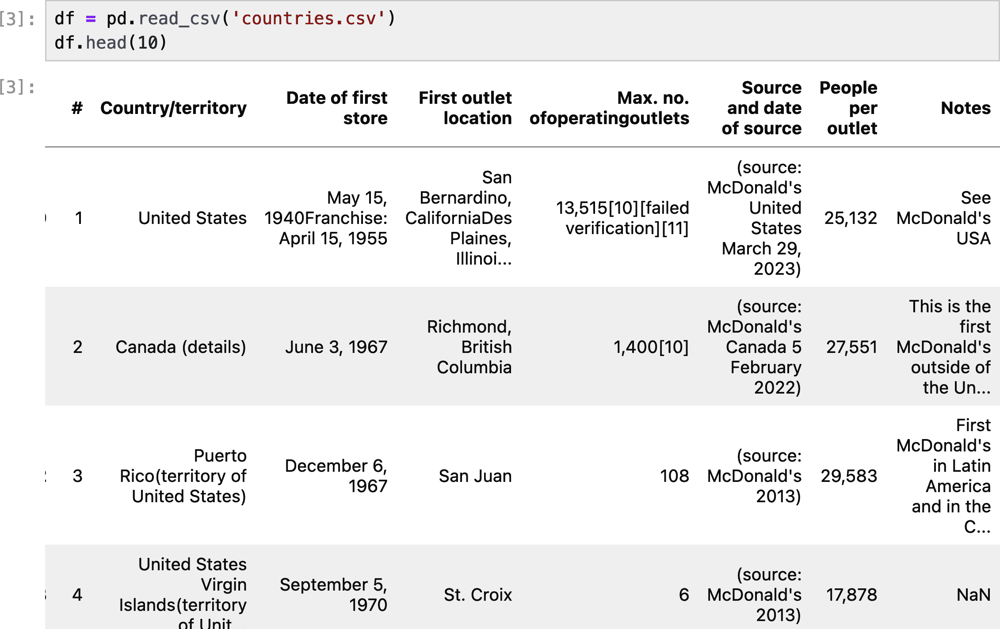

# 第十一章：处理脏数据

到目前为止，在本书中，我通过使用通常格式良好的数据源，如果数据偏离预期，则完全删除数据，忽略了格式不良的数据问题。但是，在网络抓取中，您通常无法太挑剔数据的来源或其外观。

由于错误的标点符号、不一致的大写、换行和拼写错误，脏数据在网络上可能是一个大问题。本章介绍了一些工具和技术，帮助您通过更改编码方式和在数据进入数据库后清理数据，从根源上预防问题。

这是网络抓取与其近亲数据科学交汇的章节。虽然“数据科学家”这个职称可能让人联想到先进的编程技术和高级数学，但事实上，大部分工作是苦工活。在能够用于构建机器学习模型之前，某人必须清理和规范这些数百万条记录，这就是数据科学家的工作。

# 文本清理

Python 是一种非常适合文本处理的编程语言。您可以轻松编写干净、功能性、模块化的代码，甚至处理复杂的文本处理项目。使用以下代码，我们可以从维基百科关于 Python 的文章中获取文本[*http://en.wikipedia.org/wiki/Python_(programming_language)*](http://en.wikipedia.org/wiki/Python_(programming_language))：

```py
from urllib.request import urlopen
from bs4 import BeautifulSoup

url = 'http://en.wikipedia.org/wiki/Python_(programming_language)'
html = urlopen(url)
bs = BeautifulSoup(html, 'html.parser')
content = bs.find('div', {'id':'mw-content-text'}).find_all('p')
content = [p.get_text() for p in content]

```

此内容开始：

```py
Python is a high-level, general-purpose programming language. Its 
design philosophy emphasizes code readability with the use of 
significant indentation via the off-side rule.[33]

```

我们将对这段文本执行几项操作：

+   删除形式为“[123]”的引用

+   删除换行符

+   将文本分割为句子

+   删除句子中含有旁注的括号文本

+   删除文本中未包含的插图描述

+   将文本转换为小写

+   删除所有标点符号

需要注意的是，这些函数必须按特定顺序应用。例如，如果删除标点符号（包括方括号），将难以识别和删除后续的引用。删除标点符号并将所有文本转换为小写后，也将无法将文本拆分为句子。

删除换行符和将文本转换为小写的函数非常简单：

```py
def replace_newlines(text):
    return text.replace('\n', ' ')

def make_lowercase(text):
    return text.lower()

```

这里换行用空格字符（“ ”）替换，而不是完全删除，以避免出现这样的文本：

```py
It uses dynamic name resolution (late binding), which binds method 
and variable names during program execution.
Its design offers some support for functional programming 
in the Lisp tradition.
```

被转换为以下文本：

```py
It uses dynamic name resolution (late binding), which binds method
and variable names during program execution. Its design offers some 
support for functional programming in the Lisp tradition.
```

插入空格可以确保所有句子之间仍然有空格。

有了这个想法，我们可以编写分割句子的函数：

```py
def split_sentences(text):
    return [s.strip() for s in text.split('. ')]
```

我们不是简单地在句号上进行拆分，而是在句号和空格上进行拆分。这可以避免出现小数，例如普遍存在的“Python 2.5”，或者代码示例如：

```py
if (c = 1) { ...}
```

防止被错误地分割成句子。此外，我们希望确保任何双空格或其他奇怪的句子都通过在返回之前使用`strip`函数去除每个前导或尾随空格来进行清理。

但是，不能立即调用 `split_sentences`。许多句子紧随其后引用：

```py
capable of exception handling and interfacing with the Amoeba 
operating system.[13] Its implementation began in December 1989.[44]

```

删除引用的函数可以写成这样：

```py
import re

CITATION_REGEX = re.compile('\[[0-9]*\]')
def strip_citations(text):
    return re.sub(CITATION_REGEX, '', text)

```

变量名 `CITATION_REGEX` 采用大写，表示它是一个常量，并且在函数本身之外预先编译。函数也可以写成这样：

```py
def strip_citations(text):
    return re.sub(r'\[[0-9]*\]', '', text)
```

然而，这会强制 Python 每次运行函数时重新编译这个正则表达式（这可能是成千上万次，具体取决于项目），而不是预先编译好并准备好使用。虽然程序的速度在网页抓取中并不一定是一个显著的瓶颈，但在函数外预先编译正则表达式非常容易实现，并允许您通过合适的变量名来文档化代码中的正则表达式。

删除括号文本，例如：

```py
all versions of Python (including 2.7[56]) had security issues
```

和：

```py
dynamic name resolution (late binding), which binds method
```

对于删除引用也是一种类似的模式。一个很好的初步方法可能是：

```py
PARENS_REGEX = re.compile('\(.*\)')
def remove_parentheses(text):
    return re.sub(PARENS_REGEX, '', text)
```

的确，这确实从上述示例中删除了括号文本，但它也从像这样的部分中删除了括号内的任何内容：

```py
This has the advantage of avoiding a classic C error of mistaking 
an assignment operator = for an equality operator == in conditions:
if (c = 1) { ...} is syntactically valid
```

此外，如果文本中存在不匹配的括号，会存在危险。开放括号可能导致在找到任何形式的闭合括号时，大段文本被移除。

为了解决这个问题，我们可以检查括号文本中通常见到的字符类型，仅查找它们，并限制括号文本的长度：

```py
PARENS_REGEX = re.compile('\([a-z A-Z \+\.,\-]{0,100}\)')
def remove_parentheses(text):
    return re.sub(PARENS_REGEX, '', text)
```

偶尔，文本中可能存在未提取的插图描述。例如：

```py
Hello world program:
```

它前面是一段未提取出来的代码块。

这些描述通常很短，以换行符开头，只包含字母，并以冒号结尾。我们可以使用正则表达式删除它们：

```py
DESCRIPTION_REGEX = re.compile('\n[a-z A-Z]*:')
def remove_descriptions(text):
    return re.sub(DESCRIPTION_REGEX, '', text)
```

在这一点上，我们可以删除标点符号。因为许多前面的步骤依赖于标点符号的存在来确定哪些文本保留哪些删除，所以剥离标点符号通常是任何文本清理任务的最后一步。

[Python 字符串模块](https://docs.python.org/3/library/string.html) 包含许多方便的字符集合，其中之一是 `string.punctuation`。这是所有 ASCII 标点符号的集合：

```py
>>> import string
>>> string.punctuation
'!"#$%&\'()*+,-./:;<=>?@[\\]^_`{|}~'

```

我们可以使用 `re.escape`（它转义任何保留的正则表达式符号）和用 `|` 字符连接所有 ASCII 标点的字符串，将其转换为正则表达式：

```py
puncts = [re.escape(c) for c in string.punctuation]
PUNCTUATION_REGEX = re.compile('|'.join(puncts))

def remove_punctuation(text):
    return re.sub(PUNCTUATION_REGEX, '', text)

```

在所有这些字符串操作中，Unicode 字符往往会在字符串中被错误表示。特别常见的是 Unicode 的“不间断空格”，在 HTML 中表示为 `&nbsp;`，在网页文本中经常可以找到。我们在 Wikipedia 文本中打印出来可以看到它显示为 `\xa0`：

```py
 python\xa020 was released...
```

无论遇到哪些奇怪的字符，都可以使用 Python 的 `unicodedata` 包来修复它们。规范化 Unicode 字符将是清理文本的最后一步：

```py
def normalize(text):
    return unicodedata.normalize('NFKD', text)
```

在这一点上，您已经拥有一组短小而精心组织的函数，可以执行各种文本清理操作。因为我们可能希望添加、删除或更改调用函数的顺序，所以我们可以将这些函数添加到列表中，并在文本上以一般方式调用它们：

```py
text_operations = [
    strip_citations,
    remove_parentheses,
    remove_descriptions,
    replace_newlines,
    split_sentences,
    make_lowercase,
    remove_punctuation,
    normalize
]

cleaned = content
for op in text_operations:
    if type(cleaned) == list:
        cleaned = [op(c) for c in cleaned]
    else:
        cleaned = op(cleaned)

print(cleaned)

```

尽管 Python 通常不被认为是像 JavaScript 或更极端的例子中的 Haskell 那样的函数语言，但要记住，在这种情况下，函数可以像变量一样传递！

# 使用标准化文本工作

一旦您清理了文本，接下来该怎么做呢？一个常见的技术是将其分成更容易量化和分析的小块文本。计算语言学家称这些为*n-grams*，其中 n 表示每个文本块中的单词数。在本例中，我们将专门使用 2-gram，即 2 个单词的文本块。

N-gram 通常不跨越句子。因此，我们可以使用前一节中获取的文本，将其拆分为句子，并为列表中的每个句子创建 2-gram。

一个用于将文本分解为 n-gram 的 Python 函数可以编写为：

```py
def getNgrams(text, n):
    text = text.split(' ')
    return [text[i:i+n] for i in range(len(text)-n+1)]

getNgrams('web scraping with python', 2)

```

这个函数在文本“web scraping with python”上的输出是：

```py
[['web', 'scraping'], ['scraping', 'with'], ['with', 'python']]
```

这个函数的一个问题是，它返回了许多重复的 2-gram。它遇到的每个 2-gram 都会被添加到列表中，而没有记录其频率。记录这些 2-gram 的频率是有趣的，而不仅仅是它们的存在，因为这可以在清理和数据标准化算法变更的效果图中非常有用。如果数据成功标准化，唯一 n-gram 的总数将减少，而找到的 n-gram 的总计数（即标识为 n-gram 的唯一或非唯一项的数量）不会减少。换句话说，相同数量的 n-gram 将有更少的“桶”。

你可以通过修改收集 n-gram 的代码，将它们添加到`Counter`对象中来完成。在这里，`cleaned`变量是我们在前一节中获取的已清理句子的列表：

```py
from collections import Counter

def getNgrams(text, n):
    text = text.split(' ')
    return [' '.join(text[i:i+n]) for i in range(len(text)-n+1)]

def countNGramsFromSentences(sentences, n):
    counts = Counter()
    for sentence in sentences:
        counts.update(getNgrams(sentence, n))
    return counts

```

还有许多其他创建 n-gram 计数的方法，例如将它们添加到字典对象中，其中列表的值指向它被看到的次数的计数。这样做的缺点是它需要更多的管理，并且使排序变得棘手。

然而，使用`Counter`对象也有一个缺点：它不能存储列表，因为列表是不可散列的。将它们转换为元组（可散列）将很好地解决问题，并且在这种情况下，将它们转换为字符串也是有道理的，通过在列表理解中使用`' '.join(text[i:i+n])`将它们转换为字符串。

我们可以使用前一节中清理的文本调用`countNGramsFromSentences`函数，并使用`most_common`函数获取按最常见排序的 2-gram 列表：

```py
counts = countNGramsFromSentences(cleaned, 2)
print(counts.most_common())
```

这里是结果：

```py
('in the', 19), ('of the', 19), ('such as', 18), ('as a', 14),
('in python', 12), ('python is', 9), ('of python', 9),
('the python', 9)...

```

截至本文撰写时，有 2814 个独特的 2-gram，其中最受欢迎的组合包含在任何英文文本中都非常常见的词组，例如“such as”。根据您的项目需求，您可能希望移除类似于这样没有太多关联性的 n-gram。如何做到这一点是第[12 章的一个话题。

此外，通常需要停下来考虑要消耗多少计算资源来规范化数据。有许多情况下，不同拼写的单词是等效的，但为了解决这种等效性，您需要检查每个单词，看它是否与您预先编程的等效项匹配。

例如，“Python 1st”和“Python first”都出现在 2-gram 列表中。然而，如果要制定一个一刀切的规则，即“所有的 first、second、third 等都将被解析为 1st、2nd、3rd 等（反之亦然）”，那么每个单词将额外增加约 10 次检查。

同样地，连字符的不一致使用（例如“co-ordinated”与“coordinated”）、拼写错误以及其他自然语言的不一致性将影响 n-gram 的分组，并可能使输出的结果变得模糊，如果这些不一致性足够普遍的话。

在处理连字符词的情况下，一种解决方法可能是完全删除连字符，并将该词视为一个字符串，这只需要进行一次操作。然而，这也意味着连字符短语（这种情况实在是太常见了）将被视为一个单词。采取另一种方法，将连字符视为空格可能是一个更好的选择。只是要做好准备，偶尔会有“co ordinated”和“ordinated attack”这样的情况出现！

# 使用 Pandas 清理数据

本节不是关于中国的可爱熊猫，而是关于 Python 数据分析软件包*pandas*。如果您有过数据科学和机器学习的工作经验，那么很可能在此之前就已经接触过它，因为它在该领域中无处不在。

Pandas 是由程序员 Wes McKinney 在 2008 年独立开发的项目。2009 年，他将该项目公开，并迅速获得了广泛认可。该软件包填补了数据整理中的一个特定空白。在某些方面，它的功能类似于电子表格，具有良好的打印效果和易于重塑的数据透视功能。它还充分利用了底层 Python 代码和数据科学库的强大和灵活性。

有些人在安装像 numpy、pandas 和 scikit-learn 这样的数据科学库时，可能会推荐使用[安装包管理系统 Anaconda](https://www.anaconda.com)。虽然 Anaconda 对这些包有很好的支持，但使用 pip 也可以轻松安装 pandas：

```py
pip install pandas
```

习惯上，该软件包被导入为`pd`而不是完整名称`pandas`：

```py
import pandas as pd
```

# 不要从 Pandas 中导入单独的方法和类

pandas 生态系统庞大、复杂，并且经常与内置 Python 函数和软件包的命名空间重叠。因此，几乎总是应该从`pd`开始引用 pandas 函数，而不是直接导入它们，例如：

```py
from pandas import array
from pandas.DataFrame import min

```

在这些情况下，上述导入可能会与内置 Python `array`模块和`min`函数造成混淆。

一个已接受的例外可能是对作为 DataFrame 类导入的：

```py
from pandas import DataFrame
```

在这种情况下，`DataFrame`不在 Python 标准库中，并且很容易被识别为 pandas 类。然而，这是您可能会看到的一个例外，并且许多人仍然喜欢将 DataFrame 类称为`pd.DataFrame`。因为库在代码中经常被引用，这是为什么惯例是将 pandas 导入为`pd`而不是全名的一个原因！

您在 pandas 库中最常使用的对象是数据框架。这些类似于电子表格或表格，可以通过多种方式构建。例如：

```py
df = pd.DataFrame([['a', 1], ['b', 2], ['c', 3]])
df.head()

```

`head`方法生成一个漂亮打印的数据框架，显示数据及其列和标题，如图 11-1 所示。


###### 图 11-1。一个简单的 pandas 数据框架

数据框架始终需要索引和列名。如果未提供这些信息，如本例中仅提供简单的数据矩阵，它们将被自动生成。数据框架的索引（0, 1, 2）可以在左侧以粗体显示，列名（0, 1）在顶部以粗体显示。

与使用原始的 Python 列表和字典不同，数据框提供了大量方便的辅助函数，用于对数据进行排序、清理、操作、排列和显示。如果您处理较大的数据集，它们还比列表和字典提供了速度和内存优势。

## 清理

在接下来的示例中，您将使用从[Wikipedia 的《麦当劳餐厅分布国家列表》](https://en.wikipedia.org/wiki/List_of_countries_with_McDonald%27s_restaurants)抓取的数据。我们可以使用`pd.read_csv`函数直接从 CSV 文件读取数据到数据框架：

```py
df = pd.read_csv('countries.csv')
df.head(10)
```

可选地，可以传递一个整数给`head`方法，以打印出除默认值 5 之外的行数。这样可以很好地查看早期抓取的 CSV 数据，如图 11-2 所示。



###### 图 11-2。显示具有餐厅的国家列表

这里的列名有些冗长且格式不佳。我们可以使用`rename`方法对它们进行重命名：

```py
df.rename(columns={
    '#': 'Order',
    'Country/territory': 'Country',
    'Date of first store': 'Date',
    'First outlet location': 'Location',
    'Max. no. ofoperatingoutlets': 'Outlets'    
}, inplace=True)

```

在这里，我们向`columns`关键字参数传递一个字典，其中键是原始列名，值是新列名。布尔参数`inplace`意味着列会在原始数据框架中就地重命名，而不是返回一个新的数据框架。

接下来，我们可以通过将要处理的列名列表传递给切片语法`[]`，来隔离我们想要处理的列：

```py
df = df[['Order', 'Country', 'Date', 'Location', 'Outlets']]
```

现在我们已经拥有了我们想要的重新标记的 DataFrame 列，我们可以查看数据了。有几件事情我们需要修复。首先，“首次店铺日期”或“日期”列中的日期通常格式良好，但它们也包含额外的文本甚至其他日期。作为一个简单的策略，我们可以决定保留匹配“日期”格式的第一个内容，并丢弃其余内容。

函数可以通过首先使用与上述相同的“切片”语法选择整个 DataFrame 列来应用于 DataFrame 中的整个列。一个单独选择的列是一个 pandas `Series` 实例。`Series` 类有一个 `apply` 方法，它可以将一个函数应用到 Series 中的每个值上：

```py
import re

date_regex = re.compile('[A-Z][a-z]+ [0-9]{1,2}, [0-9]{4}')
df['Date'] = df['Date'].apply(lambda d: date_regex.findall(d)[0])
```

在这里，我正在使用 lambda 运算符来应用一个函数，该函数获取所有 `date_regex` 的匹配项，并将第一个匹配项作为日期返回。

清理后，这些日期可以使用 `to_datetime` 函数转换为实际的 pandas datetime 值：

```py
df['Date'] = pd.to_datetime(df['Date'])
```

往往，在快速高效生成“干净”数据与保留完全准确和细微数据之间存在微妙的平衡。例如，我们的日期清理将英国行的以下文本减少到单个日期：“*英格兰：1974 年 11 月 13 日[21] 威尔士：1984 年 12 月 3 日 苏格兰：1987 年 11 月 23 日[22] 北爱尔兰：1991 年 10 月 12 日*”，变成了单个日期：“*1974-11-13*”。

从技术上讲，这是正确的。如果整个英国作为一个整体来考虑，那么 1974 年 11 月 13 日是麦当劳首次出现的日期。然而，很巧合的是，日期按照时间顺序写在单元格中，并且我们决定选择第一个日期，并且最早的日期是正确选择的。我们可以想象许多其他情况，在那些情况下我们可能就没有那么幸运。

在某些情况下，您可以对数据进行调查，并决定您选择的清理方法是否足够好。也许在您查看的大多数情况下都是正确的。也许在一半的时间里，向一个方向不正确，在另一半时间里，向另一个方向不正确，对于您的目的来说，在大型数据集上平衡是可以接受的。或者您可能决定需要另一种方法来更准确地清理或捕捉数据。

数据集的“出口”列也存在类似的挑战。此列包含文本，如“*13,515[10][验证失败][11]*”和“ *(不包括季节性餐厅) 43（包括季节性和移动餐厅）*”，这些都不是我们希望进行进一步分析的干净整数。同样，我们可以使用简单的方法获取数据集中可用的第一个整数：

```py
int_regex = re.compile('[0-9,]+')

def str_to_int(s):
    s = int_regex.findall(s)[0]
    s = s.replace(',','')
    return int(s)

df['Outlets'] = df['Outlets'].apply(str_to_int)

```

尽管这也可以写成一个 lambda 函数，但如果需要多个步骤，可以考虑将逻辑拆分到一个单独的函数中。这样做的好处是在探索性数据处理过程中，可以轻松打印出任何发现的异常，以便进一步考虑：

```py
def str_to_int(s):
    try:
        s = int_regex.findall(s)[0]
        s = s.replace(',','')
    except:
        print(f'Whoops: {s}')
    return int(s)
```

最后，DataFrame 已经清理好，准备进行进一步的分析，如 图 11-3 所示。


###### 图 11-3\. 具有清洁列标题、格式化日期和整数数据的 DataFrame

## 索引、排序和过滤

请记住，所有的 DataFrame 都有一个索引，无论您是否明确提供了一个。麦当劳的数据本身有一个方便的索引：”Order“ 列，表示国家接收第一家麦当劳餐厅的时间顺序。我们可以使用 `set_index` 方法设置索引：

```py
df.set_index(['Order'], inplace=True)
df.head()
```

这会丢弃旧索引并将 ”Order“ 列移到索引中。同样，`inplace` 关键字参数意味着这是在原始 DataFrame 上进行的就地操作，而不是返回 DataFrame 的副本。

`sort_values` 方法可用于按一个或多个列排序数据。在这个方法中也可以使用 `inplace` 关键字。然而，因为排序通常用于探索性分析，不需要永久排序，所以将 DataFrame 返回用于打印可能更有用：

```py
df.sort_values(by=['Outlets', 'Date'], ascending=False)
```

这显示了拥有最多麦当劳的国家是美国，其次是中国，然后是日本。法国，我相信会很高兴知道，排名第四，是欧洲国家中麦当劳最多的国家！

使用 `query` 方法很容易过滤 DataFrame。它的参数是一个查询字符串：

```py
df.query('Outlets < 100')
```

这将返回一个 DataFrame，其中仅包含 Outlets 数量小于 100 的记录。大多数常规的 Python 比较运算符在使用查询方法进行 DataFrame 过滤时都有效，但是这种查询语言不是 Python 语法。例如，这将引发异常：

```py
df.query('Date is not None')
```

如果你想测试任何空值的存在或不存在，正确的 pandas 方法是使用 `isnull` 和 `notnull` 查询函数：

```py
df.query('Date.isnull()')
df.query('Date.notnull()')

```

正如你可能猜到的那样，这些语句同时捕获了 `None` 值以及来自底层 numpy 包的 `NaN` 对象。

如果我们想要添加另一个逻辑子句，可以用一个单与号分隔它们：

```py
df.query('Outlets < 100 & Date < "01-06-1990"')

```

使用单管道表示一个 `or` 语句：

```py
df.query('Outlets < 100 | Date < "01-06-1990"')
```

注意这里不需要整个日期 (`"1990-01-01"`)，只写年份 `"1990"` 也可以。Pandas 在解释字符串为日期时相当宽容，尽管你应该始终仔细检查返回的数据是否符合你的期望。

## 更多关于 Pandas 的信息

我真诚地希望你与 pandas 的旅程不会就此结束。我们很幸运，pandas 的创造者和终身[仁慈独裁者](https://en.wikipedia.org/wiki/Benevolent_dictator_for_life) Wes McKinney，也写了一本关于它的书：[*Python for Data Analysis*](https://www.oreilly.com/library/view/python-for-data/9781098104023/)。

如果你计划在数据科学领域做更多的事情，或者只是想在 Python 中偶尔清理和分析数据的好工具，我建议你去了解一下。
