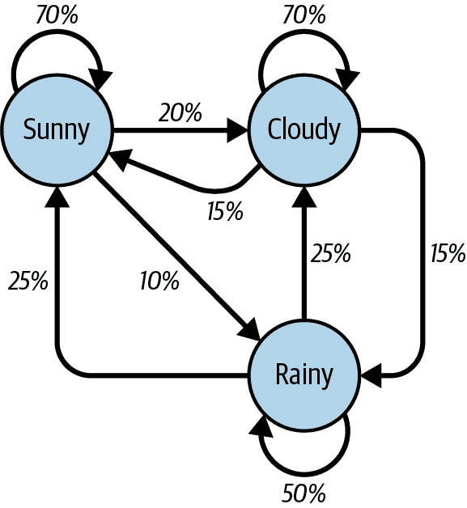

# 第十二章：读写自然语言

到目前为止，您在本书中处理的数据形式大多是数字或可计数值。在大多数情况下，您只是存储数据而没有进行后续分析。本章尝试解决英语这一棘手的主题。¹

当您在其图像搜索中输入“可爱小猫”时，Google 是如何知道您正在寻找什么？因为围绕可爱小猫图像的文本。当您在 YouTube 的搜索栏中输入“死鹦鹉”时，YouTube 是如何知道要播放某个蒙提·派森的段子？因为每个上传视频的标题和描述文本。

实际上，即使输入“已故鸟蒙提·派森”等术语，也会立即出现相同的“死鹦鹉”段子，尽管页面本身没有提到“已故”或“鸟”这两个词。Google 知道“热狗”是一种食物，而“煮狗幼犬”则完全不同。为什么？这都是统计数据！

尽管您可能认为文本分析与您的项目无关，但理解其背后的概念对各种机器学习以及更一般地在概率和算法术语中建模现实世界问题的能力都非常有用。

例如，Shazam 音乐服务可以识别包含某个歌曲录音的音频，即使该音频包含环境噪音或失真。Google 正在基于图像本身自动为图像添加字幕。² 通过将已知的热狗图像与其他热狗图像进行比较，搜索引擎可以逐渐学习热狗的外观并观察这些模式在其显示的其他图像中的表现。

# 数据摘要

在第十一章中，您看到了如何将文本内容分解为 n-gram，即长度为*n*的短语集。基本上，这可以用于确定哪些词组和短语在文本段落中最常用。此外，它还可用于通过回溯原始文本并提取围绕这些最流行短语之一的句子来创建自然语音数据摘要。

您将用美国第九任总统威廉·亨利·哈里森的就职演讲作为本章中许多代码示例的源头。

您将使用此[演讲](http://pythonscraping.com/files/inaugurationSpeech.txt)的完整文本作为本章中许多代码示例的源头。

在第十一章的清理代码中稍作修改，可以将此文本转换为准备好分割成 n-gram 的句子列表：

```py
import re
import string 

def replace_newlines(text):
    return text.replace('\n', ' ')

def make_lowercase(text):
    return text.lower()

def split_sentences(text):
    return [s.strip() for s in text.split('. ')]

puncts = [re.escape(c) for c in string.punctuation]
PUNCTUATION_REGEX = re.compile('|'.join(puncts))
def remove_punctuation(text):
    return re.sub(PUNCTUATION_REGEX, '', text)

```

然后，我们获取文本并按特定顺序调用这些函数：

```py
content = str(
    urlopen('http://pythonscraping.com/files/inaugurationSpeech.txt').read(),
    'utf-8'
)

text_operations = [
    replace_newlines,
    split_sentences,
    make_lowercase,
    remove_punctuation
]

cleaned = content
for op in text_operations:
    if type(cleaned) == list:
        cleaned = [op(c) for c in cleaned]
    else:
        cleaned = op(cleaned)

print(cleaned)

```

接下来我们使用清理后的文本来获取所有 2-gram 的 `Counter` 对象，并找出最受欢迎的那些：

```py
def getNgrams(text, n):
    text = text.split(' ')
    return [' '.join(text[i:i+n]) for i in range(len(text)-n+1)]

def countNGramsFromSentences(sentences, n):
    counts = Counter()
    for sentence in sentences:
        counts.update(getNgrams(sentence, n))
    return counts

counts = countNGramsFromSentences(cleaned, 2)
print(counts.most_common())

```

此示例说明了 Python 标准库 collections 的便利性和强大性。不，编写一个创建字典计数器、按值排序并返回这些顶级值的最受欢迎键的函数并不特别困难。但是，了解内置 collections 并能够根据手头任务选择合适的工具可以节省很多代码行！

输出的部分包括：

```py
[('of the', 213), ('in the', 65), ('to the', 61), ('by the', 41),
('the constitution', 34), ('of our', 29), ('to be', 26),
('the people', 24), ('from the', 24), ('that the', 23)...
```

在这些二元组中，“宪法”似乎是演讲中一个相当受欢迎的主题，但“of the”、“in the” 和 “to the” 看起来并不特别显着。您如何自动且准确地摆脱不想要的词？

幸运的是，有些人认真研究“有趣”词和“无趣”词之间的差异，他们的工作可以帮助我们做到这一点。布里格姆·杨大学的语言学教授马克·戴维斯维护着[当代美国英语语料库](http://corpus.byu.edu/coca/)，这是一个收集了超过 4.5 亿字的流行美国出版物最近十年左右的集合。

5000 最常见的单词列表可以免费获取，幸运的是，这已经足够作为基本过滤器，以清除最常见的二元组。仅前一百个单词就大大改善了结果，同时加入了 `isCommon` 和 `filterCommon` 函数：

```py
COMMON_WORDS = ['the', 'be', 'and', 'of', 'a', 'in', 'to', 'have',
'it', 'i', 'that', 'for', 'you', 'he', 'with', 'on', 'do', 'say',
'this', 'they', 'is', 'an', 'at', 'but', 'we', 'his', 'from', 'that',
'not', 'by', 'she', 'or', 'as', 'what', 'go', 'their', 'can',
'who', 'get', 'if', 'would', 'her', 'all', 'my', 'make', 'about',
'know', 'will', 'as', 'up', 'one', 'time', 'has', 'been', 'there',
'year', 'so', 'think', 'when', 'which', 'them', 'some', 'me',
'people', 'take', 'out', 'into', 'just', 'see', 'him', 'your',
'come', 'could', 'now', 'than', 'like', 'other', 'how', 'then',
'its', 'our', 'two', 'more', 'these', 'want', 'way', 'look', 'first',
'also', 'new', 'because', 'day', 'more', 'use', 'no', 'man', 'find',
'here', 'thing', 'give', 'many', 'well']

def isCommon(ngram):
  return any([w in COMMON_WORDS for w in ngram.split(' ')])

def filterCommon(counts):
  return Counter({key: val for key, val in counts.items() if not isCommon(key)})

filterCommon(counts).most_common()

```

这生成了在文本正文中找到的以下出现超过两次的二元组：

```py
('united states', 10),
('executive department', 4),
('general government', 4),
('called upon', 3),
('chief magistrate', 3),
('legislative body', 3),
('same causes', 3),
('government should', 3),
('whole country', 3)
```

恰如其分地，列表中的前两项是“美利坚合众国”和“行政部门”，这在总统就职演讲中是可以预期的。

需要注意的是，您使用的是一份相对现代的常用词列表来过滤结果，这可能并不适合于这段文字是在 1841 年编写的事实。然而，因为您仅使用列表中的前一百个左右单词——可以假设这些单词比后一百个单词更为稳定，且您似乎得到了令人满意的结果，您很可能可以省去追溯或创建 1841 年最常见单词列表的麻烦（尽管这样的努力可能会很有趣）。

现在从文本中提取了一些关键主题，这如何帮助您撰写文本摘要？一种方法是搜索每个“流行”的 n-gram 的第一句话，理论上第一次出现将提供对内容体的令人满意的概述。前五个最受欢迎的 2-gram 提供了这些要点：

+   “美利坚合众国宪法是包含这一授予各个组成政府部门的权力的工具。”

+   “联邦政府所构成的行政部门提供了这样一个人。”

+   “联邦政府没有侵占任何州保留的权利。”

+   “Called from a retirement which I had supposed was to continue for the residue of my life to fill the chief executive office of this great and free nation, I appear before you, fellow-citizens, to take the oaths which the constitution prescribes as a necessary qualification for the performance of its duties; and in obedience to a custom coeval with our government and what I believe to be your expectations I proceed to present to you a summary of the principles which will govern me in the discharge of the duties which I shall be called upon to perform.”

+   “政府必须永远不要使用机器来‘为罪犯洗白或者掩盖罪行’。”

当然，它可能不会很快出现在 CliffsNotes 上，但考虑到原始文档长达 217 句，第四句（“Called from a retirement...”）相当简洁地概述了主题，对于第一遍来说还算不错。

对于更长的文本块或更多样化的文本，检索一个段落中“最重要”的句子时可能值得查看 3-gram 甚至 4-gram。在这种情况下，只有一个 3-gram 被多次使用，即“exclusive metallic currency”，指的是提出美国货币金本位制的重要问题。对于更长的段落，使用 3-gram 可能是合适的。

另一种方法是寻找包含最流行 n-gram 的句子。这些句子通常会比较长，所以如果这成为问题，你可以寻找包含最高比例流行 n-gram 词的句子，或者自行创建一个结合多种技术的评分指标。

# 马尔可夫模型

您可能听说过马尔可夫文本生成器。它们已经因娱乐目的而流行起来，例如[“That can be my next tweet!”](http://yes.thatcan.be/my/next/tweet/) 应用程序，以及它们用于生成听起来真实的垃圾邮件以欺骗检测系统。

所有这些文本生成器都基于马尔可夫模型，该模型经常用于分析大量随机事件集，其中一个离散事件后跟随另一个离散事件具有一定的概率。

例如，您可以构建一个天气系统的马尔可夫模型，如图 12-1 所示。



###### 图 12-1。描述理论天气系统的马尔可夫模型

在这个模型中，每个晴天有 70%的几率第二天仍然是晴天，有 20%的几率第二天是多云，仅有 10%的几率下雨。如果今天是雨天，那么第二天有 50%的几率还是下雨，25%的几率是晴天，25%的几率是多云。

您可能会注意到这个马尔可夫模型中的几个属性：

+   所有从任何一个节点出发的百分比必须总和为 100%。无论系统多么复杂，下一步总是必须有 100%的机会能够导向其他地方。

+   尽管每次只有三种天气可能性，您可以使用此模型生成无限的天气状态列表。

+   只有当前节点的状态会影响您下一步将去哪里。如果您在晴天节点上，不管前 100 天是晴天还是雨天，明天出太阳的几率都完全相同：70%。

+   达到某些节点可能比其他节点更困难。这背后的数学相当复杂，但可以很容易地看出，雨天（箭头指向少于“100%”）在任何给定时间点上都比晴天或多云状态更不可能到达该状态。

显然，这是一个简单的系统，马尔可夫模型可以任意扩展。谷歌的页面排名算法部分基于马尔可夫模型，其中网站表示为节点，入站/出站链接表示为节点之间的连接。着陆在特定节点上的“可能性”表示该站点的相对流行程度。也就是说，如果我们的天气系统代表一个极小的互联网，“雨天”将具有较低的页面排名，而“多云”将具有较高的页面排名。

有了这些，让我们回到一个更具体的例子：分析和生成文本。

再次使用前面分析过的威廉·亨利·哈里森的就职演讲，您可以编写以下代码，根据其文本结构生成任意长度的马尔可夫链（链长度设置为 100）：

```py
from urllib.request import urlopen
from random import randint
from collections import defaultdict

def retrieveRandomWord(wordList):
    randIndex = randint(1, sum(wordList.values()))
    for word, value in wordList.items():
        randIndex -= value
        if randIndex <= 0:
            return word

def cleanAndSplitText(text):
    # Remove newlines and quotes
    text = text.replace('\n', ' ').replace('"', '');

    # Make sure punctuation marks are treated as their own "words,"
    # so that they will be included in the Markov chain
    punctuation = [',','.',';',':']
    for symbol in punctuation:
        text = text.replace(symbol, f' {symbol} ');
    # Filter out empty words
    return [word for word in text.split(' ') if word != '']

def buildWordDict(text):
    words = cleanAndSplitText(text)
    wordDict = defaultdict(dict)
    for i in range(1, len(words)):
        wordDict[words[i-1]][words[i]] = \
        wordDict[words[i-1]].get(words[i], 0) + 1
    return wordDict

text = str(urlopen('http://pythonscraping.com/files/inaugurationSpeech.txt')
          .read(), 'utf-8')
wordDict = buildWordDict(text)

#Generate a Markov chain of length 100
length = 100
chain = ['I']
for i in range(0, length):
    newWord = retrieveRandomWord(wordDict[chain[-1]])
    chain.append(newWord)

print(' '.join(chain))

```

此代码的输出每次运行时都会发生变化，但以下是它将生成的不可思议的无意义文本的示例：

```py
I sincerely believe in Chief Magistrate to make all necessary sacrifices and
oppression of the remedies which we may have occurred to me in the arrangement 
and disbursement of the democratic claims them , consolatory to have been best 
political power in fervently commending every other addition of legislation , by
the interests which violate that the Government would compare our aboriginal 
neighbors the people to its accomplishment . The latter also susceptible of the 
Constitution not much mischief , disputes have left to betray . The maxim which 
may sometimes be an impartial and to prevent the adoption or 
```

那么代码中到底发生了什么呢？

函数`buildWordDict`接收从互联网检索到的文本字符串。然后进行一些清理和格式化，删除引号并在其他标点周围放置空格，以便它有效地被视为一个独立的单词。然后，它构建一个二维字典——字典的字典，其形式如下：

```py
{word_a : {word_b : 2, word_c : 1, word_d : 1},
 word_e : {word_b : 5, word_d : 2},...}
```

在这个示例字典中，`word_a`出现了四次，其中两次后跟`word_b`，一次后跟`word_c`，一次后跟`word_d.`然后，“word_e”跟随了七次：五次跟随`word_b`，两次跟随`word_d`。

如果我们绘制此结果的节点模型，则表示`word_a`的节点将有一个 50%的箭头指向`word_b`（它四次中有两次跟随），一个 25%的箭头指向`word_c`，和一个 25%的箭头指向`word_d.`

在构建了这个字典之后，它可以作为查找表用于查看下一步该去哪里，无论你当前在文本中的哪个词上。³ 使用字典的字典示例，你目前可能在`word_e`上，这意味着你会将字典`{word_b : 5, word_d: 2}`传递给`retrieveRandomWord`函数。该函数反过来按出现次数加权从字典中检索一个随机词。

通过从一个随机的起始词（在这种情况下，无处不在的“I”）开始，你可以轻松地遍历马尔可夫链，生成任意数量的单词。

随着收集更多类似写作风格的源文本，这些马尔可夫链的“真实性”会得到改善。尽管此示例使用了 2-gram 来创建链条（其中前一个词预测下一个词），但也可以使用 3-gram 或更高阶的 n-gram，其中两个或更多词预测下一个词。

尽管这些应用程序很有趣，并且是在网络爬取期间积累的大量文本的极好用途，但这些应用程序可能会使人们难以看到马尔可夫链的实际应用。如本节前面提到的，马尔可夫链模拟了网页如何从一个页面链接到下一个页面。这些链接的大量集合可以形成有用的类似网络的图形，用于存储、跟踪和分析。这种方式，马尔可夫链为如何思考网络爬行和你的网络爬虫如何思考奠定了基础。

## 维基百科的六度分隔：结论

在第六章中，你创建了一个从一个维基百科文章到下一个文章的爬虫程序，从凯文·贝肯的文章开始，并在第九章中将这些链接存储到数据库中。为什么我再提一遍呢？因为事实证明，在选择一条从一个页面开始并在目标页面结束的链接路径的问题（即找到从[*https://en.wikipedia.org/wiki/Kevin_Bacon*](https://en.wikipedia.org/wiki/Kevin_Bacon)到[*https://en.wikipedia.org/wiki/Eric_Idle*](https://en.wikipedia.org/wiki/Eric_Idle)的一系列页面）与找到一个首尾都有定义的马尔可夫链是相同的。

这类问题属于*有向图*问题，其中 A → B 并不一定意味着 B → A。单词“足球”经常会后接“球员”，但你会发现“球员”后接“足球”的次数要少得多。尽管凯文·贝肯的维基百科文章链接到他的家乡费城的文章，但费城的文章并没有回链到他。

相比之下，原始的“凯文·贝肯的六度分隔游戏”是一个*无向图*问题。如果凯文·贝肯和茱莉亚·罗伯茨在《心灵裂缝》中演出，那么茱莉亚·罗伯茨必然也和凯文·贝肯在《心灵裂缝》中演出，因此关系是双向的（没有“方向”）。与有向图问题相比，无向图问题在计算机科学中较少见，并且两者在计算上都很难解决。

虽然已经对这类问题进行了大量工作，并且有许多变体，但在有向图中寻找最短路径——从维基百科文章“凯文·贝肯”到所有其他维基百科文章的路径——最好且最常见的方法之一是通过广度优先搜索。

首先搜索直接链接到起始页面的所有链接执行*广度优先搜索*。如果这些链接不包含目标页面（即你正在搜索的页面），则搜索第二层链接——由起始页面链接的页面链接。该过程持续进行，直到达到深度限制（在本例中为 6）或找到目标页面为止。

使用如下所述的链接表的广度优先搜索的完整解决方案如下：

```py
import pymysql

conn = pymysql.connect(host='127.0.0.1', unix_socket='/tmp/mysql.sock',
    user='', passwd='', db='mysql', charset='utf8')
cur = conn.cursor()
cur.execute('USE wikipedia')

def getUrl(pageId):
    cur.execute('SELECT url FROM pages WHERE id = %s', (int(pageId)))
    return cur.fetchone()[0]

def getLinks(fromPageId):
    cur.execute('SELECT toPageId FROM links WHERE fromPageId = %s',
        (int(fromPageId)))
    if cur.rowcount == 0:
        return []
    return [x[0] for x in cur.fetchall()]

def searchBreadth(targetPageId, paths=[[1]]):
    newPaths = []
    for path in paths:
        links = getLinks(path[-1])
        for link in links:
            if link == targetPageId:
                return path + [link]
            else:
                newPaths.append(path+[link])
    return searchBreadth(targetPageId, newPaths)

nodes = getLinks(1)
targetPageId = 28624
pageIds = searchBreadth(targetPageId)
for pageId in pageIds:
    print(getUrl(pageId))

```

`getUrl`是一个辅助函数，它根据页面 ID 从数据库中检索 URL。类似地，`getLinks`接受一个`fromPageId`，代表当前页面的整数 ID，并获取它链接到的所有页面的整数 ID 列表。

主函数`searchBreadth`递归地工作以构建从搜索页面到目标页面的所有可能路径列表，并在找到达到目标页面的路径时停止：

+   它从一个单一路径`[1]`开始，表示用户在目标页面 ID 为 1（凯文·贝肯）的页面上停留并且不跟随任何链接。

+   对于路径列表中的每条路径（在第一次通过中，只有一条路径，因此此步骤很简单），获取表示路径中最后一页的页面外部链接的所有链接。

+   对于每个出站链接，它检查它们是否与`targetPageId`匹配。如果匹配，则返回该路径。

+   如果没有匹配，将一个新路径添加到新的（现在更长的）路径列表中，包含旧路径加上新的出站页面链接。

+   如果在这个级别根本找不到`targetPageId`，则发生递归，并且使用相同的`targetPageId`和新的更长路径列表调用`searchBreadth`。

找到包含两个页面之间路径的页面 ID 列表后，将每个 ID 解析为其实际 URL 并打印出来。

在此数据库中，搜索凯文·贝肯页面（页面 ID 为 1）和搜索埃里克·艾德尔页面（数据库中页面 ID 为 28624）之间链接的输出是：

```py
/wiki/Kevin_Bacon
/wiki/Primetime_Emmy_Award_for_Outstanding_Lead_Actor_in_a_
Miniseries_or_a_Movie
/wiki/Gary_Gilmore
/wiki/Eric_Idle

```

这转化为链接的关系：凯文·贝肯 → 黄金时段艾美奖 → 加里·吉尔莫 → 埃里克·艾德尔。

除了解决六度问题和建模外，还可以使用有向和无向图来模拟在网页抓取中遇到的各种情况。哪些网站链接到其他网站？哪些研究论文引用了其他研究论文？在零售网站上，哪些产品倾向于与其他产品一起显示？这种链接的强度是多少？这个链接是双向的吗？

识别这些基本关系类型对于基于抓取数据生成模型、可视化和预测非常有帮助。

# 自然语言工具包

到目前为止，本章主要集中在对文本体中单词的统计分析上。哪些词最受欢迎？哪些词不寻常？哪些词可能会在哪些其他词之后出现？它们是如何被组合在一起的？您所缺少的是理解，以您能力所及的程度，这些词代表什么。

*自然语言工具包*（[NLTK](http://www.nltk.org/install.html)）是一套设计用来识别和标记自然英文文本中词性的 Python 库。其开发始于 2000 年，过去的 20 多年里，全球数十名开发者为该项目做出了贡献。尽管它提供的功能非常强大（整本书都可以专门讨论 NLTK），本节仅集中介绍其少数用途。

## 安装和设置

`nltk`模块可以像其他 Python 模块一样安装，可以直接通过 NLTK 网站下载包，也可以使用任意数量的第三方安装程序与关键词`nltk`一起安装。有关完整的安装说明和故障排除帮助，请参阅[NLTK 网站](http://www.nltk.org/install.html)。

安装了模块后，您可以浏览广泛的文本语料库，这些语料库可以下载和使用：

```py
>>> import nltk
>>> nltk.download()

```

这将打开 NLTK 下载器。您可以在终端使用其菜单提供的命令进行导航：

```py
NLTK Downloader
---------------------------------------------------------------------------
    d) Download   l) List    u) Update   c) Config   h) Help   q) Quit
---------------------------------------------------------------------------

Downloader> l

Packages:

  [*] abc................. Australian Broadcasting Commission 2006
  [ ] alpino.............. Alpino Dutch Treebank
  [*] averaged_perceptron_tagger Averaged Perceptron Tagger
  [ ] averaged_perceptron_tagger_ru Averaged Perceptron Tagger (Russian)
  [ ] basque_grammars..... Grammars for Basque
  [ ] bcp47............... BCP-47 Language Tags
  [ ] biocreative_ppi..... BioCreAtIvE (Critical Assessment of Information
                           Extraction Systems in Biology)
  [ ] bllip_wsj_no_aux.... BLLIP Parser: WSJ Model
  [*] book_grammars....... Grammars from NLTK Book
  [*] brown............... Brown Corpus
  [ ] brown_tei........... Brown Corpus (TEI XML Version)
  [ ] cess_cat............ CESS-CAT Treebank
  [ ] cess_esp............ CESS-ESP Treebank
  [*] chat80.............. Chat-80 Data Files
  [*] city_database....... City Database
  [*] cmudict............. The Carnegie Mellon Pronouncing Dictionary (0.6)
  [ ] comparative_sentences Comparative Sentence Dataset
  [ ] comtrans............ ComTrans Corpus Sample
  [*] conll2000........... CONLL 2000 Chunking Corpus

Hit Enter to continue:
```

语料库列表的最后一页包含其集合：

```py
Collections:
  [P] all-corpora......... All the corpora
  [P] all-nltk............ All packages available on nltk_data gh-pages
                           branch
  [P] all................. All packages
  [*] book................ Everything used in the NLTK Book
  [P] popular............. Popular packages
  [P] tests............... Packages for running tests
  [ ] third-party......... Third-party data packages

([*] marks installed packages; [P] marks partially installed collections)

```

在这里的练习中，我们将使用书籍集合。您可以通过下载器界面或在 Python 中下载它：

```py
nltk.download('book')
```

## 使用 NLTK 进行统计分析

NLTK 非常适合生成关于文本段落中单词计数、词频和词多样性的统计信息。如果您只需要相对简单的计算（例如，在文本段落中使用的独特单词的数量），那么导入`nltk`可能有些大材小用——它是一个庞大的模块。然而，如果您需要对文本进行相对广泛的分析，您可以轻松获得几乎任何想要的度量函数。

使用 NLTK 进行分析始终从`Text`对象开始。可以通过以下方式从简单的 Python 字符串创建`Text`对象：

```py
from nltk import word_tokenize
from nltk import Text

tokens = word_tokenize('Here is some not very interesting text')
text = Text(tokens)
```

函数`word_tokenize`的输入可以是任何 Python 文本字符串。任何文本都可以传递进去，但是 NLTK 语料库非常适合用来玩耍和研究功能。你可以通过从 book 模块导入所有内容来使用前面部分下载的 NLTK 集合：

```py
from nltk.book import *
```

这加载了九本书：

```py
*** Introductory Examples for the NLTK Book ***
Loading text1, ..., text9 and sent1, ..., sent9
Type the name of the text or sentence to view it.
Type: 'texts()' or 'sents()' to list the materials.
text1: Moby Dick by Herman Melville 1851
text2: Sense and Sensibility by Jane Austen 1811
text3: The Book of Genesis
text4: Inaugural Address Corpus
text5: Chat Corpus
text6: Monty Python and the Holy Grail
text7: Wall Street Journal
text8: Personals Corpus
text9: The Man Who Was Thursday by G . K . Chesterton 1908
```

你将在所有接下来的例子中使用`text6`，“Monty Python and the Holy Grail”（1975 年电影的剧本）。

文本对象可以像普通的 Python 数组一样进行操作，就像它们是文本中包含的单词的数组一样。利用这一特性，你可以计算文本中唯一单词的数量，并将其与总单词数进行比较（记住 Python 的`set`只包含唯一值）：

```py
>>> len(text6)/len(set(text6))
7.833333333333333
```

上面显示了脚本中每个单词平均使用约八次的情况。你还可以将文本放入频率分布对象中，以确定一些最常见的单词和各种单词的频率：

```py
>>> from nltk import FreqDist
>>> fdist = FreqDist(text6)
>>> fdist.most_common(10)
[(':', 1197), ('.', 816), ('!', 801), (',', 731), ("'", 421), ('[', 3
19), (']', 312), ('the', 299), ('I', 255), ('ARTHUR', 225)]
>>> fdist["Grail"]
34
```

因为这是一个剧本，所以写作方式可能会显现一些特定的艺术形式。例如，大写的“ARTHUR”经常出现，因为它出现在剧本中亚瑟王每一行的前面。此外，冒号（:）在每一行之前出现，作为角色名和角色台词之间的分隔符。利用这一事实，我们可以看到电影中有 1,197 行！

在前几章中我们称之为 2-grams，在 NLTK 中称为*bigrams*（有时你也可能听到 3-grams 被称为*trigrams*，但我更喜欢 2-gram 和 3-gram 而不是 bigram 或 trigram）。你可以非常轻松地创建、搜索和列出 2-grams：

```py
>>> from nltk import bigrams
>>> bigrams = bigrams(text6)
>>> bigramsDist = FreqDist(bigrams)
>>> bigramsDist[('Sir', 'Robin')]
18
```

要搜索 2 元组“Sir Robin”，你需要将其分解为元组（“Sir”，“Robin”），以匹配频率分布中表示 2 元组的方式。还有一个`trigrams`模块以相同方式工作。对于一般情况，你还可以导入`ngrams`模块：

```py
>>> from nltk import ngrams
>>> fourgrams = ngrams(text6, 4)
>>> fourgramsDist = FreqDist(fourgrams)
>>> fourgramsDist[('father', 'smelt', 'of', 'elderberries')]
1
```

这里，调用`ngrams`函数将文本对象分解为任意大小的 n-grams，由第二个参数控制。在这种情况下，你将文本分解为 4-grams。然后，你可以展示短语“father smelt of elderberries”在剧本中正好出现一次。

频率分布、文本对象和 n-grams 也可以在循环中进行迭代和操作。例如，以下代码打印出所有以单词“coconut”开头的 4-grams：

```py
from nltk.book import *
from nltk import ngrams

fourgrams = ngrams(text6, 4)

[f for f in fourgrams if f[0] == 'coconut']

```

NLTK 库拥有大量工具和对象，旨在组织、计数、排序和测量大段文本。尽管我们只是初步了解了它们的用途，但这些工具大多设计良好，对熟悉 Python 的人操作起来相当直观。

## 使用 NLTK 进行词汇分析

到目前为止，你只是根据它们自身的价值比较和分类了遇到的所有单词。没有区分同音异义词或单词使用的上下文。

尽管有些人可能会觉得同音异义词很少会成问题，你也许会惊讶地发现它们出现的频率有多高。大多数以英语为母语的人可能并不经常意识到一个词是同音异义词，更不用说考虑它可能在不同语境中被误认为另一个词了。

“他在实现他写一部客观哲学的目标时非常客观，主要使用客观语态的动词”对人类来说很容易解析，但可能会让网页抓取器以为同一个词被使用了四次，导致它简单地丢弃了关于每个词背后意义的所有信息。

除了查找词性，能够区分一个词在不同用法下的差异也许会很有用。例如，你可能想要查找由常见英语词组成的公司名称，或分析某人对公司的看法。“ACME 产品很好”和“ACME 产品不坏”可能有着相同的基本意思，即使一句话使用了“好”而另一句话使用了“坏”。

除了测量语言之外，NLTK 还可以根据上下文和自身庞大的词典帮助找到词语的含义。在基本水平上，NLTK 可以识别词性：

```py
>>> from nltk.book import *
>>> from nltk import word_tokenize
>>> text = word_tokenize('Strange women lying in ponds distributing swords'\
'is no basis for a system of government.')
>>> from nltk import pos_tag
>>> pos_tag(text)
[('Strange', 'NNP'), ('women', 'NNS'), ('lying', 'VBG'), ('in', 'IN')
, ('ponds', 'NNS'), ('distributing', 'VBG'), ('swords', 'NNS'), ('is'
, 'VBZ'), ('no', 'DT'), ('basis', 'NN'), ('for', 'IN'), ('a', 'DT'), 
('system', 'NN'), ('of', 'IN'), ('government', 'NN'), ('.', '.')]
```

每个词都被分为一个包含该词和标识其词性的标签的*元组*（有关这些标签的更多信息，请参见前面的侧边栏）。虽然这看起来可能是一个简单的查找，但正确执行这项任务所需的复杂性在以下示例中变得显而易见：

```py
>>> text = word_tokenize('The dust was thick so he had to dust')
>>> pos_tag(text)
[('The', 'DT'), ('dust', 'NN'), ('was', 'VBD'), ('thick', 'JJ'), 
('so', 'RB'), ('he', 'PRP'), ('had', 'VBD'), ('to', 'TO'), ('dust', 'VB')]
```

注意，“dust”一词在句子中使用了两次：一次作为名词，另一次作为动词。NLTK 根据它们在句子中的上下文正确地识别了两种用法。NLTK 通过使用由英语语言定义的上下文无关语法来识别词性。*上下文无关语法*是定义哪些东西允许跟随其他东西的规则集合。在这种情况下，它们定义了哪些词性可以跟随其他词性。每当遇到一个模棱两可的词如“dust”时，上下文无关语法的规则被参考，并选择一个符合规则的适当词性。

在特定语境中知道一个词是动词还是名词有什么意义呢？在计算机科学研究实验室里或许很有意思，但它如何帮助网页抓取呢？

网页抓取中的一个常见问题涉及搜索。你可能正在从网站上抓取文本，并希望搜索其中“google”一词的实例，但只有在它被用作动词时才这样做，而不是作为专有名词。或者你可能只想寻找公司 Google 的实例，并且不希望依赖人们对大小写的正确使用来找到这些实例。在这里，`pos_tag`函数可以极为有用：

```py
from nltk import word_tokenize, sent_tokenize, pos_tag
sentences = [
    'Google is one of the best companies in the world.',
    ' I constantly google myself to see what I\'m up to.'
]
nouns = ['NN', 'NNS', 'NNP', 'NNPS']

for sentence in sentences:
    for word, tag in pos_tag(word_tokenize(sentence)):
        if word.lower() == 'google' and tag in nouns:
            print(sentence)

```

这只打印包含“google”（或“Google”）一词的句子（作为某种名词，而不是动词）。当然，您可以更具体地要求只打印带有“NNP”（专有名词）标记的 Google 实例，但即使是 NLTK 有时也会出错，因此根据应用程序的不同，留给自己一些灵活性也是有好处的。

大部分自然语言的歧义可以通过 NLTK 的`pos_tag`函数来解决。通过搜索文本中目标单词或短语 *以及* 其标记，您可以极大地提高抓取器搜索的准确性和效率。

# 其他资源

通过机器处理、分析和理解自然语言是计算机科学中最困难的任务之一，关于此主题已经有无数的书籍和研究论文被撰写。我希望这里的涵盖范围能激发您思考超越传统的网络抓取，或者至少给您在开始进行需要自然语言分析的项目时提供一些初始方向。

对于初学者语言处理和 Python 的自然语言工具包有许多优秀的资源。特别是 Steven Bird、Ewan Klein 和 Edward Loper 的书籍[*Natural Language Processing with Python*](http://oreil.ly/1HYt3vV)（O'Reilly）对该主题提供了全面和初步的介绍。

此外，James Pustejovsky 和 Amber Stubbs 的书籍[*Natural Language Annotations for Machine Learning*](http://oreil.ly/S3BudT)（O'Reilly）提供了一个略微更高级的理论指南。您需要掌握 Python 的知识才能实施这些教训；所涵盖的主题与 Python 的自然语言工具包完全契合。

¹ 尽管本章描述的许多技术可以应用于所有或大多数语言，但现在只专注于英语自然语言处理也是可以的。例如，工具如 Python 的自然语言工具包专注于英语。根据[W3Techs](http://w3techs.com/technologies/overview/content_language/all)，仍有 53%的互联网内容是用英语编写的（其次是西班牙语，仅占 5.4%）。但谁知道呢？英语在互联网上的主导地位几乎肯定会在未来发生变化，因此在未来几年可能需要进一步更新。

² Oriol Vinyals 等人，[“一幅图值千言（连贯）：构建图片的自然描述”](http://bit.ly/1HEJ8kX)，*Google 研究博客*，2014 年 11 月 17 日。

³ 例外是文本中的最后一个单词，因为没有任何单词跟随最后一个单词。在我们的示例文本中，最后一个单词是句号（.），这很方便，因为文本中还有 215 个其他出现，所以不会形成死胡同。但是，在马尔科夫生成器的实际实现中，最后一个单词可能是您需要考虑的内容。
