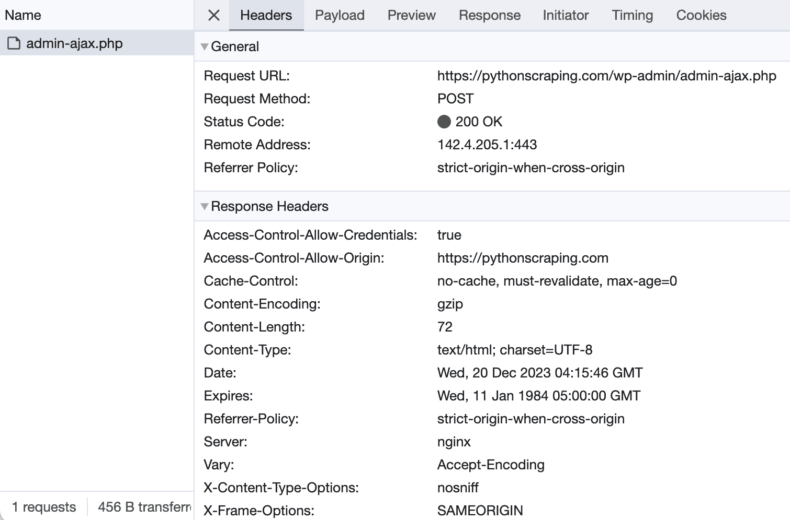
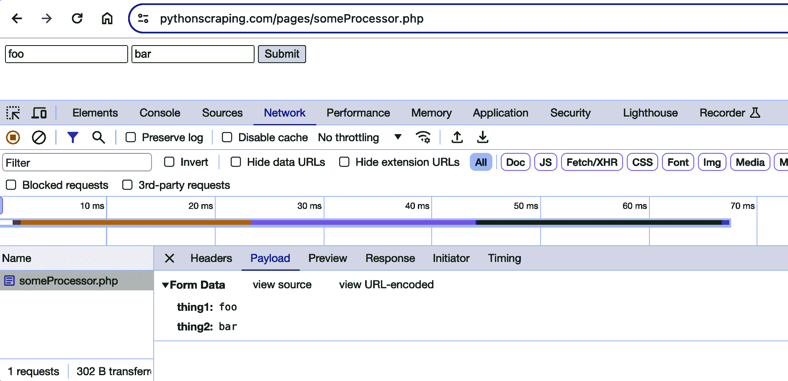
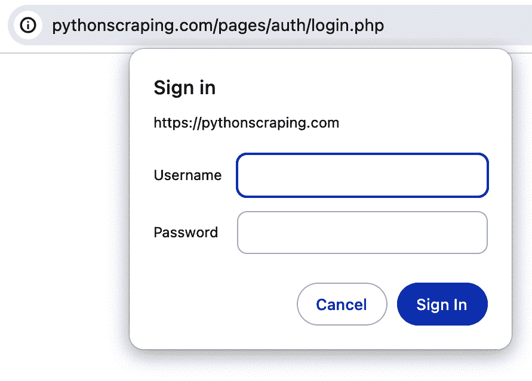

# 第十三章：穿越表单和登录

当您开始超越 Web 抓取的基础时，一个最先提出的问题是：“我如何访问登录屏幕背后的信息？”网络越来越向互动、社交媒体和用户生成内容发展。表单和登录是这些类型网站的一个组成部分，几乎不可避免。幸运的是，它们也相对容易处理。

到目前为止，我们示例爬虫中与 Web 服务器的大多数交互都是使用 HTTP `GET`请求信息。本章重点介绍`POST`方法，该方法将信息推送到 Web 服务器进行存储和分析。

表单基本上为用户提供了一种提交`POST`请求，Web 服务器可以理解和使用的方法。就像网站上的链接标签帮助用户格式化`GET`请求一样，HTML 表单帮助他们格式化`POST`请求。当然，通过少量的编码，我们也可以创建这些请求并使用爬虫提交它们。

# Python Requests 库

虽然使用 Python 核心库可以导航网页表单，但有时一些语法糖会让生活变得更甜美。当你开始执行比基本的`GET`请求更多的操作时，看看 Python 核心库之外的东西可能会有所帮助。

[Requests 库](http://www.python-requests.org)在处理复杂的 HTTP 请求、Cookie、标头等方面非常出色。Requests 的创始人 Kenneth Reitz 对 Python 的核心工具有什么看法：

> Python 的标准 urllib2 模块提供了大部分你需要的 HTTP 功能，但 API 是彻底破损的。它是为不同的时间和不同的 Web 构建的。即使是最简单的任务，也需要大量工作（甚至是方法覆盖）。
> 
> 事情不应该这样。在 Python 中不应该这样。

与任何 Python 库一样，Requests 库可以通过任何第三方 Python 库管理器（如 pip）安装，或者通过下载和安装[源文件](https://github.com/kennethreitz/requests/tarball/master)来安装。

# 提交一个基本表单

大多数 Web 表单包含几个 HTML 字段、一个提交按钮和一个动作页面，实际上处理表单处理的地方。HTML 字段通常包含文本，但也可能包含文件上传或其他非文本内容。

大多数流行的网站在其*robots.txt*文件中阻止对其登录表单的访问（第二章讨论了刮取这些表单的合法性），所以为了安全起见，我构建了一系列不同类型的表单和登录页面在*pythonscraping.com*上，您可以在那里运行您的网络爬虫。[*http://pythonscraping.com/pages/files/form.html*](http://pythonscraping.com/pages/files/form.html) 是这些表单中最基本的位置。

表单的整个 HTML 代码如下：

```py
<form method="post" action="processing.php">
First name: <input type="text" name="firstname"><br>
Last name: <input type="text" name="lastname"><br>
<input type="submit" value="Submit">
</form>
```

这里需要注意几点：首先，两个输入字段的名称分别是 `firstname` 和 `lastname`。这很重要。这些字段的名称决定了在提交表单时将 `POST` 到服务器的变量参数的名称。如果你想模仿表单在提交你自己的数据时所采取的动作，你需要确保你的变量名称匹配。

第二点需要注意的是，表单的 action 是 *processing.php*（绝对路径为 [*http://pythonscraping.com/pages/files/processing.php*](http://pythonscraping.com/pages/files/processing.php)）。对表单的任何 `POST` 请求应该在 *这个* 页面上进行，而不是表单本身所在的页面。记住：HTML 表单的目的只是帮助网站访问者格式化正确的请求，以发送给真正执行动作的页面。除非你正在研究如何格式化请求本身，否则不需要过多关注可以找到表单的页面。

使用 Requests 库提交表单只需四行代码，包括导入和指令以打印内容（是的，就是这么简单）：

```py
import requests

params = {'firstname': 'Ryan', 'lastname': 'Mitchell'}
r = requests.post(
    'http://pythonscraping.com/pages/files/processing.php',
    data=params
)
print(r.text)
```

表单提交后，脚本应返回页面的内容：

```py
Hello there, Ryan Mitchell!
```

此脚本可应用于互联网上遇到的许多简单表单。例如，注册“使用 Python 进行网页抓取”通讯的表单如下所示：

```py
 <form id="eclg-form">
  <div class="input-field">
    <label>First Name</label>
    <input type="text" name="first_name" class="eclg_firstname">
  </div>
  <div class="input-field">
    <label>Last Name</label>
    <input type="text" name="last_name" class="eclg_lastname">
  </div>
  <div class="input-field">
    <label>Email</label>
    <input type="text" name="email" class="eclg_email">
  </div>
  <div class="input-field input-submit">
    <button type="button" id="eclg-submit-btn">Send </button>
    <div class="eclg_ajax_loader" style="display: none;">

</div>
  </div>
  <div class="eclg-message-container"></div>
</form>

```

虽然一开始看起来可能有些吓人，但大多数情况下（稍后我们将讨论例外情况），你只需寻找两件事：

+   要提交的字段（或字段）的名称和数据。在这种情况下，名字是 `first_name`、姓是 `last_name` 和电子邮件地址是 `email`。

+   表单本身的 action 属性；也就是表单提交数据的页面。

在这种情况下，表单的 action 不明显。与传统的 HTML 表单不同，此页面使用 JavaScript 程序检测表单提交并将其提交到正确的 URL。

在这种情况下，使用浏览器的网络工具会很方便。只需打开网络选项卡，填写表单，点击提交按钮，观察发送到网络的值（图 13-1）。



###### 图 13-1\. 发送到 pythonscraping.com 的通讯订阅表单的请求

虽然你可以深入研究复杂的 JavaScript，并最终得出相同的答案，但使用网络选项卡可以让你轻松地看到表单内容被提交到 [*https://pythonscraping.com/wp-admin/admin-ajax.php*](https://pythonscraping.com/wp-admin/admin-ajax.php)。

此外，Payload 选项卡显示发送到此端点的第四个表单值：`action: eclg_add_newsletter`。

有了这个，我们可以在 Python 中复制表单提交的过程：

```py
import requests
params = {
    'firstname': 'Ryan',
    'lastname': 'Mitchell',
    'email': 'ryanemitchell@gmail.com',
    'action': 'eclg_add_newsletter'
}
r = requests.post('https://pythonscraping.com/wp-admin/admin-ajax.php',
                   data=params)
print(r.text)
```

在这种情况下，表单提供了一个 JSON 格式的响应：

```py
{"status":"1","errmsg":"You have subscribed successfully!."}

```

# 单选按钮、复选框和其他输入

显然，并非所有的网络表单都是由文本字段和提交按钮组成的。标准的 HTML 包含多种可能的表单输入字段：单选按钮、复选框和选择框等。HTML5 还增加了滑块（范围输入字段）、电子邮件、日期等。利用自定义的 JavaScript 字段，可能性是无限的，包括颜色选择器、日历和开发人员接下来想出的任何东西。

无论任何类型的表单字段看起来多么复杂，你只需要关心两件事情：元素的名称和其值。元素的名称可以通过查看源代码并找到`name`属性来确定。值有时可能会更加棘手，因为它可能会在表单提交之前由 JavaScript 立即填充。例如，作为相当奇特的表单字段的颜色选择器，可能会具有像`#F03030`这样的值。

如果你不确定输入字段值的格式，可以使用各种工具跟踪浏览器发送到和从站点的`GET`和`POST`请求。跟踪`GET`请求的最佳方法，正如前面提到的，是查看站点的 URL。如果 URL 如下所示：

> `http://domainname.com?thing1=foo&thing2=bar`

你就知道这对应于这种类型的表单：

```py
<form method="GET" action="someProcessor.php">
<input type="someCrazyInputType" name="thing1" value="foo" />
<input type="anotherCrazyInputType" name="thing2" value="bar" />
<input type="submit" value="Submit" />
</form>
```

对应于 Python 参数对象：

```py
{'thing1':'foo', 'thing2':'bar'}
```

如果你卡在一个看起来复杂的`POST`表单上，并且你想准确地查看浏览器发送到服务器的参数，最简单的方法是使用浏览器的检查器或开发者工具查看它们（见图 13-2）。



###### 图 13-2\. 表单数据部分，突出显示为框，显示了 POST 参数“thing1”和“thing2”，它们的值分别为“foo”和“bar”

# 提交文件和图像

虽然文件上传在互联网上很常见，但文件上传并不是网络爬虫中经常使用的内容。不过，你可能想为自己的网站编写一个涉及文件上传的测试。无论如何，了解如何做这件事是很有用的。

在*[*http://pythonscraping.com/pages/files/form2.html*](http://pythonscraping.com/pages/files/form2.html)*上有一个练习文件上传表单。页面上的表单标记如下：

```py
<form action="processing2.php" method="post" enctype="multipart/form-data">
  Submit a jpg, png, or gif: <input type="file" name="uploadFile"><br>
  <input type="submit" value="Upload File">
</form>
```

除了`<input>`标签具有类型属性`file`之外，它看起来基本与前面示例中使用的文本表单相同。幸运的是，Python Requests 库使用表单的方式也类似：

```py
import requests

files = {'uploadFile': open('files/python.png', 'rb')}
r = requests.post('http://pythonscraping.com/pages/files/processing2.php', 
                  files=files)
print(r.text)
```

请注意，与简单的字符串不同，提交到表单字段（名称为`uploadFile`）的值现在是一个 Python 文件对象，由`open`函数返回。在这个例子中，你正在提交一个图像文件，该文件存储在本地机器上，路径为*../files/Python-logo.png*，相对于运行 Python 脚本的位置。

是的，确实如此！

# 处理登录和 Cookies

到目前为止，我们主要讨论了允许您向网站提交信息或在表单之后立即查看所需信息的表单。这与登录表单有何不同，登录表单允许您在访问网站期间处于永久“已登录”状态？

大多数现代网站使用 Cookie 来跟踪谁已登录和谁未登录。网站在验证您的登录凭据后，将它们存储在您的浏览器 Cookie 中，该 Cookie 通常包含服务器生成的令牌、超时和跟踪信息。然后，网站将此 Cookie 用作身份验证的一种证明，该证明显示在您在网站上停留期间访问的每个页面上。在 1990 年代中期 Cookie 的广泛使用之前，保持用户安全验证并跟踪他们是网站的一个巨大问题。

尽管 Cookie 对于网站开发人员是一个很好的解决方案，但对于网络爬虫来说可能会有问题。您可以整天提交登录表单，但如果您不跟踪表单发送给您的 Cookie，那么您访问的下一页将表现得好像您根本没有登录过一样。

我在[*http://pythonscraping.com/pages/cookies/login.html*](http://pythonscraping.com/pages/cookies/login.html)创建了一个简单的登录表单（用户名可以是任何内容，但密码必须是“password”）。该表单在*[*http://pythonscraping.com/pages/cookies/welcome.php*](http://pythonscraping.com/pages/cookies/welcome.php)*处理，其中包含指向主页的链接，*[*http://pythonscraping.com/pages/cookies/profile.php*](http://pythonscraping.com/pages/cookies/profile.php)*。

如果您尝试在登录之前访问欢迎页面或个人资料页面，您将收到错误消息并获得登录指示。在个人资料页面上，会检查您浏览器的 Cookie，以查看其 Cookie 是否设置在登录页面上。

使用 Requests 库跟踪 Cookie 很容易：

```py
import requests

params = {'username': 'Ryan', 'password': 'password'}
r = requests.post(
    'https://pythonscraping.com/pages/cookies/welcome.php',
    params)
print(r.text)

print('Cookie is set to:')
print(r.cookies.get_dict())
print('Going to profile page...')
r = requests.get('https://pythonscraping.com/pages/cookies/profile.php', 
                 cookies=r.cookies)
print(r.text)

```

在这里，您将登录参数发送到欢迎页面，该页面充当登录表单的处理器。您从上次请求的结果中检索 Cookie，打印结果以进行验证，然后通过设置`cookies`参数将其发送到个人资料页面。

这在简单情况下效果很好，但是如果您要处理的是频繁修改 Cookie 而没有警告的更复杂的站点，或者如果您根本不想考虑 Cookie，那怎么办？在这种情况下，Requests 的`session`函数完美地解决了这个问题：

```py
session = requests.Session()

params = {'username': 'Ryan', 'password': 'password'}
s = session.post('https://pythonscraping.com/pages/cookies/welcome.php', params)
print('Cookie is set to:')
print(s.cookies.get_dict())
print('Going to profile page...')
s = session.get('https://pythonscraping.com/pages/cookies/profile.php')
print(s.text)

```

在这种情况下，会话对象（通过调用`requests.Session()`检索）会跟踪会话信息，例如 Cookie、标头，甚至您可能在 HTTP 之上运行的协议的信息，例如 HTTPAdapters。

Requests 是一个了不起的库，也许仅次于 Selenium（在第十四章中介绍）的完整性，它可以处理所有这些而不需要程序员考虑或编写代码。虽然让库来完成所有工作可能很诱人，但在编写网络爬虫时，始终要意识到 Cookie 的样子以及它们在控制什么，这非常重要。这可以节省许多痛苦的调试时间，或者弄清楚为什么网站的行为很奇怪！

## HTTP 基本访问身份验证

在 Cookie 出现之前，处理登录的一种流行方式是使用 HTTP *基本访问身份验证*。你偶尔还会看到它，尤其是在高安全性或企业站点上，以及一些 API 上。我创建了一个页面，地址是[*http://pythonscraping.com/pages/auth/login.php*](http://pythonscraping.com/pages/auth/login.php)，具有此类身份验证（图 13-3）。



###### 图 13-3。用户必须提供用户名和密码才能访问受基本访问身份验证保护的页面

与这些示例一样，你可以使用任何用户名登录，但密码必须是“password”。

Requests 包含一个专门设计用于处理 HTTP 身份验证的`auth`模块：

```py
import requests
from requests.auth import AuthBase
from requests.auth import HTTPBasicAuth

auth = HTTPBasicAuth('ryan', 'password')
r = requests.post(
    url='https://pythonscraping.com/pages/auth/login.php', auth=auth)
print(r.text)

```

尽管这看起来像是一个普通的`POST`请求，但在请求中将一个`HTTPBasicAuth`对象作为`auth`参数传递。结果文本将是由用户名和密码保护的页面（或者如果请求失败，则为拒绝访问页面）。

# 其他表单问题

Web 表单是恶意机器人的热门入口点。你不希望机器人创建用户帐户、占用宝贵的服务器处理时间或在博客上提交垃圾评论。因此，安全功能通常被纳入现代网站的 HTML 表单中，这些功能可能不会立即显现。

###### 提示

如需有关 CAPTCHA 的帮助，请查看第十六章，其中涵盖了 Python 中的图像处理和文本识别。

如果你遇到一个神秘的错误，或者服务器因为未知原因拒绝你的表单提交，请查看第十七章，其中涵盖了蜜罐、隐藏字段和其他网站采取的安全措施，以保护其表单。
