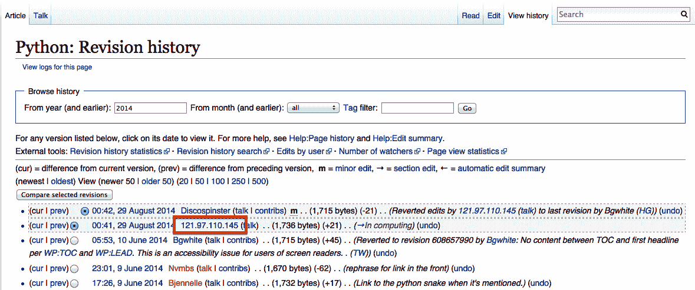

# 第十五章。通过 API 爬行

JavaScript 一直是网络爬虫的克星。在互联网古老历史的某个时刻，你可以确保向 Web 服务器请求一个 HTML 页面，所得到的内容与在浏览器中看到的完全相同。

随着 JavaScript 和 Ajax 内容的生成和加载变得更加普遍，这种情况变得不那么常见了。在第十四章中，你看到了解决这个问题的一种方法：使用 Selenium 自动化浏览器并获取数据。这是一件容易的事情。它几乎总是有效的。

问题在于，当你拥有像 Selenium 这样强大和高效的“锤子”时，每个网络抓取问题开始看起来都很像一个钉子。

在本章中，你将完全消除 JavaScript 的影响（甚至无需执行它或加载它！），直接访问数据源：生成数据的 API。

# API 简介

尽管关于 REST、GraphQL、JSON 和 XML API 的复杂性有无数书籍、演讲和指南，但它们的核心基于一个简单的概念。一个*API*，或者应用程序编程接口，定义了一种标准化的语法，允许一个软件件与另一个软件件通信，即使它们可能是用不同的语言编写或以其他方式不同结构化的。

本节专注于 Web API（特别是允许 Web 服务器与浏览器通信的 API），并使用术语*API*特指这种类型。但是你可能想记住，在其他情境中，*API*也是一个通用术语，可以用来允许例如 Java 程序与同一台机器上运行的 Python 程序通信。API 并不总是“通过互联网”并且不一定涉及任何 Web 技术。

Web API 最常被使用的是那些使用良好宣传和文档化的公共服务的开发人员。例如，美国国家气象局提供了一个[weather API](https://www.weather.gov/documentation/services-web-api)，可以获取任何地点的当前天气数据和预报。Google 在其[开发者部分](https://console.developers.google.com)提供了几十种 API，用于语言翻译、分析和地理位置。

这些 API 的文档通常描述路由或*端点*，即你可以请求的 URL，带有可变参数，可以是 URL 路径中的一部分，也可以是`GET`参数。

例如，以下示例将`pathparam`作为路由路径的参数提供：

```py
http://example.com/the-api-route/pathparam

```

而这个示例将`pathparam`作为参数`param1`的值提供：

```py
http://example.com/the-api-route?param1=pathparam

```

尽管像许多计算机科学中的主题一样，有关何时以及在哪里通过路径或参数传递变量的哲学辩论一直在进行，但两种通过 API 传递变量数据的方法经常被使用。

API 的响应通常以 JSON 或 XML 格式返回。在现代，JSON 比 XML 更流行，但您仍然可能会看到一些 XML 响应。许多 API 允许您更改响应类型，使用另一个参数来定义您想要的响应类型。

这里是一个 JSON 格式的 API 响应的示例：

```py
{"user":{"id": 123, "name": "Ryan Mitchell", "city": "Boston"}}

```

这里是一个 XML 格式的 API 响应的示例：

```py
<user><id>123</id><name>Ryan Mitchell</name><city>Boston</city></user>
```

[ip-api.com](http://ip-api.com) 提供了一个易于使用且简单的 API，将 IP 地址转换为实际物理地址。您可以尝试在浏览器中输入以下内容进行简单的 API 请求：¹

```py
http://ip-api.com/json/50.78.253.58
```

这应该产生类似以下的响应：

```py
{"as": "AS7922 Comcast Cable Communications, LLC","city": "Boston",
"country": "United States","countryCode": "US",
"isp": "Comcast Cable Communications","lat": 42.3584,"lon": -71.0598,
"org": "Boston Park Plaza Hotel","query": "50.78.253.58",
"region": "MA","regionName": "Massachusetts","status": "success",
"timezone": "America/New_York","zip": "02116"}
```

注意，请求路径中包含`json`参数。您可以通过相应地更改此参数来请求 XML 或 CSV 响应：

```py
http://ip-api.com/xml/50.78.253.58
http://ip-api.com/csv/50.78.253.58

```

## HTTP 方法和 API

在前面的部分中，您看到了通过`GET`请求从服务器获取信息的 API。通过 HTTP，有四种主要的方式（或*方法*）来请求从 Web 服务器获取信息：

+   `` `GET` ``

+   `` `POST` ``

+   `` `PUT` ``

+   `` `DELETE` ``

从技术上讲，还存在更多的方法（如`HEAD`、`OPTIONS`和`CONNECT`），但它们在 API 中很少使用，您几乎不太可能看到它们。绝大多数 API 限制自己使用这四种方法或这四种方法的子集。常见的是只看到使用`GET`，或者只看到使用`GET`和`POST`的 API。

当您通过浏览器地址栏访问网站时，使用的是`GET`。当您像这样调用[*http://ip-api.com/json/50.78.253.58*](http://ip-api.com/json/50.78.253.58)时，您可以将`GET`视为说：“嘿，Web 服务器，请检索/获取我这些信息。”

根据定义，`GET`请求不会对服务器数据库中的信息进行任何更改。不会存储任何内容；不会修改任何内容。只是读取信息。

`POST` 在您填写表单或提交信息时使用。每次登录网站时，您都在使用`POST`请求与您的用户名和（希望的话）加密密码。如果您使用 API 发送`POST`请求，则表示：“请将此信息存储在您的数据库中。”

`PUT` 在与网站交互时使用较少，但在 API 中有时会用到。`PUT` 请求用于更新对象或信息。例如，一个 API 可能需要用`POST`请求创建新用户，但如果要更新用户的电子邮件地址，则可能需要用`PUT`请求。²

`DELETE` 被用来删除对象，正如您可以想象的那样。例如，如果您向 *http://example.com/user/23* 发送一个 `DELETE` 请求，它将删除 ID 为 23 的用户。`DELETE` 方法在公共 API 中并不常见，这些 API 主要用于传播信息或允许用户创建或发布信息，而不是允许用户从数据库中删除信息。

与 `GET` 请求不同，`POST`、`PUT` 和 `DELETE` 请求允许您在请求的主体中发送信息，除了 URL 或路由外。

就像您从 Web 服务器收到的响应一样，这些数据通常被格式化为 JSON 或者更少见的 XML，这些数据的格式由 API 的语法定义。例如，如果您正在使用一个用于在博客文章上创建评论的 API，您可能会发出 `PUT` 请求到：

```py
http://example.com/comments?post=123

```

使用以下请求主体：

```py
{"title": "Great post about APIs!", "body": "Very informative. Really helped me 
out with a tricky technical challenge I was facing. Thanks for taking the time 
to write such a detailed blog post about PUT requests!", "author": {"name":"Ryan 
Mitchell", "website": "http://pythonscraping.com", "company": "O'Reilly Media"}}

```

请注意，博客文章的 ID（`123`）作为 URL 的参数传递，您正在创建的新评论的内容则在请求的主体中传递。参数和数据可以同时传递到参数和主体中。哪些参数是必需的以及它们被传递的位置，再次由 API 的语法确定。

## 更多关于 API 响应的信息

正如您在本章开头看到的 ip-api.com 示例中所见，API 的一个重要特性是它们具有良好格式化的响应。最常见的响应格式包括 *可扩展标记语言*（XML）和 *JavaScript 对象表示法*（JSON）。

近年来，JSON 比 XML 更受欢迎的原因有几个主要因素。首先，良好设计的 XML 文件通常比 JSON 文件更小。例如，比较以下这段包含 98 个字符的 XML 数据：

```py
<user><firstname>Ryan</firstname><lastname>Mitchell</lastname><username>Kludgist
</username></user>
```

现在看看相同的 JSON 数据：

```py
{"user":{"firstname":"Ryan","lastname":"Mitchell","username":"Kludgist"}}
```

这仅有 73 个字符，比等效的 XML 小了整整 36%。

当然，有人可能会争辩说 XML 可以这样格式化：

```py
<user firstname="ryan" lastname="mitchell" username="Kludgist"></user>
```

但这被认为是一种不良做法，因为它不支持数据的深度嵌套。尽管如此，它仍然需要 71 个字符，大约与等效的 JSON 一样长。

JSON 之所以比 XML 更受欢迎的另一个原因是由于 Web 技术的变化。过去，接收 API 的一端通常是服务器端脚本，如 PHP 或 .NET。如今，像 Angular 或 Backbone 这样的框架可能会发送和接收 API 调用。服务器端技术对数据的形式有些中立。但像 Backbone 这样的 JavaScript 库更容易处理 JSON。

尽管 API 通常被认为具有 XML 响应或 JSON 响应，但任何事情都有可能。API 的响应类型仅受其创建者想象力的限制。CSV 是另一种典型的响应输出（如在 ip-api.com 示例中看到的）。某些 API 甚至可能设计用于生成文件。可以向服务器发送请求以生成带有特定文本覆盖的图像或请求特定的 XLSX 或 PDF 文件。

有些 API 根本不返回任何响应。例如，如果您正在向服务器发出请求以创建新的博客文章评论，则它可能仅返回 HTTP 响应代码 200，意味着“我发布了评论；一切都很好！”其他可能返回类似这样的最小响应：

```py
{"success": true}

```

如果发生错误，可能会得到这样的响应：

```py
{"error": {"message": "Something super bad happened"}}

```

或者，如果 API 配置不是特别好，您可能会得到一个无法解析的堆栈跟踪或一些简单的英文文本。在向 API 发出请求时，通常最明智的做法是首先检查您收到的响应是否实际上是 JSON（或 XML、CSV 或您期望返回的任何其他格式）。

# 解析 JSON

在本章中，您已经看过各种类型的 API 及其功能，并查看了这些 API 的示例 JSON 响应。现在让我们看看如何解析和使用这些信息。

在本章开头，您看到了 ip-api.com API 的示例，该 API 将 IP 地址解析为物理地址：

```py
http://ip-api.com/json/50.78.253.58
```

您可以使用 Python 的 JSON 解析函数解码此请求的输出：

```py
import json
from urllib.request import urlopen

def getCountry(ipAddress):
    response = urlopen('http://ip-api.com/json/'+ipAddress).read()
    ​    .decode('utf-8')
    responseJson = json.loads(response)
    return responseJson.get('countryCode')

print(getCountry('50.78.253.58'))
```

这将打印 IP 地址`50.78.253.58`的国家代码。

Python 使用的 JSON 解析库是 Python 核心库的一部分。只需在顶部输入`import json`，一切就搞定了！与许多语言不同，可能将 JSON 解析为特殊的 JSON 对象或 JSON 节点，Python 使用了一种更灵活的方法，将 JSON 对象转换为字典，将 JSON 数组转换为列表，将 JSON 字符串转换为字符串等等。这样一来，访问和操作存储在 JSON 中的值就变得非常容易了。

以下快速演示了 Python 的 JSON 库如何处理可能在 JSON 字符串中遇到的值：

```py
import json

jsonString = '{"arrayOfNums":[{"number":0},{"number":1},{"number":2}],
               "arrayOfFruits":[{"fruit":"apple"},{"fruit":"banana"},
                               {"fruit":"pear"}]}'
jsonObj = json.loads(jsonString)

print(jsonObj.get('arrayOfNums'))
print(jsonObj.get('arrayOfNums')[1])
print(jsonObj.get('arrayOfNums')[1].get('number') +
      jsonObj.get('arrayOfNums')[2].get('number'))
print(jsonObj.get('arrayOfFruits')[2].get('fruit'))
```

这是输出：

```py
[{'number': 0}, {'number': 1}, {'number': 2}]
{'number': 1}
3
pear
```

第 1 行是字典对象的列表，第 2 行是字典对象，第 3 行是整数（访问字典中的整数的总和），第 4 行是字符串。

# 未记录的 API

到目前为止，在本章中，我们只讨论了已记录的 API。它们的开发人员打算让它们被公众使用，发布有关它们的信息，并假设 API 将被其他开发人员使用。但是绝大多数 API 根本没有任何已发布的文档。

但为什么要创建没有任何公共文档的 API 呢？正如本章开头提到的，这一切都与 JavaScript 有关。

传统上，动态网站的 Web 服务器在用户请求页面时有几个任务：

+   处理用户请求网站页面的`GET`请求

+   从出现在该页面上的数据库中检索数据

+   为页面的 HTML 模板格式化数据

+   将格式化后的 HTML 发送给用户

随着 JavaScript 框架的普及，许多由服务器处理的 HTML 创建任务移至了浏览器端。服务器可能会向用户的浏览器发送一个硬编码的 HTML 模板，但是会发起单独的 Ajax 请求来加载内容，并将其放置在 HTML 模板的正确位置。所有这些操作都会在浏览器/客户端上进行。

这最初对 Web 爬虫构成了问题。他们习惯于请求一个 HTML 页面，并返回完全相同的内容已就绪的 HTML 页面。但是，现在他们得到的是一个 HTML 模板，没有任何内容。

Selenium 用于解决这个问题。现在程序员的网络爬虫可以变成浏览器，请求 HTML 模板，执行任何 JavaScript，允许所有数据加载到位，然后仅*然后*再爬取页面数据。因为 HTML 已经全部加载，它基本上变成了一个先前解决过的问题——解析和格式化现有的 HTML 问题。

然而，由于整个内容管理系统（原本只存在于 Web 服务器中）基本上已经移至浏览器客户端，即使是最简单的网站也可能膨胀到数兆字节的内容和十几个 HTTP 请求。

此外，当使用 Selenium 时，所有用户可能不关心的“额外内容”都会被加载：调用跟踪程序，加载侧边栏广告，调用侧边栏广告的跟踪程序。图像、CSS、第三方字体数据——所有这些都需要加载。当您使用浏览器浏览网页时，这可能看起来很好，但是如果您正在编写一个需要快速移动、收集特定数据并尽可能减少对 Web 服务器负载的网络爬虫，则可能加载的数据量要比您需要的数据多 100 倍。

但是，所有这些 JavaScript、Ajax 和 Web 现代化都有其积极的一面：因为服务器不再将数据格式化为 HTML，它们通常只是作为数据库本身的薄包装。这个薄包装只是从数据库中提取数据，并通过 API 返回到页面中。

当然，这些 API 并不打算被除了网页本身之外的任何人或任何东西使用，因此开发人员将它们未记录，并假设（或希望）没有人会注意到它们。但是它们确实存在。

例如，美国零售巨头 target.com 通过 JSON 加载其所有搜索结果。您可以通过访问[*https://www.target.com/s?searchTerm=web%20scraping%20with%20python*](https://www.target.com/s?searchTerm=web%20scraping%20with%20python)在他们的网站上搜索产品。

如果您使用 urllib 或 Requests 库来爬取此页面，您将找不到任何搜索结果。这些结果是通过对 URL 的 API 调用单独加载的：

```py
https://redsky.target.com/redsky_aggregations/v1/web/plp_search_v2
```

因为 Target 的 API 每个请求都需要一个密钥，并且这些 API 密钥会超时，我建议你自己试一试并查看 JSON 结果。

当然，你可以使用 Selenium 加载所有搜索结果并解析生成的 HTML。不过，每次搜索将需要进行约 260 次请求并传输数兆字节的数据。直接使用 API，你只需发出一次请求并传输大约只有你所需的 10 KB 精美格式的数据。

## 查找未记录的 API

在之前的章节中，你使用 Chrome 检查器来检查 HTML 页面的内容，但现在你将以稍微不同的目的使用它：来检查用于构建页面的调用的请求和响应。

要做到这一点，请打开 Chrome 检查器窗口，点击 Network 选项卡，如图 15-1 所示。


###### 图 15-1。Chrome 网络检查工具提供了浏览器正在进行和接收的所有调用的视图。

注意，在页面加载之前需要打开此窗口。关闭窗口时不会跟踪网络调用。

在页面加载时，每当浏览器向 Web 服务器发出调用以获取渲染页面所需的附加信息时，你将实时看到一条线。这可能包括 API 调用。

找到未记录的 API 可能需要一些侦探工作（为了避免这种侦探工作，请参见“记录未记录的 API”），特别是在具有大量网络调用的大型站点中。不过，一般来说，一旦看到它，你就会知道。

API 调用往往具有几个有助于在网络调用列表中定位它们的特征：

+   它们通常包含 JSON 或 XML。你可以使用搜索/过滤字段来过滤请求列表。

+   使用`GET`请求，URL 将包含传递给它们的参数值。例如，如果你正在寻找一个 API 调用，返回搜索结果或加载特定页面的数据，那么这将非常有用。只需用你使用的搜索词、页面 ID 或其他标识信息来过滤结果。

+   它们通常是 XHR 类型。

API 可能并不总是显而易见，特别是在具有大量功能的大型网站中，可能在加载单个页面时会进行数百次调用。然而，通过一点实践，就能更轻松地找到草堆中的比喻性针。

## 记录未记录的 API

当你发现正在进行的 API 调用时，通常有必要至少部分记录它，特别是如果你的爬虫将严重依赖该调用。你可能希望在网站上加载多个页面，在检查器控制台的网络选项卡中过滤目标 API 调用。通过这样做，你可以看到调用在不同页面之间的变化，并确定它接受和返回的字段。

每个 API 调用都可以通过关注以下字段来识别和记录：

+   使用的 HTTP 方法

+   输入

    +   路径参数

    +   标头（包括 cookie）

    +   正文内容（用于`PUT`和`POST`调用）

+   输出

    +   响应头（包括设置的 cookie）

    +   响应体类型

    +   响应体字段

# 将 API 与其他数据源结合使用

尽管许多现代 Web 应用程序的存在理由是获取现有数据并以更吸引人的方式格式化它，但我认为在大多数情况下这并不是一个有趣的事情。如果你只使用 API 作为数据源，那么你所能做的就是简单地复制已经存在并基本上已经发布的别人的数据库。更有趣的可能是以新颖的方式结合两个或更多数据源，或者使用 API 作为一个工具来从新的角度查看抓取的数据。

让我们来看一个例子，说明如何将 API 中的数据与网络抓取结合使用，以查看哪些地区对维基百科贡献最多。

如果你在维基百科上花了很多时间，你可能已经见过文章的修订历史页面，显示了最近的编辑列表。如果用户在编辑时已登录维基百科，会显示他们的用户名。如果未登录，则记录其 IP 地址，如图 15-2 所示。



###### 图 15-2\. 维基百科 Python 条目修订历史页面上匿名编辑者的 IP 地址

在历史页面上提供的 IP 地址是 121.97.110.145。根据目前的信息，使用 ip-api.com API，该 IP 地址来自菲律宾卡尼洛，菲律宾（IP 地址有时会在地理位置上略微变动）。

这些信息单独来看并不那么有趣，但是如果你能够收集关于维基百科编辑及其发生地点的许多地理数据，会怎么样呢？几年前，我确实做到了，并使用[Google 的 GeoChart 库](https://developers.google.com/chart/interactive/docs/gallery/geochart)创建了一个[有趣的图表](http://www.pythonscraping.com/pages/wikipedia.html)，展示了对英语维基百科以及其他语言维基百科的编辑来源（图 15-3）。


###### 图 15-3\. 使用 Google 的 GeoChart 库创建的维基百科编辑可视化

创建一个基本的脚本来爬取维基百科，查找修订历史页面，然后在这些修订历史页面上查找 IP 地址并不难。使用修改自第六章的代码，以下脚本正是如此：

```py
def getLinks(articleUrl):
    html = urlopen(f'http://en.wikipedia.org{articleUrl}')
    bs = BeautifulSoup(html, 'html.parser')
    return bs.find('div', {'id':'bodyContent'}).findAll('a', 
        href=re.compile('^(/wiki/)((?!:).)*$'))

def getHistoryIPs(pageUrl):
    #Format of revision history pages is: 
    #http://en.wikipedia.org/w/index.php?title=Title_in_URL&action=history
    pageUrl = pageUrl.replace('/wiki/', '')
    historyUrl = f'http://en.wikipedia.org/w/index.php?title={pageUrl}\
    &action=history'
    print(f'history url is: {historyUrl}')
    bs = BeautifulSoup(urlopen(historyUrl), 'html.parser')
    #finds only the links with class "mw-anonuserlink" which has IP addresses 
    #instead of usernames
    ipAddresses = bs.findAll('a', {'class':'mw-anonuserlink'})
    return set([ip.get_text() for ip in ipAddresses])

links = getLinks('/wiki/Python_(programming_language)')

while(len(links) > 0):
    for link in links:
        print('-'*20) 
        historyIPs = getHistoryIPs(link.attrs['href'])
        for historyIP in historyIPs:
            print(historyIP)

    newLink = links[random.randint(0, len(links)-1)].attrs['href']
    links = getLinks(newLink)

```

该程序使用两个主要函数：`getLinks`（在第六章中也使用过），以及新的`getHistoryIPs`，后者搜索所有带有类`mw-anonuserlink`的链接内容（指示使用 IP 地址而不是用户名的匿名用户）并将其作为集合返回。

这段代码还使用了一个有些任意的（但对于本例来说很有效）搜索模式来查找要检索修订历史记录的文章。它首先检索由起始页面链接到的所有维基百科文章的历史记录（在本例中是关于 Python 编程语言的文章）。之后，它会随机选择一个新的起始页面，并检索该页面链接到的所有文章的修订历史页面。它会一直持续下去，直到碰到没有链接的页面。

现在您已经有了检索 IP 地址作为字符串的代码，您可以将其与上一节中的`getCountry`函数结合使用，将这些 IP 地址解析为国家。您将稍微修改`getCountry`以处理导致 404 Not Found 错误的无效或格式不正确的 IP 地址：

```py
def getCountry(ipAddress):
    try:
      response = urlopen(f'https://ipwho.is/{ipAddress}').read().decode('utf-8')
    except HTTPError:
      return None
    responseJson = json.loads(response)
    return responseJson.get('country_code')

links = getLinks('/wiki/Python_(programming_language)')

while(len(links) > 0):
    for link in links:
      print('-'*20) 
      historyIPs = getHistoryIPs(link.attrs["href"])
      for historyIP in historyIPs:
          print(f'{historyIP} is from {getCountry(historyIP)}')

    newLink = links[random.randint(0, len(links)-1)].attrs['href']
    links = getLinks(newLink)

```

这是示例输出：

```py
--------------------
history url is: http://en.wikipedia.org/w/index.php?title=Programming_paradigm&a
ction=history
2405:201:2009:80b0:41bc:366f:a49c:52f2 is from IN
115.186.189.53 is from PK
103.252.145.68 is from IN
2405:201:400b:7058:b128:89fd:5248:f249 is from IN
172.115.220.47 is from US
2806:1016:d:54b6:8950:4501:c00b:507a is from MX
36.255.87.160 is from IN
2603:6011:1100:a1d0:31bd:8a11:a0c8:e4c3 is from US
2806:108e:d:bd2c:a577:db4f:2867:2b5c is from MX
2409:4042:e8f:8d39:b50c:f4ca:91b8:eb9d is from IN
107.190.108.84 is from CA
--------------------
history url is: http://en.wikipedia.org/w/index.php?title=Multi-paradigm_program
ming_language&action=history
98.197.198.46 is from US
75.139.254.117 is from US

```

# 关于 API 的更多信息

本章展示了现代 API 通常用于访问网络数据的几种方式，以及这些 API 如何用于构建更快更强大的网络爬虫。如果您想构建 API 而不仅仅是使用它们，或者如果您想进一步了解它们的构建和语法理论，我推荐阅读[《RESTful Web APIs》](http://bit.ly/RESTful-Web-APIs)，作者是 Leonard Richardson、Mike Amundsen 和 Sam Ruby（O’Reilly）。这本书提供了关于在网络上使用 API 的理论和实践的强大概述。此外，Mike Amundsen 还有一系列有趣的视频，[*《Designing APIs for the Web》*](http://oreil.ly/1GOXNhE)（O’Reilly），教你如何创建自己的 API——如果您决定以方便的格式向公众提供您的抓取数据，这是一个有用的技能。

虽然有些人可能对 JavaScript 和动态网站的无处不在感到惋惜，使得传统的“抓取和解析 HTML 页面”的做法已经过时，但我对我们的新机器人统治者表示欢迎。随着动态网站对 HTML 页面的人类消费依赖程度降低，更多地依赖于严格格式化的 JSON 文件进行 HTML 消费，这为每个试图获取干净、格式良好的数据的人提供了便利。

网络已不再是偶尔带有多媒体和 CSS 装饰的 HTML 页面集合。它是数百种文件类型和数据格式的集合，一次传输数百个，形成您通过浏览器消耗的页面。真正的诀窍通常是超越你面前的页面，抓取其源头的数据。

¹ 这个 API 将 IP 地址解析为地理位置，您稍后在本章中也将使用它。

² 实际上，许多 API 在更新信息时使用`POST`请求代替`PUT`请求。新实体是创建还是仅更新一个旧实体通常取决于 API 请求本身的结构。但是，了解区别仍然是很重要的，您经常会在常用 API 中遇到`PUT`请求。
