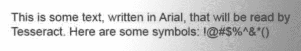

# 第十六章 图像处理与文本识别

从谷歌的自动驾驶汽车到能够识别假钞的自动售货机，机器视觉是一个具有深远目标和影响的广阔领域。本章专注于该领域的一个小方面：文本识别——具体而言，如何利用各种 Python 库识别和使用在线找到的基于文本的图像。

当你不希望文本被机器人发现和阅读时，使用图像代替文本是一种常见的技术。这在联系表单上经常见到，当电子邮件地址部分或完全呈现为图像时。取决于执行的技巧如何，这甚至可能对人类观众不可察觉，但机器人很难读取这些图像，这种技术足以阻止大多数垃圾邮件发送者获取您的电子邮件地址。

当然，CAPTCHA 利用了用户能够阅读安全图像而大多数机器人不能的事实。一些 CAPTCHA 比其他更难，这是我们将在本书后面解决的问题。

但 CAPTCHA 并不是网络上唯一需要图像转文本翻译帮助的地方。甚至很多文档都是从硬拷贝扫描并放在网络上，这使得这些文档对大部分互联网用户而言是无法访问的，尽管它们就在“人们的视线之中”。没有图像转文本的能力，唯一的方法是让人类手动输入它们，但谁有时间做这件事呢。

将图像转换为文本称为*光学字符识别*（OCR）。一些主要的库可以执行 OCR，许多其他库支持它们或构建在它们之上。这些库体系相当复杂，因此建议您在尝试本章中的任何练习之前先阅读下一节。

本章中使用的所有示例图像都可以在 GitHub 仓库文件夹*Chapter16_ImageProcessingFiles*中找到。为简洁起见，所有文中代码示例将简称为*files*目录。

# 库概述

Python 是处理图像和阅读、基于图像的机器学习甚至图像创建的绝佳语言。虽然有许多库可用于图像处理，但我将专注于两个：Pillow 和 Tesseract。

当处理并对来自网络的图像进行 OCR 时，这两个库组成了一个强大的互补二重奏。*Pillow*执行第一次清理和过滤图像，*Tesseract*则尝试将这些图像中找到的形状与其已知文本库进行匹配。

本章涵盖了它们的安装和基本使用，以及这两个库一起工作的几个示例。我还将介绍一些高级的 Tesseract 训练，以便您可以训练 Tesseract 识别您可能在网络上遇到的额外字体和语言（甚至是 CAPTCHA）。

## Pillow

尽管 Pillow 可能不是最全功能的图像处理库，但它具有您可能需要的所有功能，甚至更多——除非您计划用 Python 重写 Photoshop，否则您读的不是这本书！Pillow 还有一个优点，即是其中一些更好文档化的第三方库之一，并且非常容易上手使用。

Forked off the Python Imaging Library (PIL) for Python 2.x, Pillow adds support for Python 3.x. Like its predecessor, Pillow allows you to easily import and manipulate images with a variety of filters, masks, and even pixel-specific transformations:

```py
from PIL import Image, ImageFilter

kitten = Image.open('kitten.jpg')
blurryKitten = kitten.filter(ImageFilter.GaussianBlur)
blurryKitten.save('kitten_blurred.jpg')
blurryKitten.show()
```

在上面的例子中，*kitten.jpg* 图像将在您默认的图像查看器中打开，并添加模糊效果，同时也会保存为同一目录下更模糊的 *kitten_blurred.jpg*。

您将使用 Pillow 对图像执行预处理，使其更易于机器读取，但正如前面提到的，您也可以使用该库进行许多其他操作，而不仅仅是这些简单的滤镜应用。欲了解更多信息，请查看 [Pillow 文档](http://pillow.readthedocs.org)。

## Tesseract

Tesseract 是一个 OCR 库。由 Google 赞助（一个显然以其 OCR 和机器学习技术而闻名的公司），Tesseract 被普遍认为是目前最好、最准确的开源 OCR 系统。

除了准确外，它还非常灵活。它可以被训练来识别任何数量的字体（只要这些字体在自身内部相对一致，您很快就会看到）。它还可以扩展到识别任何 Unicode 字符。

本章同时使用命令行程序 *Tesseract* 及其第三方 Python 包装 *pytesseract*。这两者将明确命名为其中的一个，所以当您看到 Tesseract 时，我指的是命令行软件，当您看到 pytesseract 时，我特指它的第三方 Python 包装。

### 安装 Tesseract

对于 Windows 用户，有一个方便的 [可执行安装程序](https://code.google.com/p/tesseract-ocr/downloads/list)。截至目前，当前版本是 3.02，尽管新版本也应该是可以的。

Linux 用户可以使用 `apt-get` 安装 Tesseract：

```py
$ sudo apt-get tesseract-ocr
```

在 Mac 上安装 Tesseract 稍微复杂一些，但可以通过许多第三方安装程序轻松完成，例如 [Homebrew](http://brew.sh)，它在 第九章 中用于安装 MySQL。例如，您可以安装 Homebrew 并使用它在两行命令中安装 Tesseract：

```py
$ /bin/bash -c "$(curl -fsSL https://raw.githubusercontent.com/Homebrew/install/\
HEAD/install.sh)"
$ brew install tesseract
```

Tesseract 也可以从源代码安装，在[项目的下载页面](https://code.google.com/p/tesseract-ocr/downloads/list)。

要将图像转换为文本，Tesseract 使用在各种语言（或字符集）的大型数据集上训练过的机器学习模型。要查看安装的可用模型，请使用以下命令：

```py
$ tesseract --list-langs

```

这将打印存储模型的目录（在 Linux 上是*/usr/local/share*，在使用 HomeBrew 安装的 Mac 上是*/opt/homebrew/share/tessdata/*），以及可用的模型。

安装了 Tesseract 后，您可以准备安装 Python 包装库 pytesseract，它使用您现有的 Tesseract 安装来读取图像文件并输出可在 Python 脚本中使用的字符串和对象。

如往常一样，您可以通过 pip 安装 pytesseract：

```py
$ pip install pytesseract

```

Pytesseract 可以与 PIL 结合使用从图像中读取文本：

```py
from PIL import Image
import pytesseract

print(pytesseract.image_to_string(Image.open('files/test.png')))

```

如果 pytesseract 无法识别您是否已安装了 Tesseract，则可以使用以下命令获取您的 Tesseract 安装位置：

```py
$ which tesseract
```

并且在 Python 中，通过包含这一行来指定 pytesseract 的位置：

```py
pytesseract.pytesseract.tesseract_cmd = '/path/to/tesseract'

```

Pytesseract 除了像上面代码示例中返回图像 OCR 结果之外，还有几个有用的功能。它可以估算框文件（每个字符边界的像素位置）：

```py
print(pytesseract.image_to_boxes(Image.open('files/test.png')))

```

它还可以返回所有数据的完整输出，如置信度分数、页数和行数、框数据以及其他信息：

```py
print(pytesseract.image_to_data(Image.open('files/test.png')))

```

这两个文件的默认输出为以空格或制表符分隔的字符串文件，但您也可以将输出作为字典或（如果 UTF-8 解码不够用）字节字符串获取：

```py
from PIL import Image
import pytesseract
from pytesseract import Output

print(pytesseract.image_to_data(Image.open('files/test.png'),
    output_type=Output.DICT))
print(pytesseract.image_to_string(Image.open('files/test.png'),
    output_type=Output.BYTES))

```

本章节同时使用了 pytesseract 库和通过`subprocess`库从 Python 触发 Tesseract 的命令行 Tesseract。虽然 pytesseract 库很有用且方便，但它无法完成一些 Tesseract 函数，因此熟悉所有方法是很好的。

## NumPy

虽然 NumPy 对于简单的 OCR 并非必需，但如果您想要在本章后面介绍的训练 Tesseract 识别额外字符集或字体，您将需要它。您还将在本章后面的某些代码示例中使用它进行简单的数学任务（如加权平均数）。

NumPy 是用于线性代数和其他大规模数学应用的强大库。NumPy 与 Tesseract 配合良好，因为它能够将图像数学地表示为大型像素数组并进行操作。

NumPy 可以通过任何第三方 Python 安装器如 pip 来安装，或者通过[下载软件包](https://pypi.python.org/pypi/numpy)并使用`$ python setup.py install`进行安装。

即使您不打算运行使用它的代码示例，我强烈建议您安装它或将其添加到 Python 工具库中。它有助于完善 Python 的内置数学库，并具有许多有用的特性，特别是对于操作数字列表。

按照惯例，NumPy 作为`np`导入，并且可以如下使用：

```py
import numpy as np

numbers = [100, 102, 98, 97, 103]
print(np.std(numbers))
print(np.mean(numbers))

```

此示例打印了提供给它的数字集的标准差和均值。

# 处理格式良好的文本

幸运的话，大多数需要处理的文本应该相对干净且格式良好。格式良好的文本通常符合几个要求，尽管“混乱”和“格式良好”之间的界限可能是主观的。

总的来说，格式良好的文本

+   以一种标准字体书写（不包括手写字体、草书字体或过度装饰的字体）

+   如果复制或拍摄，具有极其清晰的线条，没有复制伪影或黑斑

+   对齐良好，没有倾斜的字母

+   不会跑到图像之外，也没有截断的文本或图像边缘的边距

其中一些问题可以在预处理中修复。例如，图像可以转换为灰度，亮度和对比度可以调整，根据需要可以裁剪和旋转图像。但是，某些基本限制可能需要更广泛的训练。请参阅“阅读 CAPTCHA 和训练 Tesseract”。

图 16-1 是格式良好文本的理想示例。


###### 图 16-1\. 保存为.tiff 文件以供 Tesseract 读取的示例文本

在*files*目录中，您可以从命令行运行 Tesseract 来读取此文件并将结果写入文本文件：

```py
$ tesseract text.png textoutput
$ cat textoutput.txt
```

输出包含新创建的*textoutput.txt*文件的内容：

```py
This is some text, written in Arial, that will be read by
Tesseract. Here are some symbols: !|@#$%&*()

```

您可以看到结果大多是准确的，尽管它在`!`和`@`之间添加了额外的竖线字符。总体而言，这使您能够相当舒适地阅读文本。

在模糊图像文本、创建一些 JPG 压缩伪影和添加轻微背景渐变后，Tesseract 的结果变得更糟（见图 16-2）。



###### 图 16-2\. 不幸的是，您在互联网上遇到的许多文档更像是这种情况，而不是前面的例子

而不是将结果写入文件，您还可以在文件名通常出现的地方传递一个破折号（`-`），Tesseract 将结果回显到终端：

```py
$ tesseract text_bad.png -
```

Tesseract 由于背景渐变的原因无法处理此图像，因此产生了以下输出：

```py
This is some text, written In Arlal, that"
Tesseract. Here are some symbols: _
```

请注意，一旦背景渐变使文本更难以区分，文本就会被截断，并且每行的最后一个字符都是错误的，因为 Tesseract 试图徒劳地理解它。此外，JPG 伪影和模糊使得 Tesseract 难以区分小写字母*i*和大写字母*I*以及数字*1*。

在这里，使用 Python 脚本首先清理图像非常方便。使用 Pillow 库，您可以创建一个阈值滤镜来去除背景中的灰色，突出文本，并使图像更清晰，以便 Tesseract 读取。

此外，您可以使用 pytesseract 库而不是从命令行使用 Tesseract 来运行 Tesseract 命令并读取生成的文件：

```py
from PIL import Image
import pytesseract

def cleanFile(filePath, newFilePath):
    image = Image.open(filePath)

    #Set a threshold value for the image, and save
    image = image.point(lambda x: 0 if x < 143 else 255)
    image.save(newFilePath)
    return image

image = cleanFile('files/textBad.png', 'files/textCleaned.png')

#call tesseract to do OCR on the newly created image
print(pytesseract.image_to_string(image))

```

结果图像被自动创建为 *text_cleaned.png*，如 图 16-3 所示。


###### 图 16-3。通过将图像的前一“混乱”版本通过阈值过滤器进行处理而创建的图像

除了一些几乎难以辨认或缺失的标点符号外，文本是可读的，至少对我们来说是这样。Tesseract 尽力而为：

```py
This is some text, written In Anal, that will be read by 
Tesseract Here are some symbols: !@#$%"&'()
```

逗号和句号非常小，是图像整理的首要受害者，几乎从我们的视野和 Tesseract 的视野中消失。还有不幸的是，Tesseract 将“Arial”误解为“Anal”，这是 Tesseract 将 *r* 和 *i* 解释为单个字符 *n* 的结果。

尽管如此，它仍然比之前的版本有所改进，其中近一半的文本被切掉。

Tesseract 最大的弱点似乎是背景亮度不均。Tesseract 的算法在读取文本之前尝试自动调整图像的对比度，但使用类似 Pillow 库这样的工具可能会获得更好的结果。

提交给 Tesseract 之前绝对需要修复的图像包括倾斜的图像、有大量非文本区域或其他问题的图像。

## 自动调整图像

在前面的例子中，值 143 被实验性地选择为将所有图像像素调整为黑色或白色以便 Tesseract 读取图像的“理想”阈值。但是，如果您有许多图像，所有图像都有稍有不同的灰度问题，并且无法合理地手动调整所有图像，那该怎么办？

找到最佳解决方案（或至少是相当不错的解决方案）的一种方法是对一系列调整到不同值的图像运行 Tesseract，并通过某种组合来选择最佳结果，这些组合包括 Tesseract 能够读取的字符和/或字符串的数量以及它读取这些字符的“置信度”。

您使用的确切算法可能因应用程序而异，但以下是通过图像处理阈值进行迭代以找到“最佳”设置的一个示例：

```py
import pytesseract
from pytesseract import Output
from PIL import Image
import numpy as np

def cleanFile(filePath, threshold):
    image = Image.open(filePath)
    #Set a threshold value for the image, and save
    image = image.point(lambda x: 0 if x < threshold else 255)
    return image

def getConfidence(image):
    data = pytesseract.image_to_data(image, output_type=Output.DICT)
    text = data['text']
    confidences = []
    numChars = []

    for i in range(len(text)):
        if data['conf'][i] > -1:
            confidences.append(data['conf'][i])
            numChars.append(len(text[i]))

    return np.average(confidences, weights=numChars), sum(numChars)

filePath = 'files/textBad.png'

start = 80
step = 5
end = 200

for threshold in range(start, end, step):
    image = cleanFile(filePath, threshold)
    scores = getConfidence(image)
    print("threshold: " + str(threshold) + ", confidence: "
        + str(scores[0]) + " numChars " + str(scores[1]))

```

该脚本有两个功能：

`cleanFile`

接收原始的“坏”文件和一个阈值变量以运行 PIL 阈值工具。它处理文件并返回 PIL 图像对象。

`getConfidence`

接收清理后的 PIL 图像对象并将其传递给 Tesseract。它计算每个识别字符串的平均置信度（按该字符串中的字符数加权），以及识别字符的数量。

通过改变阈值并在每个值上获取识别字符的置信度和数量，您可以得到输出：

```py
threshold: 80, confidence: 61.8333333333 numChars 18
threshold: 85, confidence: 64.9130434783 numChars 23
threshold: 90, confidence: 62.2564102564 numChars 39
threshold: 95, confidence: 64.5135135135 numChars 37
threshold: 100, confidence: 60.7878787879 numChars 66
threshold: 105, confidence: 61.9078947368 numChars 76
threshold: 110, confidence: 64.6329113924 numChars 79
threshold: 115, confidence: 69.7397260274 numChars 73
threshold: 120, confidence: 72.9078947368 numChars 76
threshold: 125, confidence: 73.582278481 numChars 79
threshold: 130, confidence: 75.6708860759 numChars 79
threshold: 135, confidence: 76.8292682927 numChars 82
threshold: 140, confidence: 72.1686746988 numChars 83
threshold: 145, confidence: 75.5662650602 numChars 83
threshold: 150, confidence: 77.5443037975 numChars 79
threshold: 155, confidence: 79.1066666667 numChars 75
threshold: 160, confidence: 78.4666666667 numChars 75
threshold: 165, confidence: 80.1428571429 numChars 70
threshold: 170, confidence: 78.4285714286 numChars 70
threshold: 175, confidence: 76.3731343284 numChars 67
threshold: 180, confidence: 76.7575757576 numChars 66
threshold: 185, confidence: 79.4920634921 numChars 63
threshold: 190, confidence: 76.0793650794 numChars 63
threshold: 195, confidence: 70.6153846154 numChars 65

```

无论是结果中的平均置信度还是识别字符的数量，都显示出明显的趋势。两者都倾向于在阈值约为 145 时达到峰值，这接近手动找到的“理想”结果 143。

140 和 145 的阈值都给出了最大数量的识别字符（83 个），但是 145 的阈值为这些找到的字符提供了最高的置信度，因此您可能希望选择该结果，并返回在该阈值下被识别为图像包含的文本的“最佳猜测”。

当然，仅仅找到“最多”字符并不一定意味着所有这些字符都是真实的。在某些阈值下，Tesseract 可能会将单个字符拆分为多个字符，或者将图像中的随机噪声解释为实际不存在的文本字符。在这种情况下，您可能更倾向于更重视每个评分的平均置信度。

例如，如果你找到的结果读取（部分）：

```py
threshold: 145, confidence: 75.5662650602 numChars 83
threshold: 150, confidence: 97.1234567890 numChars 82

```

如果结果让您的置信度增加超过 20％，仅丢失一个字符，并假设 145 的阈值结果仅仅是不正确的，或者可能分割一个字符或者找到了不存在的东西，那么选择该结果可能是个明智的选择。

这是某些前期实验用于完善您的阈值选择算法可能会派上用场的部分。例如，您可能希望选择其置信度和字符数的*乘积*最大化的得分（在本例中，145 仍以 6272 的产品获胜，在我们的想象例子中，阈值 150 以 7964 的产品获胜），或者其他某种度量。

请注意，此类选择算法除了仅限于`threshold`之外，还适用于任意 PIL 工具值。您还可以通过改变每个值的值来选择两个或多个值，并以类似的方式选择最佳结果分数。

显然，这种选择算法在计算上是非常密集的。您在每张图片上都要运行 PIL 和 Tesseract 多次，而如果您事先知道“理想”的阈值值，您只需运行它们一次。

请记住，当您开始处理的图像时，您可能会开始注意到找到的“理想”值中的模式。而不是尝试从 80 到 200 的每个阈值，您可能实际上只需要尝试从 130 到 180 的阈值。

您甚至可以采用另一种方法，并选择首次通过时间间隔为 20 的阈值，然后使用贪心算法在前一次迭代中找到的“最佳”解决方案之间减小您的阈值步长，以获得最佳结果。当您处理多个变量时，这种方法可能也是最佳的。

## 从网站上的图像中抓取文本

使用 Tesseract 从硬盘上的图像中读取文本可能并不那么令人兴奋，但是当与网页抓取器一起使用时，它可以成为一个强大的工具。图片在网站上可能会无意中混淆文本（例如在本地餐馆网站上的菜单的 JPG 副本），但它们也可以有意地隐藏文本，正如我将在下一个例子中展示的那样。

尽管亚马逊的 *robots.txt* 文件允许爬取其产品页面，但书籍预览通常不会被通过的爬虫所捕捉到。这是因为书籍预览是通过用户触发的 Ajax 脚本加载的，图像被精心隐藏在多层的 div 和 iframe 中。当然，即使你能访问这些图像，还有一个不小的问题是将它们作为文本进行阅读。

以下脚本就实现了这一壮举：它导航到托尔斯泰的大字版《伊凡·伊里奇之死》，打开阅读器，收集图像网址，然后系统地从每一个图像中下载、阅读和打印文本。

# 选择一个测试主题

当涉及到处理它未经训练的字体时，Tesseract 在处理大格式的书籍版本时表现得更好，特别是如果图像较小。下一节将介绍如何训练 Tesseract 以识别不同字体，这可以帮助它读取包括非大字版书籍预览在内的更小字号！

请注意，此代码依赖于亚马逊上的实时列表以及亚马逊网站的几个架构特性才能正确运行。如果此列表下架或更换，请随时用另一本具有预览功能的书籍 URL 进行替换（我发现大字版和无衬线字体效果良好）。

因为这是一个相对复杂的代码，整合了前几章的多个概念，我在整个过程中添加了注释，以便更容易理解正在进行的操作：

```py
# Retrieve and image URL and read the image as text
def image_to_text(image):
    urlretrieve(image, 'page.jpg')
    imageList.append(image)
    print(pytesseract.image_to_string(Image.open('page.jpg')))

# Create new Selenium driver
driver = webdriver.Chrome(service=Service(CHROMEDRIVER_PATH))

driver.get(
    'https://www.amazon.com/Death-Ivan-Ilyich-Nikolayevich-Tolstoy/\
dp/1427027277')

# Click on the book preview button
driver.find_element(By.ID, 'litb-canvas-click-wrapper').click()
try:
    # Wait for iframe to load
    WebDriverWait(driver, 600).until(
        EC.presence_of_element_located((By.ID, 'litb-read-frame'))
    )
except TimeoutException:
    print('Did not find the iframe')

# Switch to iframe
frame = driver.find_element(By.ID, 'litb-read-frame')
driver.switch_to.frame(frame)

try:
    Wait for preview reader to load
    WebDriverWait(driver, 600).until(
        EC.presence_of_element_located((By.ID, 'kr-renderer'))
    )
except TimeoutException:
    print('Did not find the images')

# Collect all images inside divs with the "data-page" attribute
images = driver.find_elements(By.XPATH, '//div[@data-page]/img')
for image in images:
    image_url = image.get_attribute('src')
    image_to_text(image_url)

driver.quit()

```

尽管理论上这个脚本可以使用任何类型的 Selenium webdriver 运行，但我发现它目前与 Chrome 一起工作最为可靠。

正如你之前使用 Tesseract 阅读器时所经历的那样，它能够基本上清晰地打印出书籍的许多长段落，就像在第一章的预览中所看到的那样：

```py
Chapter I

During an interval in the Melvinski trial in the large
building of the Law Courts the members and public
prosecutor met in Ivan Egorovich Shebek's private
room, where the conversation turned on the celebrated
Krasovski case. Fedor Vasilievich warmly maintained
that it was not subject to their jurisdiction, Ivan
Egorovich maintained the contrary, while Peter
Ivanovich, not having entered into the discussion at
the start, took no part in it but looked through the
Gazette which had just been handed in.

“Gentlemen,” he said, “Ivan Ilych has died!”

```

大字版和无衬线字体确保了图像的无误转录。在转录中可能出现错误的情况下，可以通过基于字典单词列表的猜测进行修正（也许还可以根据相关专有名词如“Melvinski”进行补充）。

有时候，错误可能会涵盖整个单词，比如文本第三页上的情况：

```py
it is he who is dead and not 1.

```

在这种情况下，“I” 这个单词被字符 “1” 替换了。在这里，马尔科夫链分析可能会有所帮助，除了一个单词字典之外。如果文本的任何部分包含一个极不常见的短语（“and not 1”），则可以假设该文本实际上是更常见的短语（“and not I”）。

当然，这些字符替换遵循可预测的模式是有帮助的：“vi” 变成了 “w”，“I” 变成了 “1”。如果你的文本中这些替换经常发生，你可以创建一个列表，用来“尝试”新词和短语，选择最合理的解决方案。一种方法可能是替换频繁混淆的字符，并使用与字典中的词匹配的解决方案，或者是一个被认可的（或最常见的）n-gram。

如果您选择这种方法，请务必阅读第十二章以获取有关处理文本和自然语言处理的更多信息。

尽管此示例中的文本是常见的无衬线字体，Tesseract 应该能够相对容易地识别它，有时稍微重新训练也有助于提高准确性。下一节将讨论另一种解决错乱文本问题的方法，需事先投入一些时间。

通过为 Tesseract 提供大量具有已知值的文本图像集合，Tesseract 可以“学习”以便在将来更精确和准确地识别相同字体，即使文本中偶尔存在背景和位置问题。

# 阅读 CAPTCHA 并训练 Tesseract

尽管大多数人熟悉 *CAPTCHA* 这个词，但很少有人知道它代表什么：*Completely Automated Public Turing Test to Tell Computers and Humans Apart*。它笨重的首字母缩略语暗示了它在阻碍本应完全可用的网络界面中的作用，因为人类和非人类机器人经常难以解决 CAPTCHA 测试。

图灵测试是由艾伦·图灵在其 1950 年的论文《计算机机器与智能》中首次描述的。在这篇论文中，他描述了一个理论情景，其中一个人可以通过计算机终端与人类和人工智能程序进行交流。如果在随意对话中，人类无法区分人类和 AI 程序，那么 AI 程序被认为通过了图灵测试。图灵推理认为，从所有意图和目的来看，人工智能会真正地“思考”。

在图灵测试理论提出 70 年后，如今 CAPTCHA 主要用于激怒人类而不是机器。2017 年，Google 关闭了其标志性的 reCAPTCHA，这在很大程度上是因为它倾向于阻止合法的网站用户。¹（参见图 16-4 的例子。）许多其他公司也效仿，用替代性的防机器人程序替换传统的基于文本的 CAPTCHA。


###### 图 16-4\. Google reCAPTCHA 的文本，2017 年之前

尽管 CAPTCHA 的流行度有所下降，但它们仍然常用，尤其是在较小的网站上。它们还可以作为计算机阅读样本“困难”文本的来源。也许您的目标不是解决 CAPTCHA，而是阅读扫描不良的 PDF 或手写笔记。但原则是相同的。

鉴于此，我创建了一个表单，机器人“被阻止”提交，因为它需要解决一个 CAPTCHA：[*https://pythonscraping.com/humans-only/*](https://pythonscraping.com/humans-only/)。在这一部分中，您将训练 Tesseract 库以识别其特定字体和文本变化，以便高可靠性地解决此 CAPTCHA。

如果您是机器人并且难以阅读此图像，“U8DG” 是图 16-5 中 CAPTCHA 的解决方案。作为机器人的 Tesseract 当然难以解决它。


###### 图 16-5\. 防机器人验证码位于[*https://pythonscraping.com/humans-only/*](https://pythonscraping.com/humans-only/)

```py
$ tesseract U8DG.png -

u& DS

```

在这种情况下，Tesseract 返回五个字符（包括一个空格），并且只正确识别了一个字符，大写的 D。

问题不在于 Tesseract 读取文本的能力差，或者这个验证码对计算机来说过于复杂——而是这种手写字体与 Tesseract "开箱即用" 的常规英文字体不同。幸运的是，可以训练它识别额外的字体、字符和语言。

## 训练 Tesseract

无论您是为验证码还是任何其他文本进行训练，都有几个因素需要考虑，这些因素会极大地影响 Tesseract 的性能以及您训练的方法：

+   字符是否在图像中重叠，或者您是否可以在每个字符周围画出整齐的矩形而不会有其他字符的部分侵犯这个矩形？

+   文本中是否存在多种字体或书写风格的变体，还是仅使用单一字体？

+   图像中是否有任何背景图像、线条或其他分散注意力的垃圾？

+   字符之间是否有高对比度，字符与背景之间是否有清晰的边界？

+   字体是否是比较标准的有衬线或无衬线字体，还是具有随机元素和“手写”风格的不寻常字体？

如果某些文本样本中字符有重叠，您可以考虑仅使用没有重叠的文本样本。如果每个文本样本都有重叠，则考虑在训练之前进行预处理以分离字符。

### 爬取和准备图像

预处理有助于去除任何背景垃圾，并改善图像中字符的颜色、对比度和分离度。

# 需要多少图像？

您应该获取多少图像？我建议每个字符大约有 10 个示例，如果您的文本有高变异性或随机性，则更多。Tesseract 偶尔会丢弃文件，例如由于重叠的框或其他神秘的原因，因此您可能希望有一些额外的缓冲空间。如果发现您的 OCR 结果不如预期，或者 Tesseract 在某些字符上出现问题，创建额外的训练数据并再次尝试是一个良好的调试步骤。

此外，如果同一文本样本中存在多种字体变体，或者涉及其他变体（随机倾斜或混淆文本），您可能需要更多的训练数据。

如果字体比较标准且没有其他严重的复杂因素，请确保先尝试使用 Tesseract 而不需额外训练！没有训练的情况下，性能可能已经满足您的需求，而训练可能是非常耗时的过程。

训练需要向 Tesseract 提供至少每个您希望其能够识别的字符的几个示例。以下内容下载了包含四个字符的每个样本 CAPTCHA 图像的 100 个示例，共计 400 个字符样本：

```py
from bs4 import BeautifulSoup
from urllib.request import urlopen, urlretrieve
import os 

if not os.path.exists('captchas'):
    os.mkdir('captchas')

for i in range(0, 100):
    bs = BeautifulSoup(urlopen('https://pythonscraping.com/humans-only/'))
    imgUrl = bs.find('img', {'class': 'wpcf7-captchac'})['src']
    urlretrieve(imgUrl, f'captchas/{imgUrl.split("/")[-1]}')    

```

在审查下载的训练图像之后，现在是决定是否需要进行任何预处理的时候了。这些 CAPTCHA 图像中的文本为灰色，背景为黑色。您可以编写一个*cleanImage*函数，将其转换为白色背景上的黑色文本，并添加白色边框，以确保每个字符与图像边缘分离：

```py
def cleanImage(imagePath):
    image = Image.open(imagePath)
    image = image.point(lambda x: 255 if x<143 else 0)
    image = ImageOps.expand(image,border=20,fill='white')
    image.save(imagePath)

for filename in os.listdir('captchas'):
    if '.png' in filename:
        cleanImage(f'captchas/{filename}')
```

### 使用 Tesseract 训练项目创建框文件

接下来，您需要使用这些清理过的图像来创建*框文件*。框文件包含图像中每个字符占据一行，后跟该字符的边界框坐标。例如，包含字符“AK6F”的 CAPTCHA 图像可能具有相应的框文件：

```py
A 32 34 54 58
K 66 32 91 56
6 101 34 117 57
F 135 32 156 57

```

我在[*https://github.com/REMitchell/tesseract-trainer*](https://github.com/REMitchell/tesseract-trainer)创建了一个项目，其中包括一个 Web 应用程序，帮助创建这些框文件。要使用此项目创建框文件，请按照以下步骤操作：

1.  将每个 CAPTCHA 图像重命名为其解决方案。例如，包含“AK6F”的图像将被重命名为“AK6F.png.”

1.  在 Tesseract 训练项目中，打开名为*createBoxes.html*的文件，使用您选择的 Web 浏览器。

1.  单击“添加新文件”链接，并选择在第一步中重命名的多个图像文件。

1.  Web 应用程序将基于图像名称自动生成框。将这些框拖动到其对应字符周围，如图 16-6 所示。

1.  当您满意框的放置位置时，请单击“下载.box”以下载框文件，接下来的图像应该会出现。


###### 图 16-6。使用 Tesseract 训练器工具创建框文件

作为可选步骤，我建议您播放一些好的播客或电视节目，因为这将是几个小时的乏味工作。确切的时间取决于您需要绘制多少个框。

创建框文件后的下一步是向 Tesseract 展示您所有的辛勤工作，并让它进行训练。该过程的最终目标是创建一个*traineddata*文件，您可以将其添加到您的 Tesseract 语言目录中。

在 Tesseract 训练项目中，[*https://github.com/REMitchell/tesseract-trainer*](https://github.com/REMitchell/tesseract-trainer)，我包含了一个名为 trainer.py 的文件。此脚本期望项目根目录下有一个*data*目录，并在其下有*cleaned*和*box*目录：

+   *data*

    +   *cleaned*

        +   具有任何预处理和清理完成的 CAPTCHA 图像，文件名与框文件匹配

    +   *box*

        +   从 Web 应用程序下载的框文件

在创建您的*.box*文件和图像文件夹之后，请将这些数据复制到备份文件夹中，然后再进行任何进一步的操作。尽管运行数据训练脚本不太可能删除任何内容，但当涉及到花费数小时来创建*.box*文件时，最好还是小心为好。

### 从 box 文件训练 Tesseract

执行数据分析并创建 Tesseract 所需的训练文件涉及许多步骤。*trainer.py*文件会为您完成所有这些工作。

该程序采取的初始设置和步骤可以在该类的`__init__`和`runAll`方法中看到：

```py
CLEANED_DIR = 'cleaned'
BOX_DIR = 'box'
EXP_DIR = 'exp'
class TesseractTrainer():
    def __init__(self, languageName, fontName, directory='data'):
        self.languageName = languageName
        self.fontName = fontName
        self.directory = directory

    def runAll(self):
        os.chdir(self.directory)
        self.createDirectories()
        self.createFontProperties()
        prefixes = self.renameFiles()
        self.createTrainingFiles(prefixes)
        self.extractUnicode()
        self.runShapeClustering()
        self.runMfTraining()
        self.runCnTraining()
        self.createTessData()

```

在*trainer.py*的底部创建了一个新的`TesseractTrainer`实例，并调用了 runAll 方法：

```py
trainer = TesseractTrainer('captcha', 'captchaFont')
trainer.runAll()

```

将传递给`TesseractTrainer`对象的三个属性是：

`languageName`

Tesseract 用来跟踪语言的三个字母语言代码。对于特定的训练场景，我更喜欢创建一个新语言，而不是合并它或使用它来替换 Tesseract 预训练的英文数据。

`fontName`

您选择的字体名称。这可以是任何东西，但必须是一个没有空格的单词。在实践中，这仅用于训练过程中的内部目的，您不太可能看到它或需要引用它。

`directory`

包含清理图像和 box 文件的目录名。默认情况下，这是 data。如果您有多个项目，您可以为每个项目传入一个唯一的数据目录名称，以保持所有内容的组织。

让我们来看一些使用的个别方法。

`createDirectories`会进行一些初始的清理工作，并创建子目录，如稍后将存储训练文件的*exp*目录。

`createFontProperties`会创建一个必需的文件*font_properties*，让 Tesseract 知道您正在创建的新字体：

```py
captchaFont 0 0 0 0 0
```

该文件包含字体名称，后面跟着 1 和 0，表示是否考虑斜体、粗体或字体的其他版本。训练具有这些属性的字体是一个有趣的练习，但不幸的是超出了本书的范围。

`renameFiles`会重命名所有*.box*文件及其相应的图像文件，名称需符合 Tesseract 所需（这里的文件编号是顺序数字，以保持多个文件分开）：

+   *<languageName>.<fontName>.exp<fileNumber>.box*

+   *<languageName>.<fontName>.exp<fileNumber>.tiff*

`extractUnicode`会查看所有已创建的*.box*文件，并确定可以训练的总字符集。生成的 Unicode 文件将告诉您找到了多少不同的字符，这可能是快速查看是否缺少任何内容的好方法。

下面的三个函数，`runShapeClustering`、`runMfTraining`和`runCtTraining`，分别创建文件`shapetable`、`pfftable`和`normproto`。它们都提供关于每个字符的几何和形状的信息，以及提供 Tesseract 用于计算给定字符是哪种类型的概率的统计信息。

最后，Tesseract 将每个编译的数据文件夹重命名为所需语言名称的前缀（例如，*shapetable*重命名为*cap.shapetable*），并将所有这些文件编译成最终的训练数据文件*cap.traineddata*。

### 使用 Tesseract 的 traineddata 文件

*traineddata*文件是整个过程的主要输出。该文件告诉 Tesseract 如何在你提供的训练数据集中识别字符。要使用该文件，你需要将其移动到你的*tessdata*根目录。

你可以使用以下命令找到这个文件夹：

```py
$ tesseract --list-langs
```

这将提供类似以下的输出：

```py
List of available languages in "/opt/homebrew/share/tessdata/" (3):
eng
osd
snum

```

然后将`TESSDATA_PREFIX`环境变量设置为此目录：

```py
$ export TESSDATA_PREFIX=/opt/homebrew/share/tessdata/
```

最后，将你的新*traineddata*文件移动到*languages*目录：

```py
$ cp data/exp/cap.traineddata $TESSDATA_PREFIX/cap.traineddata

```

安装新的*traineddata*文件后，Tesseract 应该会自动识别它作为新语言，并能够解决其遇到的新 CAPTCHA：

```py
$ tesseract -l captcha U8DG.png -

U8DG
```

成功！显著改进了之前将图像解释为`u& DS`的情况。

这只是对 Tesseract 字体训练和识别能力的简要概述。如果你对深入训练 Tesseract 感兴趣，也许开始自己的 CAPTCHA 训练文件库，或者与世界分享新的字体识别能力，我建议查看[文档](https://github.com/tesseract-ocr/tesseract)。

# 检索 CAPTCHA 并提交解决方案

许多流行的内容管理系统经常会被预先编程的机器人注册，这些机器人知道这些用户注册页面的著名位置。例如，在[*http://pythonscraping.com*](http://pythonscraping.com)上，即使有 CAPTCHA（诚然，不够强大），也无法阻止注册量的增加。

那么这些机器人是如何做到的呢？你已经成功解决了硬盘上围绕的图像中的 CAPTCHA，但是如何制作一个完全功能的机器人呢？本节综合了前几章涵盖的许多技术。如果你还没有，建议至少浏览第十三章。

大多数基于图像的 CAPTCHA 具有几个特性：

+   它们是由服务器端程序动态生成的图像。它们可能具有看起来不像传统图像的图像源，例如``，但可以像任何其他图像一样下载和操作。

+   图像的解决方案存储在服务器端数据库中。

+   如果您花费的时间过长，许多 CAPTCHA 会超时。对于机器人来说，这通常不是问题，但是排队 CAPTCHA 解决方案以供以后使用，或者可能延迟 CAPTCHA 请求和提交解决方案之间时间的其他做法，可能不会成功。

处理这个问题的一般方法是将 CAPTCHA 图像文件下载到您的硬盘上，清理它，使用 Tesseract 解析图像，并在适当的表单参数下返回解决方案。

我创建了一个页面，位于[*http://pythonscraping.com/humans-only*](http://pythonscraping.com/humans-only)，带有一个 CAPTCHA 保护的评论表单，用于编写一个击败其的机器人。该机器人使用命令行的 Tesseract 库，而不是 pytesseract 包装器，尽管可以使用任一包。

要开始，加载页面并找到需要与其余表单数据一起 POST 的隐藏令牌的位置：

```py
html = urlopen('https://www.pythonscraping.com/humans-only')
bs = BeautifulSoup(html, 'html.parser')
#Gather prepopulated form values
hiddenToken = bs.find(
    'input',
    {'name':'_wpcf7_captcha_challenge_captcha-170'}
)['value']
```

这个隐藏令牌恰好也是在页面上呈现的 CAPTCHA 图像的文件名，这使得编写`getCaptchaSolution`函数相对简单：

```py
def getCaptchaSolution(hiddenToken):
    imageLocation = f'https://pythonscraping.com/wp-content/\
uploads/wpcf7_captcha/{hiddenToken}.png'
    urlretrieve(imageLocation, 'captcha.png')
    cleanImage('captcha.png')
    p = subprocess.Popen(
        ['tesseract','-l', 'captcha', 'captcha.png', 'output'],
        stdout=subprocess.PIPE,stderr=subprocess.PIPE
    )
    p.wait()
    f = open('output.txt', 'r')

    #Clean any whitespace characters
    captchaResponse = f.read().replace(' ', '').replace('\n', '')
    print('Captcha solution attempt: '+captchaResponse)
    return captchaResponse

```

请注意，此脚本将在两种情况下失败：如果 Tesseract 未从图像中精确提取出四个字符（因为我们知道这个 CAPTCHA 的所有有效解决方案必须有四个字符），或者如果它提交了表单但 CAPTCHA 解决方案错误。

在第一种情况下，您可以重新加载页面并重试，可能不会受到 Web 服务器的任何惩罚。在第二种情况下，服务器可能会注意到您错误地解决了 CAPTCHA，并对您进行惩罚。许多服务器在多次失败的 CAPTCHA 尝试后，会阻止用户或对其进行更严格的筛选。

当然，作为这个特定服务器的所有者，我可以证明它非常宽容，不太可能阻止您！

表单数据本身相对较长，您可以在 GitHub 存储库或在自己提交表单时的浏览器网络检查工具中完整查看。检查 CAPTCHA 解决方案的长度并使用 Requests 库提交它是相当简单的，但是：

```py
if len(captcha_solution) == 4:
    formSubmissionUrl = 'https://pythonscraping.com/wp-json/contact-form-7/v1/\
contact-forms/93/feedback'
    headers = {'Content-Type': 'multipart/form-data;boundary=----WebKitFormBou\
ndaryBFvsPGsghJe0Esco'}
    r = requests.post(formSubmissionUrl, data=form_data, headers=headers)
    print(r.text)
else:
    print('There was a problem reading the CAPTCHA correctly!')
```

如果 CAPTCHA 解决方案是正确的（通常是这样），您应该期望看到类似以下内容的打印输出：

```py
Captcha solution attempt: X9SU
{"contact_form_id":93,"status":"mail_sent","message":
"Thank you for your message. It has been sent.",
"posted_data_hash":"2bc8d1e0345bbfc281eac0410fc7b80d",
"into":"#wpcf7-f93-o1","invalid_fields":[],"captcha":
{"captcha-170":
"https:\/\/pythonscraping.com\/wp-content\/uploads
\/wpcf7_captcha\/3551342528.png"}}
```

尽管 CAPTCHA 不像 10 或 20 年前那样普遍，但许多站点仍在使用它们，了解如何处理它们非常重要。此外，通过处理 CAPTCHA 解决方案而获得的技能，可以轻松转化为您可能遇到的其他图像到文本场景。

¹ 参见 Rhett Jones，“Google 终于杀死了 CAPTCHA”，Gizmodo，2017 年 3 月 11 日，[*https://gizmodo.com/google-has-finally-killed-the-captcha-1793190374*](https://gizmodo.com/google-has-finally-killed-the-captcha-1793190374)。
