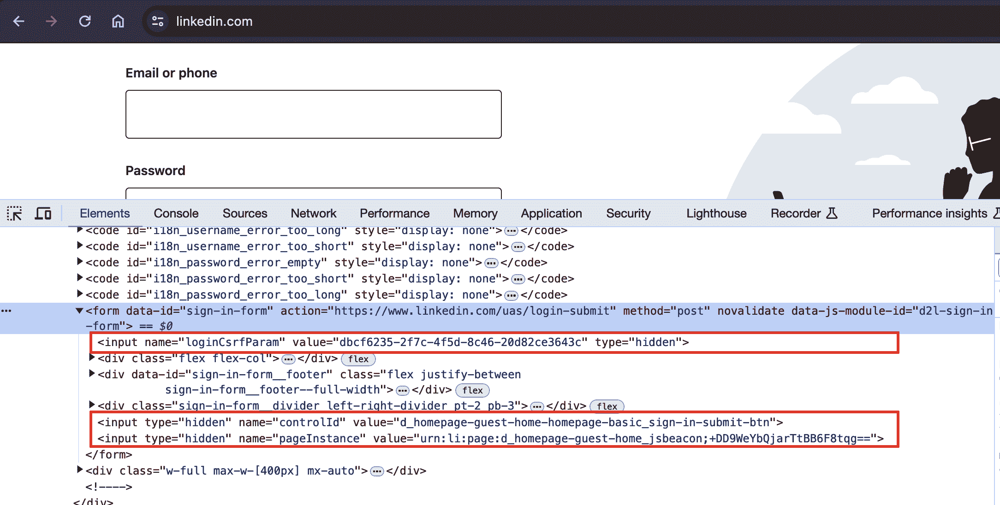

# 第十七章：避免爬虫陷阱

很少有什么比爬取一个网站、查看输出，并没有看到浏览器中清晰可见的数据更令人沮丧的了。或者提交一个应该完全正常但被网络服务器拒绝的表单。或者因未知原因被一个网站阻止 IP 地址。

这些是一些最难解决的 bug，不仅因为它们可能是如此意外（在一个网站上运行良好的脚本在另一个看似相同的网站上可能根本不起作用），而且因为它们故意不提供任何显眼的错误消息或堆栈跟踪供使用。你被识别为机器人，被拒绝了，而你却不知道为什么。

在本书中，我写了很多在网站上执行棘手任务的方法，包括提交表单、提取和清理困难数据以及执行 JavaScript。这一章有点像一个杂项章节，因为这些技术来自各种各样的学科。然而，它们都有一个共同点：它们旨在克服一个唯一目的是防止自动爬取网站的障碍。

无论这些信息对你目前有多么重要，我强烈建议你至少浏览一下这一章。你永远不知道它何时会帮助你解决一个难题或完全防止一个问题的发生。

# 关于伦理的一点说明

在本书的前几章中，我讨论了网络爬虫所处的法律灰色地带，以及一些伦理和法律指南。说实话，对我来说，这一章在伦理上可能是最难写的一章。我的网站一直受到机器人、垃圾邮件发送者、网络爬虫和各种不受欢迎的虚拟访客的困扰，也许你的网站也是如此。那么为什么要教人们如何构建更好的机器人呢？

我认为包括这一章有几个重要原因：

+   有一些完全符合道德和法律的理由可以爬取一些不希望被爬取的网站。在我以前的一份工作中，我作为一个网络爬虫，自动收集网站上发布客户姓名、地址、电话号码和其他个人信息的信息，而这些客户并未同意发布这些信息到互联网上。我使用爬取的信息向网站提出合法请求，要求其删除这些信息。为了避免竞争，这些网站密切关注着这些信息不被爬取。然而，我的工作确保了我公司客户（其中一些人有骚扰者，是家庭暴力的受害者，或者有其他非常充分的理由希望保持低调）的匿名性，这为网络爬取提供了一个令人信服的理由，我很感激我有必要的技能来完成这项工作。

+   尽管几乎不可能建立一个“抓取器免疫”的网站（或者至少是一个仍然容易被合法用户访问的网站），但我希望本章的信息能帮助那些希望捍卫其网站免受恶意攻击的人。在整本书中，我将指出每种网页抓取技术的一些弱点，你可以用来保护自己的网站。请记住，今天网络上的大多数机器人仅仅是在进行广泛的信息和漏洞扫描；即使使用本章描述的几种简单技术，也很可能会阻挡其中 99%。然而，它们每个月都在变得更加复杂，最好做好准备。

+   像大多数程序员一样，我不认为隐瞒任何教育信息是一件积极的事情。

在阅读本章节时，请记住，许多这些脚本和描述的技术不应该在你能找到的每个网站上运行。这不仅仅是不好的做法，而且你可能最终会收到停止和停止信函或者更糟糕的后果（如果你收到这样的信函，详细信息请参阅第二章）。但我不会每次讨论新技术时都敲打你的头。所以，在本章剩余部分，就像哲学家 Gump 曾经说过的：“这就是我要说的一切。”

# 仿人行为

对于不想被抓取的网站而言，基本挑战在于如何区分机器人和人类。虽然许多网站使用的技术（如 CAPTCHA）很难欺骗，但你可以通过一些相对简单的方法使你的机器人看起来更像人类。

## 调整你的标头

在整本书中，你已经使用 Python Requests 库来创建、发送和接收 HTTP 请求，比如在第十三章处理网站上的表单。Requests 库也非常适合设置标头。HTTP 标头是每次向 Web 服务器发出请求时由你发送的属性或偏好列表。HTTP 定义了几十种晦涩的标头类型，其中大多数不常用。然而，大多数主流浏览器在发起任何连接时一直使用以下七个字段（显示了来自我的浏览器示例数据）：

| `Host` | https://www.google.com/ |
| --- | --- |
| `Connection` | keep-alive |
| `Accept` | text/html,application/xhtml+xml,application/xml;q=0.9,image/avif,image/webp,image/apng,*/*;q=0.8,application/signed-exchange;v=b3;q=0.7 |
| `User-Agent` | Mozilla/5.0 (Macintosh; Intel Mac OS X 10_15_7) AppleWebKit/537.36 (KHTML, like Gecko) Chrome/113.0.0.0 Safari/537.36 |
| `Referrer` | https://www.google.com/ |
| `Accept-Encoding` | gzip, deflate, sdch |
| `Accept-Language` | en-US,en;q=0.8 |

这里是一个使用默认的 urllib 库进行典型 Python 网页抓取的标头：

| `Accept-Encoding` | identity |
| --- | --- |
| `User-Agent` | Python-urllib/3.9 |

如果你是一个试图阻止爬虫的网站管理员，你更可能放行哪一个？

幸运的是，使用 Requests 库可以完全自定义头部。[*https://www.whatismybrowser.com*](https://www.whatismybrowser.com)这个网站非常适合测试服务器可见的浏览器属性。你将使用以下脚本爬取这个网站以验证你的 Cookie 设置。

```py
import requests
from bs4 import BeautifulSoup

session = requests.Session()

headers = {'User-Agent':'Mozilla/5.0 (Macintosh; Intel Mac OS X 10_15_7) \
AppleWebKit/537.36 (KHTML, like Gecko) Chrome/113.0.0.0 Safari/537.36',
           'Accept':'text/html,application/xhtml+xml,application/xml;q=0.9,\
image/avif,image/webp,image/apng,*/*;q=0.8,application/signed-exchange;v=b3;\
q=0.7'}
url = 'https://www.whatismybrowser.com/\
developers/what-http-headers-is-my-browser-sending'
req = session.get(url, headers=headers)

bs = BeautifulSoup(req.text, 'html.parser')
print(bs.find('table', {'class':'table-striped'}).get_text)

```

输出应显示标题现在与代码中的`headers`字典对象中设置的相同。

尽管网站可以基于 HTTP 头部的任何属性检查“人类性”，但我发现通常唯一重要的设置是`User-Agent`。无论你在做什么项目，将其设置为比`Python-urllib/3.9`更不引人注意的内容都是个好主意。此外，如果你遇到一个极为可疑的网站，填充诸如`Accept-Language`等常用但很少检查的头部之一可能是说服它你是人类的关键。

## 使用 JavaScript 处理 Cookie

正确处理 Cookie 可以缓解许多爬取问题，尽管 Cookie 也可能是双刃剑。使用 Cookie 跟踪你在网站上的活动进度的网站可能会试图阻止显示异常行为的爬虫，如过快地完成表单或访问过多页面。尽管这些行为可以通过关闭和重新打开与网站的连接，甚至更改你的 IP 地址来掩饰，但如果你的 Cookie 暴露了你的身份，你的伪装努力可能会徒劳无功（详见第二十章了解更多关于如何做到这一点的信息）。

Cookies 有时也是爬取网站必需的。如第十三章所示，在网站上保持登录状态需要能够保存并呈现页面到页面的 Cookie。有些网站甚至不要求你真正登录并获得新版本的 Cookie，只需持有一个旧的“已登录”Cookie 并访问网站即可。

如果你正在爬取一个或少数几个特定的网站，我建议检查这些网站生成的 Cookie，并考虑你的爬虫可能需要处理哪些 Cookie。各种浏览器插件可以在你访问和浏览网站时显示 Cookie 的设置方式。[EditThisCookie](http://www.editthiscookie.com)，一款 Chrome 扩展，是我喜欢的工具之一。

若要了解有关使用 Requests 库处理 cookies 的更多信息，请查看“处理登录和 cookies”中的代码示例在第十三章。当然，由于它无法执行 JavaScript，因此 Requests 库将无法处理许多现代跟踪软件生成的 cookies，例如 Google Analytics，这些 cookies 仅在客户端脚本执行后（或有时基于页面事件，如按钮点击，在浏览页面时发生）设置。为了处理这些问题，您需要使用 Selenium 和 Chrome WebDriver 包（我在第十四章中介绍了它们的安装和基本用法）。

您可以通过访问任何站点（[*http://pythonscraping.com*](http://pythonscraping.com)，例如）并在 webdriver 上调用 `get_cookies()` 查看 cookies：

```py
from selenium import webdriver
from selenium.webdriver.chrome.options import Options
chrome_options = Options()
chrome_options.add_argument('--headless')
driver = webdriver.Chrome(
    executable_path='drivers/chromedriver', 
    options=chrome_options)
driver.get('http://pythonscraping.com')
driver.implicitly_wait(1)
print(driver.get_cookies())
```

这提供了相当典型的 Google Analytics cookies 数组：

```py
[{'domain': '.pythonscraping.com', 'expiry': 1722996491, 'httpOnly': False,
'name': '_ga', 'path': '/', 'sameSite': 'Lax', 'secure': False, 'value': 
'GA1.1.285394841.1688436491'}, {'domain': '.pythonscraping.com', 'expiry': 
1722996491, 'httpOnly': False, 'name': '_ga_G60J5CGY1N', 'path': '/', 
'sameSite': 'Lax', 'secure': False, 'value': 
'GS1.1.1688436491.1.0.1688436491.0.0.0'}]

```

要操作 cookies，您可以调用 `delete_cookie()`、`add_cookie()` 和 `delete_all_cookies()` 函数。此外，您可以保存和存储 cookies 以供其他网络爬虫使用。以下示例让您了解这些函数如何协同工作：

```py
from selenium import webdriver
from selenium.webdriver.chrome.options import Options

chrome_options = Options()
chrome_options.add_argument("--headless")
driver = webdriver.Chrome(
    service=Service(CHROMEDRIVER_PATH),
    options=chrome_options
)

driver.get('http://pythonscraping.com')
driver.implicitly_wait(1)

savedCookies = driver.get_cookies()
print(savedCookies)

driver2 = webdriver.Chrome(
    service=Service(CHROMEDRIVER_PATH),
    options=chrome_options
)

driver2.get('http://pythonscraping.com')
driver2.delete_all_cookies()
for cookie in savedCookies:
    driver2.add_cookie(cookie)

driver2.get('http://pythonscraping.com')
driver.implicitly_wait(1)
print(driver2.get_cookies())

```

在这个示例中，第一个 webdriver 检索一个网站，打印 cookies，然后将它们存储在变量 `savedCookies` 中。第二个 webdriver 加载同一个网站，删除自己的 cookies，并添加第一个 webdriver 的 cookies。

注意第二个 webdriver 必须先加载网站，然后再添加 cookies。这样 Selenium 才知道 cookies 属于哪个域，即使加载网站本身对爬虫没有实际用处。

完成后，第二个 webdriver 应该有与第一个相同的 cookies。根据 Google Analytics 的说法，这第二个 webdriver 现在与第一个完全相同，并且它们将以相同的方式被跟踪。如果第一个 webdriver 已登录到一个站点，第二个 webdriver 也将是如此。

## TLS 指纹识别

在 2000 年代初，许多大型科技公司喜欢在面试程序员时提出经典谜题。当招聘经理意识到两件事情时，这种做法大多数已经淡出：候选人共享和记忆谜题解决方案，以及“解决谜题的能力”与工作表现之间的关联并不紧密。

然而，这些经典的面试谜题之一仍然作为传输层安全协议的隐喻是有价值的。它是这样的：

您需要通过危险的路线向朋友发送一条绝密消息，如果解锁的包含消息的盒子被间谍拦截（但是，如果间谍没有钥匙，则带锁的消息盒是安全的）。您将消息放入可以用多个挂锁锁定的盒子中。虽然您有相应钥匙的挂锁和您的朋友也有自己的挂锁及其相应的钥匙，但是您的朋友的钥匙不适用于您的挂锁，反之亦然。如何确保您的朋友能够在其端解锁盒子并安全地接收消息？

请注意，即使作为单独的运输发送解锁您的挂锁的密钥也不起作用。间谍会拦截并复制这些钥匙并保存以备将来使用。此外，稍后发送钥匙也不起作用（尽管这是“谜题作为隐喻”有点崩溃的地方），因为间谍可以复制*盒子本身*，如果稍后发送一个钥匙，则可以解锁他们的盒子副本。

一个解决方案是这样的：你把你的挂锁放在盒子上并将其寄给你的朋友。你的朋友收到了锁上的盒子，把他们自己的挂锁放在上面（这样盒子上就有两个挂锁），然后把它寄回来。你移走你的挂锁，只剩下他们的挂锁寄给你的朋友。你的朋友收到盒子并解锁它。

本质上，这是如何在不可信网络上建立安全通信的方法。在像 HTTPS 这样的安全通信协议上，所有消息都使用密钥进行加密和解密。如果攻击者获得了密钥（谜题中的秘密消息表示的），则能够读取发送的任何消息。

那么如何将您将用于加密和解密未来消息的密钥发送给朋友，而不会被攻击者拦截和使用？用您自己的“挂锁”加密它，发送给朋友，朋友添加他们自己的“挂锁”，您移除您的“挂锁”，然后发送回来供朋友“解锁”。通过这种方式，秘密密钥安全地交换。

这个“锁定”、发送、添加另一个“锁定”等整个过程由传输层安全协议（TLS）处理。安全地建立双方共知的密钥的这一过程称为*TLS 握手*。

除了建立一个双方共知的密钥或*主秘密*外，握手期间还建立了许多其他事情：

+   双方支持的 TLS 协议的最高版本（在握手的其余部分中将使用的版本）

+   将使用的加密库是哪个

+   将使用的压缩方法

+   服务器的身份，由其公共证书表示

+   验证主秘密对双方都有效并且通信现在是安全的

每次与新的 Web 服务器联系和建立新的 HTTP 会话时，都会执行整个 TLS 握手过程（有关会话的更多信息，请参见第一章）。由你的计算机发送的确切 TLS 握手消息由进行连接的应用程序确定。例如，Chrome 可能支持略有不同的 TLS 版本或加密库，因此在 TLS 握手中发送的消息将不同。

由于 TLS 握手过程非常复杂，并涉及的变量很多，聪明的服务器管理员意识到，在 TLS 握手期间由客户端发送的消息在某种程度上对每个应用程序都是独一无二的。这些消息形成了一种*TLS 指纹*，可以显示出消息是由 Chrome、Microsoft Edge、Safari 甚至 Python Requests 库生成的。

您可以通过访问（或爬取）[*https://tools.scrapfly.io/api/fp/ja3?extended=1*](https://tools.scrapfly.io/api/fp/ja3?extended=1)来查看由您的 TLS 握手生成的一些信息。为了使 TLS 指纹更易于管理和比较，通常会使用称为 JA3 的哈希方法，其结果显示在此 API 响应中。JA3 哈希指纹被编入大型数据库，并在以后需要识别应用程序时进行查找。

TLS 指纹有点像用户代理 cookie，它是一个长字符串，用于标识您用于发送数据的应用程序。但与用户代理 cookie 不同的是，它不容易修改。在 Python 中，TLS 由[SSL 库](https://github.com/python/cpython/blob/3.11/Lib/ssl.py)控制。理论上，也许你可以重写 SSL 库。通过努力和奉献，也许你能够修改 Python 发送的 TLS 指纹，使其足够不同，以致于服务器无法识别 JA3 哈希以阻止 Python 机器人。通过更加努力和奉献，你甚至可能冒充一个无害的浏览器！一些项目，如[*https://github.com/lwthiker/curl-impersonate*](https://github.com/lwthiker/curl-impersonate)，正在试图做到这一点。

不幸的是，TLS 指纹问题的本质意味着任何仿冒库都需要由志愿者进行频繁维护，并且容易快速退化。在这些项目获得更广泛的关注和可靠性之前，有一种更简单的方法可以规避 TLS 指纹识别和阻断：Selenium。

在整本书中，我都警告过不要在存在替代解决方案时使用自动化浏览器来解决问题。浏览器使用大量内存，经常加载不必要的页面，并需要额外的依赖项来保持您的网络爬虫运行。但是，当涉及到 TLS 指纹时，避免麻烦并使用浏览器是很合理的选择。

请记住，无论您使用浏览器的无头版本还是非无头版本，您的 TLS 指纹都将是相同的。因此，可以关闭图形并使用最佳实践仅加载您需要的数据——目标服务器不会知道（至少根据您的 TLS 数据）！

## 时间至关重要

一些受到良好保护的网站可能会阻止您提交表单或与网站进行交互，如果您操作得太快的话。即使这些安全功能没有启用，从网站下载大量信息比正常人类快得多也是一个被注意并被封锁的好方法。

因此，虽然多线程编程可能是加快页面加载速度的好方法——允许您在一个线程中处理数据，同时在另一个线程中反复加载页面——但对于编写良好的爬虫来说却是一种糟糕的策略。您应该始终尽量减少单个页面加载和数据请求。如果可能的话，尽量将它们间隔几秒钟，即使您必须添加额外的：

```py
import time

time.sleep(3)
```

是否需要在页面加载之间增加这几秒钟的额外时间通常需要通过实验来确定。我曾多次为了从网站中抓取数据而苦苦挣扎，每隔几分钟就要证明自己“不是机器人”（手动解决 CAPTCHA，将新获取的 cookie 粘贴回到爬虫中，以便网站将爬虫本身视为“已证明其人类性”），但添加了 `time.sleep` 解决了我的问题，并使我可以无限期地进行抓取。

有时候你必须放慢脚步才能更快地前进！

# 常见的安全特性

多年来一直使用并继续使用许多试金石测试，以不同程度的成功将网络爬虫与使用浏览器的人类分开。虽然如果机器人下载了一些对公众可用的文章和博客文章并不是什么大事，但如果机器人创建了数千个用户帐户并开始向您网站的所有成员发送垃圾邮件，则这是一个大问题。网络表单，特别是处理帐户创建和登录的表单，如果容易受到机器人的不加区分使用，那么对于安全和计算开销来说，它们对许多站点所有者的最大利益（或至少他们认为是）是限制对站点的访问。

这些以表单和登录为中心的反机器人安全措施可能对网络爬虫构成重大挑战。

请记住，这只是创建这些表单的自动化机器人时可能遇到的一些安全措施的部分概述。请参阅第十六章，有关处理 CAPTCHA 和图像处理的内容，以及第十三章，有关处理标头和 IP 地址的内容，获取有关处理受良好保护的表单的更多信息。

## 隐藏的输入字段值

HTML 表单中的“隐藏”字段允许浏览器查看字段中包含的值，但用户看不到它们（除非他们查看站点的源代码）。随着使用 cookie 在网站上存储变量并在之间传递它们的增加，隐藏字段在一段时间内不再受欢迎，然后发现了它们的另一个出色用途：防止网页抓取程序提交表单。

图 17-1 显示了 LinkedIn 登录页面上这些隐藏字段的示例。虽然表单只有三个可见字段（用户名、密码和提交按钮），但它向服务器传递了大量信息。



###### 图 17-1\. LinkedIn 登录表单有几个隐藏字段。

隐藏字段主要用于防止 Web 抓取程序的两种主要方式：字段可以在表单页面上使用随机生成的变量填充，服务器期望在处理页面上提交该变量。如果表单中没有这个值，服务器可以合理地认为提交不是源自表单页面的有机操作，而是直接由机器人发布到处理页面。绕过此措施的最佳方法是首先抓取表单页面，收集随机生成的变量，然后从那里发布到处理页面。

第二种方法有点像“蜜罐”。如果表单包含一个隐藏字段，其名称看似无害，比如用户名或电子邮件地址，那么一个编写不良的机器人可能会填写该字段并尝试提交它，而不管它对用户是否隐藏。任何带有实际值的隐藏字段（或者在表单提交页面上与其默认值不同的值）都应被忽略，甚至可能会阻止用户访问该站点。

简而言之：有时需要检查表单所在的页面，看看服务器可能期望您漏掉的任何内容。如果看到几个隐藏字段，通常带有大量随机生成的字符串变量，那么 Web 服务器可能会在表单提交时检查它们的存在。此外，可能还会有其他检查，以确保表单变量仅被使用一次，是最近生成的（这消除了仅仅将它们存储在脚本中并随时使用的可能性），或两者兼而有之。

## 避免蜜罐

尽管 CSS 在区分有用信息和无用信息（例如通过读取`id`和`class`标签）方面大多数情况下使生活变得极为简单，但在 Web 抓取程序方面有时可能会出现问题。如果通过 CSS 从用户隐藏网页上的字段，可以合理地假设平均访问该网站的用户将无法填写它，因为它在浏览器中不显示。如果表单被填充，很可能是有机器人在操作，并且该帖子将被丢弃。

这不仅适用于表单，还适用于链接、图像、文件和站点上的任何其他项目，这些项目可以被机器人读取，但对于通过浏览器访问站点的普通用户而言是隐藏的。访问站点上的“隐藏”链接可能很容易触发一个服务器端脚本，该脚本将阻止用户的 IP 地址，将该用户从站点注销，或者采取其他措施防止进一步访问。事实上，许多商业模型都是基于这个概念的。

例如，位于[*http://pythonscraping.com/pages/itsatrap.html*](http://pythonscraping.com/pages/itsatrap.html)的页面。这个页面包含两个链接，一个被 CSS 隐藏，另一个可见。此外，它包含一个带有两个隐藏字段的表单：

```py
<html>
<head> 
    <title>A bot-proof form</title>
</head>
<style>
    body { 
        overflow-x:hidden;
    }
    .customHidden { 
        position:absolute; 
        right:50000px;
    }
</style>
<body> 
    <h2>A bot-proof form</h2>
    <a href=
     "http://pythonscraping.com/dontgohere" style="display:none;">Go here!</a>
    <a href="http://pythonscraping.com">Click me!</a>
    <form>
        <input type="hidden" name="phone" value="valueShouldNotBeModified"/><p/>
        <input type="text" name="email" class="customHidden" 
                  value="intentionallyBlank"/><p/>
        <input type="text" name="firstName"/><p/>
        <input type="text" name="lastName"/><p/>
        <input type="submit" value="Submit"/><p/>
   </form>
</body>
</html>
```

这三个元素以三种方式对用户隐藏：

+   第一个链接使用简单的 CSS `display:none`属性隐藏。

+   电话字段是一个隐藏的输入字段。

+   电子邮件字段通过将其向右移动 50,000 像素（可能超出所有人的显示器屏幕）并隐藏显眼的滚动条来隐藏它。

幸运的是，因为 Selenium 呈现它访问的页面，它能够区分页面上视觉上存在的元素和不存在的元素。元素是否存在于页面上可以通过`is_displayed()`函数确定。

例如，以下代码检索先前描述的页面，并查找隐藏链接和表单输入字段：

```py
from selenium import webdriver
from selenium.webdriver.remote.webelement import WebElement
from selenium.webdriver.chrome.options import Options
from selenium.webdriver.common.by import By

driver = webdriver.Chrome(service=Service(CHROMEDRIVER_PATH))

driver.get('http://pythonscraping.com/pages/itsatrap.html')
links = driver.find_elements(By.TAG_NAME, 'a')
for link in links:
    if not link.is_displayed():
        print(f'The link {link.get_attribute("href")} is a trap')

fields = driver.find_elements(By.TAG_NAME, 'input')
for field in fields:
    if not field.is_displayed():
        print(f'Do not change value of {field.get_attribute("name")}')

```

Selenium 捕获每个隐藏字段，产生以下输出：

```py
The link http://pythonscraping.com/dontgohere is a trap
Do not change value of phone
Do not change value of email
```

虽然你可能不想访问你发现的任何隐藏链接，但你会想确保你提交了任何预填充的隐藏表单值（或者让 Selenium 为你提交），并与其他表单一起提交。总之，简单忽略隐藏字段是危险的，尽管在与它们交互时必须小心。

# 人类检查清单

这一章节以及这本书中有很多关于如何构建一个看起来不像爬虫而更像人类的爬虫的信息。如果你不断被网站阻止而又不知道原因，这里有一个你可以用来解决问题的检查清单：

+   首先，如果你从 Web 服务器接收的页面是空白的、缺少信息的，或者与你期望的（或者在你自己的浏览器中看到的）不同，很可能是由于 JavaScript 在站点上执行以创建页面。查看第十四章。

+   如果你正在向网站提交表单或进行`POST`请求，请检查页面以确保网站期望你提交的一切都被提交并且格式正确。使用诸如 Chrome 的 Inspector 面板之类的工具查看发送到网站的实际`POST`请求，确保你拥有一切，并且“有机”的请求看起来与你的机器人发送的请求相同。

+   如果您尝试登录网站但无法保持登录状态，或者网站出现其他奇怪的“状态”行为，请检查您的 cookies。确保 cookies 在每次页面加载之间都被正确保存，并且您的 cookies 被发送到该网站以处理每个请求。

+   如果您从客户端收到 HTTP 错误，特别是 403 Forbidden 错误，这可能表示网站已将您的 IP 地址识别为机器人，不愿再接受任何请求。您需要等待直到您的 IP 地址从列表中移除，或者获取一个新的 IP 地址（要么去星巴克，要么参考第二十章）。为了确保您不会再次被阻止，请尝试以下方法：

    +   确保您的抓取器不要过快地浏览网站。快速抓取是一种不良实践，会给网站管理员的服务器带来沉重负担，可能会让您陷入法律麻烦，并且是抓取器被列入黑名单的头号原因。为您的抓取器添加延迟，并让它们在夜间运行。记住：匆忙编写程序或收集数据是糟糕项目管理的表现；提前计划以避免出现这种混乱。

    +   最明显的一种：更改您的 headers！一些网站会阻止任何宣称自己是抓取器的内容。如果您对一些合理的 header 值感到不确定，请复制您自己浏览器的 headers。

    +   确保您不要点击或访问任何人类通常无法访问的内容（更多信息请参考“避免蜜罐”）。

    +   如果您发现自己需要跨越许多困难障碍才能获得访问权限，请考虑联系网站管理员，让他们知道您的操作。尝试发送电子邮件至*webmaster@<domain name>*或*admin@<domain name>*，请求使用您的抓取器。管理员也是人，您可能会惊讶地发现他们对分享数据的态度是多么的乐意。
