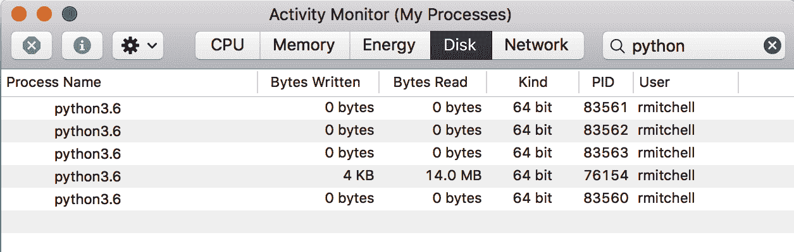

# 第十九章：并行网络爬虫

网络爬虫速度快。至少，通常比雇佣十几个实习生手工复制互联网数据要快得多！当然，科技的进步和享乐主义跑步机要求在某一点上甚至这都不够“快”。这就是人们通常开始寻求分布式计算的时候。

与大多数其他技术领域不同，网络爬虫通常不能简单地通过“将更多的周期投入到问题中”来改进。运行一个进程是快速的；运行两个进程不一定是两倍快。运行三个进程可能会让你被禁止访问你正在猛击的远程服务器！

但是，在某些情况下，并行网络爬虫或运行并行线程或进程仍然有益：

+   从多个来源（多个远程服务器）收集数据而不仅仅是单个来源

+   在收集的数据上执行长时间或复杂的操作（例如进行图像分析或 OCR），这些操作可以与获取数据并行进行。

+   从一个大型网络服务中收集数据，在这里你需要为每个查询付费，或者在你的使用协议范围内创建多个连接到服务。

# 进程与线程

线程和进程不是 Python 特有的概念。虽然确切的实现细节在操作系统之间不同，并且依赖于操作系统，但计算机科学界的一般共识是，进程更大并且有自己的内存，而线程更小并且在包含它们的进程内共享内存。

通常，当你运行一个简单的 Python 程序时，你在自己的进程中运行它，该进程包含一个线程。但是 Python 支持多进程和多线程。多进程和多线程都实现了同样的最终目标：以并行方式执行两个编程任务，而不是以更传统的线性方式一个接一个地运行函数。

但是，你必须仔细考虑每个方案的利弊。例如，每个进程都有自己由操作系统分配的内存。这意味着内存不在进程之间共享。虽然多个线程可以愉快地写入相同的共享 Python 队列、列表和其他对象，但进程不能，必须更显式地传递这些信息。

使用多线程编程在单独的线程中执行具有共享内存的任务通常被认为比多进程编程更容易。但是这种方便性是有代价的。

Python 的全局解释器锁（GIL）用于防止多个线程同时执行同一行代码。GIL 确保所有进程共享的通用内存不会变得损坏（例如，内存中的字节一半被写入一个值，另一半被写入另一个值）。这种锁定使得编写多线程程序并在同一行内知道你得到什么成为可能，但它也有可能造成瓶颈。

# 多线程爬取

以下示例说明了使用多线程执行任务：

```py
import threading
import time

def print_time(threadName, delay, iterations):
    start = int(time.time())
    for i in range(0,iterations):
        time.sleep(delay)
        print(f'{int(time.time() - start)} - {threadName}')

threads = [
    threading.Thread(target=print_time, args=('Fizz', 3, 33)),
    threading.Thread(target=print_time, args=('Buzz', 5, 20)),
    threading.Thread(target=print_time, args=('Counter', 1, 100))
]

[t.start() for t in threads]
[t.join() for t in threads]

```

这是对经典的[FizzBuzz 编程测试](http://wiki.c2.com/?FizzBuzzTest)的参考，输出略显冗长：

```py
1 Counter
2 Counter
3 Fizz
3 Counter
4 Counter
5 Buzz
5 Counter
6 Fizz
6 Counter

```

脚本启动三个线程，一个每三秒打印一次“Fizz”，另一个每五秒打印一次“Buzz”，第三个每秒打印一次“Counter”。

你可以在线程中执行有用的任务，如爬取网站，而不是打印 Fizz 和 Buzz：

```py
from urllib.request import urlopen
from bs4 import BeautifulSoup
import re
import random
import threading
import time

# Recursively find links on a Wikipedia page, 
# then follow a random link, with artificial 5 sec delay
def scrape_article(thread_name, path):
    time.sleep(5)
    print(f'{thread_name}: Scraping {path}')
    html = urlopen('http://en.wikipedia.org{}'.format(path))
    bs = BeautifulSoup(html, 'html.parser')
    title = bs.find('h1').get_text()
    links = bs.find('div', {'id':'bodyContent'}).find_all('a',
        href=re.compile('^(/wiki/)((?!:).)*$'))
    if len(links) > 0:
        newArticle = links[random.randint(0, len(links)-1)].attrs['href']
        scrape_article(thread_name, newArticle)

threads = [
    threading.Thread(
        target=scrape_article,
        args=('Thread 1', '/wiki/Kevin_Bacon',)
    ),
    threading.Thread(
        target=scrape_article,
        args=('Thread 2', '/wiki/Monty_Python',)
    ),
]
[t.start() for t in threads]
[t.join() for t in threads]

```

注意包含这一行：

```py
time.sleep(5)

```

因为你几乎比单线程快了将近一倍的速度爬取维基百科，所以包含这一行可以防止脚本给维基百科的服务器造成过大负载。在实践中，在针对请求数量不是问题的服务器上运行时，应该删除这一行。

如果你想要稍微改写这个例子，以便追踪线程迄今为止共同看到的文章，以便不会重复访问任何文章，你可以在多线程环境中使用列表的方式与在单线程环境中使用它一样：

```py
visited = []
def get_links(thread_name, bs):
    print('Getting links in {}'.format(thread_name))
    links = bs.find('div', {'id':'bodyContent'}).find_all('a',
        href=re.compile('^(/wiki/)((?!:).)*$')
    )
    return [link for link in links if link not in visited]

def scrape_article(thread_name, path):
    visited.append(path)
    ...
    links = get_links(thread_name, bs)
    ...

```

注意，将路径附加到已访问路径列表的操作是`scrape_article`执行的第一个动作。这减少了但并没有完全消除它被重复爬取的机会。

如果你运气不好，两个线程仍然可能在同一瞬间偶然遇到相同的路径，两者都会看到它不在已访问列表中，然后都会将其添加到列表并同时进行爬取。但是，实际上由于执行速度和维基百科包含的页面数量，这种情况不太可能发生。

这是一个*竞争条件*的例子。竞争条件对于有经验的程序员来说可能很难调试，因此评估代码中这些潜在情况，估计它们发生的可能性，并预测其影响的严重性是很重要的。

在这种特定的竞争条件下，爬虫两次访问同一页的情况可能不值得去解决。

## 竞争条件和队列

虽然你可以使用列表在线程之间通信，但列表并非专门设计用于线程之间通信，它们的错误使用很容易导致程序执行缓慢甚至由竞争条件导致的错误。

列表适用于追加或读取，但不太适合从任意点删除项目，尤其是从列表开头删除。使用如下语句：

```py
myList.pop(0)

```

实际上需要 Python 重新编写整个列表，从而减慢程序执行速度。

更危险的是，列表还使得在不是线程安全的情况下方便地写入一行。例如：

```py
myList[len(myList)-1]

```

在多线程环境中，这可能实际上并不会获取列表中的最后一个项目，或者如果计算 `len(myList)-1` 的值恰好在另一个操作修改列表之前立即进行，则可能会引发异常。

有人可能会认为前面的陈述可以更“Python 化”地写成 `myList[-1]`，当然，像我这样的前 Java 开发者，在弱点时刻从未不小心写过非 Python 风格的代码（尤其是回想起像 `myList[myList.length-1]` 这样的模式的日子）！但即使您的代码毫无可指摘，也请考虑以下涉及列表的其他非线程安全代码形式：

```py
my_list[i] = my_list[i] + 1
my_list.append(my_list[-1])

```

这两者都可能导致竞态条件，从而导致意外结果。您可能会尝试另一种方法，并使用除列表之外的其他变量类型。例如：

```py
# Read the message in from the global list
my_message = global_message
# Write a message back
global_message = 'I've retrieved the message'
# do something with my_message

```

这似乎是一个很好的解决方案，直到您意识到在第一行和第二行之间的瞬间，您可能已经无意中覆盖了来自另一个线程的另一条消息，其文本为“我已检索到消息”。因此，现在您只需为每个线程构建一系列复杂的个人消息对象，并添加一些逻辑来确定谁获取什么……或者您可以使用专为此目的构建的 `Queue` 模块。

队列是类似列表的对象，可以采用先进先出（FIFO）或后进先出（LIFO）方法。队列通过 `queue.put('My message')` 从任何线程接收消息，并可以将消息传输给调用 `queue.get()` 的任何线程。

队列不是设计用来存储静态数据的，而是以线程安全的方式传输数据。从队列检索数据后，它应该仅存在于检索它的线程中。因此，它们通常用于委派任务或发送临时通知。

这在网页抓取中可能很有用。例如，假设您希望将爬取器收集到的数据持久化到数据库中，并且希望每个线程能够快速持久化其数据。一个共享的单一连接可能会导致问题（单一连接无法并行处理请求），但每个爬取线程都分配自己的数据库连接也是没有意义的。随着爬取器的规模扩大（最终您可能从一百个不同的网站中收集数据，每个网站一个线程），这可能会转化为大量大多数空闲的数据库连接，仅在加载页面后偶尔进行写入。

相反，您可以拥有少量数据库线程，每个线程都有自己的连接，等待从队列中接收并存储项目。这提供了一组更易管理的数据库连接：

```py
def storage(queue):
    conn = pymysql.connect(host='127.0.0.1', unix_socket='/tmp/mysql.sock',
    user='root', passwd='password', db='mysql', charset='utf8')
    cur = conn.cursor()
    cur.execute('USE wikipedia')
    while 1:
        if not queue.empty():
            path = queue.get()
            cur.execute('SELECT * FROM pages WHERE url = %s', (path))
            if cur.rowcount == 0:
                print(f'Storing article {path}')
                cur.execute('INSERT INTO pages (url) VALUES (%s)', (path))
                conn.commit()
            else:
                print("Article already exists: {}".format(path))

visited = set()
def get_links(thread_name, bs):
    print('Getting links in {}'.format(thread_name))
    links = bs.find('div', {'id':'bodyContent'}).find_all(
        'a',
        href=re.compile('^(/wiki/)((?!:).)*$')
    )
    links = [link.get('href') for link in links]
    return [link for link in links if link and link not in visited]

def scrape_article(thread_name, path):
    time.sleep(5)
    visited.add(path)
    print(f'{thread_name}: Scraping {path}')
    bs = BeautifulSoup(
        urlopen('http://en.wikipedia.org{}'.format(path)),
        'html.parser'
    )
    links = get_links(thread_name, bs)
    if len(links) > 0:
        [queue.put(link) for link in links]
        newArticle = links[random.randint(0, len(links)-1)].attrs['href']
        scrape_article(thread_name, newArticle)

queue = Queue()

threads = [
    threading.Thread(
    ​    target=scrape_article,
​    ​    args=('Thread 1', '/wiki/Kevin_Bacon',)
​    ),
    threading.Thread(
​    ​    target=scrape_article,
​    ​    args=('Thread 2', '/wiki/Monty_Python',)
​    ),
    threading.Thread(
​    ​    target=storage,
​    ​    args=(queue,)
​    )
]
[t.start() for t in threads]
[t.join() for t in threads]

```

此脚本创建三个线程：两个线程在维基百科上进行随机遍历页面，第三个线程将收集的数据存储在 MySQL 数据库中。有关 MySQL 和数据存储的更多信息，请参见第九章。

此爬虫也比之前的版本简化了一些。它不再处理页面的标题和 URL，而是只关注 URL。此外，鉴于两个线程可能同时尝试将相同的 URL 添加到`visited`列表中，我已将此列表转换为集合。虽然它不严格地线程安全，但冗余设计确保任何重复不会对最终结果产生影响。

## 线程模块的更多特性

Python 的`threading`模块是在低级别`_thread`模块之上构建的高级接口。虽然`_thread`可以完全独立使用，但它需要更多的工作，而且不提供让生活变得如此愉快的小东西——例如便捷函数和巧妙功能。

例如，您可以使用像`enumerate`这样的静态函数来获取通过`threading`模块初始化的所有活动线程列表，而无需自己跟踪它们。类似地，`activeCount`函数提供线程的总数。来自`_thread`的许多函数都有更方便或更易记的名称，例如`currentThread`而不是`get_ident`来获取当前线程的名称。

关于线程模块的一个很好的特点是，可以轻松创建本地线程数据，这些数据对其他线程不可用。如果您有多个线程，每个线程分别从不同的网站抓取数据，并且每个线程跟踪其自己的本地已访问页面列表，这可能是一个不错的功能。

此本地数据可以在线程函数内的任何点上通过调用`threading.local()`来创建：

```py
import threading

def crawler(url):
    data = threading.local()
    data.visited = []
    # Crawl site

threading.Thread(target=crawler, args=('http://brookings.edu')).start()

```

这解决了在线程共享对象之间发生竞争条件的问题。每当一个对象不需要被共享时，它就不应该被共享，并且应该保留在本地线程内存中。为了安全地在线程之间共享对象，仍然可以使用前一节中的`Queue`。

线程模块充当一种线程保姆，并且可以高度定制以定义这种保姆的具体任务。`isAlive`函数默认查看线程是否仍然活动。直到线程完成（或崩溃）时，该函数将返回`True`。

通常，爬虫设计为长时间运行。`isAlive`方法可以确保如果线程崩溃，它将重新启动：

```py
threading.Thread(target=crawler)
t.start()

while True:
    time.sleep(1)
    if not t.isAlive():
        t = threading.Thread(target=crawler)
        t.start()

```

另外，可以通过扩展`threading.Thread`对象来添加其他监控方法：

```py
import threading
import time

class Crawler(threading.Thread):
    def __init__(self):
        threading.Thread.__init__(self)
        self.done = False

    def isDone(self):
        return self.done

    def run(self):
        time.sleep(5)
        self.done = True
        raise Exception('Something bad happened!')

t = Crawler()
t.start()

while True:
    time.sleep(1)
    if t.isDone():
        print('Done')
        break
    if not t.isAlive():
        t = Crawler()
        t.start()

```

这个新的`Crawler`类包含一个`isDone`方法，可以用来检查爬虫是否完成了爬取工作。如果还有一些需要完成的额外记录方法，以便线程不能关闭，但大部分爬取工作已经完成，这可能会很有用。通常情况下，`isDone`可以替换为某种状态或进度度量 - 例如已记录的页面数或当前页面。

任何由`Crawler.run`引发的异常都会导致类重新启动，直到`isDone`为`True`并退出程序。

在您的爬虫类中扩展`threading.Thread`可以提高它们的健壮性和灵活性，以及您同时监视许多爬虫的任何属性的能力。

# 多进程

Python 的`Processing`模块创建了可以从主进程启动和加入的新进程对象。以下代码使用了线程进程部分中的 FizzBuzz 示例来演示：

```py
from multiprocessing import Process
import time

def print_time(threadName, delay, iterations):
    start = int(time.time())
    for i in range(0,iterations):
        time.sleep(delay)
        seconds_elapsed = str(int(time.time()) - start)
        print (threadName if threadName else seconds_elapsed)

processes = [
    Process(target=print_time, args=('Counter', 1, 100)),
    Process(target=print_time, args=('Fizz', 3, 33)),
    Process(target=print_time, args=('Buzz', 5, 20)) 
]

[p.start() for p in processes]
[p.join() for p in processes]

```

请记住，每个进程都被操作系统视为独立的个体程序。如果通过操作系统的活动监视器或任务管理器查看进程，您应该能看到这一点，就像在图 19-1 中所示。



###### 图 19-1. 在运行 FizzBuzz 时运行的五个 Python 进程

第四个进程的 PID 为 76154，是运行中的 Jupyter 笔记本实例，如果您是从 IPython 笔记本中运行此程序，应该会看到它。第五个进程 83560 是执行的主线程，在程序首次执行时启动。PID 是由操作系统顺序分配的。除非在 FizzBuzz 脚本运行时有另一个程序快速分配 PID，否则您应该会看到另外三个顺序 PID - 在本例中为 83561、83562 和 83563。

这些 PID 也可以通过使用`os`模块在代码中找到：

```py
import os
...
`# prints the child PID`
`os``.``getpid``(``)`
`# prints the parent PID`
os.getppid()

```

您程序中的每个进程应该为`os.getpid()`行打印不同的 PID，但在`os.getppid()`上将打印相同的父 PID。

从技术上讲，对于这个特定程序，不需要几行代码。如果不包括结束的`join`语句：

```py
[p.join() for p in processes]
```

父进程仍将结束并自动终止子进程。但是，如果希望在这些子进程完成后执行任何代码，则需要这种连接。

例如：

```py
[p.start() for p in processes]
print('Program complete')

```

如果不包括`join`语句，输出将如下所示：

```py
Program complete
1
2

```

如果包括`join`语句，程序将等待每个进程完成后再继续：

```py
[p.start() for p in processes]
[p.join() for p in processes]
print('Program complete')

```

```py
...
Fizz
99
Buzz
100
Program complete

```

如果您想要提前停止程序执行，您当然可以使用 Ctrl-C 来终止父进程。父进程的终止也将终止已生成的任何子进程，因此可以放心使用 Ctrl-C，不用担心意外地使进程在后台运行。

## 多进程爬取

多线程维基百科爬取示例可以修改为使用单独的进程而不是单独的线程：

```py
from urllib.request import urlopen
from bs4 import BeautifulSoup
import re
import random

from multiprocessing import Process
import os
import time

visited = []
def get_links(bs):
    links = bs.find('div', {'id':'bodyContent'})
        .find_all('a', href=re.compile('^(/wiki/)((?!:).)*$'))
    return [link for link in links if link not in visited]

def scrape_article(path):
    visited.append(path)
    html = urlopen('http://en.wikipedia.org{}'.format(path))
    time.sleep(5)
    bs = BeautifulSoup(html, 'html.parser')
    print(f'Scraping {bs.find("h1").get_text()} in process {os.getpid()}')
    links = get_links(bs)
    if len(links) > 0:
        scrape_article(links[random.randint(0, len(links)-1)].attrs['href'])

processes = [
    Process(target=scrape_article, args=('/wiki/Kevin_Bacon',)),
    Process(target=scrape_article, args=('/wiki/Monty_Python',)) 
]
[p.start() for p in processes]

```

再次，您通过包含`time.sleep(5)`来人为地减慢爬虫的过程，以便可以在不对维基百科服务器施加不合理负载的情况下用于示例目的。

在这里，您正在用`os.getpid()`替换传递为参数的用户定义的`thread_name`，这不需要作为参数传递，并且可以在任何时候访问。

这将产生如下的输出：

```py
Scraping Kevin Bacon in process 4067
Scraping Monty Python in process 4068
Scraping Ewan McGregor in process 4067
Scraping Charisma Records in process 4068
Scraping Renée Zellweger in process 4067
Scraping Genesis (band) in process 4068
Scraping Alana Haim in process 4067
Scraping Maroon 5 in process 4068

```

理论上，与分开线程爬行相比，单独进程爬行略快，有两个主要原因：

+   进程不受 GIL 锁定的限制，可以同时执行相同的代码行并修改同一个（实际上是同一对象的不同实例化）对象。

+   进程可以在多个 CPU 核心上运行，这可能会提供速度优势，如果您的每个进程或线程都是处理器密集型的。

然而，这些优势伴随着一个主要的缺点。在前述程序中，所有找到的 URL 都存储在全局的`visited`列表中。当您使用多个线程时，此列表在所有线程之间共享；除非存在罕见的竞争条件，否则一个线程无法访问已被另一个线程访问过的页面。然而，现在每个进程都获得其自己独立版本的 visited 列表，并且可以自由地访问其他进程已经访问过的页面。

## 在进程之间通信

进程在其自己独立的内存中运行，如果您希望它们共享信息，这可能会导致问题。

将前面的示例修改为打印 visited 列表的当前输出，您可以看到这个原理的实际应用：

```py
def scrape_article(path): 
    visited.append(path)
    print("Process {} list is now: {}".format(os.getpid(), visited))

```

这导致输出如下所示：

```py
Process 84552 list is now: ['/wiki/Kevin_Bacon']
Process 84553 list is now: ['/wiki/Monty_Python']
Scraping Kevin Bacon in process 84552
/wiki/Desert_Storm
Process 84552 list is now: ['/wiki/Kevin_Bacon', '/wiki/Desert_Storm']
Scraping Monty Python in process 84553
/wiki/David_Jason
Process 84553 list is now: ['/wiki/Monty_Python', '/wiki/David_Jason']

```

但是通过两种类型的 Python 对象：队列和管道，可以在同一台机器上的进程之间共享信息。

一个*队列*与先前看到的线程队列类似。信息可以由一个进程放入队列，由另一个进程移除。一旦这些信息被移除，它就从队列中消失了。因为队列被设计为“临时数据传输”的一种方法，所以不适合保存静态引用，例如“已经访问过的网页列表”。

但是，如果这个静态的网页列表被某种爬取委托替代怎么办？爬虫可以从一个队列中弹出一个路径来爬取（例如*/wiki/Monty_Python*），并且返回一个包含“找到的 URL”列表的独立队列，该队列将由爬取委托处理，以便只有新的 URL 被添加到第一个任务队列中：

```py
def task_delegator(taskQueue, urlsQueue):
    #Initialize with a task for each process
    visited = ['/wiki/Kevin_Bacon', '/wiki/Monty_Python']
    taskQueue.put('/wiki/Kevin_Bacon')
    taskQueue.put('/wiki/Monty_Python')

    while 1:
        # Check to see if there are new links in the urlsQueue
        # for processing
        if not urlsQueue.empty():
            links = [link for link in urlsQueue.get() if link not in visited]
            for link in links:
                #Add new link to the taskQueue
                taskQueue.put(link)

def get_links(bs):
    links = bs.find('div', {'id':'bodyContent'}).find_all('a',
        href=re.compile('^(/wiki/)((?!:).)*$'))
    return [link.attrs['href'] for link in links]

def scrape_article(taskQueue, urlsQueue):
    while 1:
        while taskQueue.empty():
            #Sleep 100 ms while waiting for the task queue
            #This should be rare
            time.sleep(.1)
        path = taskQueue.get()
        html = urlopen('http://en.wikipedia.org{}'.format(path))
        time.sleep(5)
        bs = BeautifulSoup(html, 'html.parser')
        title = bs.find('h1').get_text()
        print(f'Scraping {bs.find('h1').get_text()} in process {os.getpid()}')
        links = get_links(bs)
        #Send these to the delegator for processing
        urlsQueue.put(links)

processes = []
taskQueue = Queue()
urlsQueue = Queue()
processes.append(Process(target=task_delegator, args=(taskQueue, urlsQueue,)))
processes.append(Process(target=scrape_article, args=(taskQueue, urlsQueue,)))
processes.append(Process(target=scrape_article, args=(taskQueue, urlsQueue,)))

for p in processes:
    p.start()

```

这个爬虫与最初创建的爬虫之间存在一些结构上的差异。不同于每个进程或线程按照其分配的起始点进行自己的随机漫步，它们共同努力完成对网站的完整覆盖爬行。每个进程可以从队列中获取任何“任务”，而不仅仅是它们自己找到的链接。

你可以看到它的实际效果，例如进程 97024 同时爬取*蒙提·派森*和*费城*（凯文·贝肯的电影）：

```py
Scraping Kevin Bacon in process 97023
Scraping Monty Python in process 97024
Scraping Kevin Bacon (disambiguation) in process 97023
Scraping Philadelphia in process 97024
Scraping Kevin Bacon filmography in process 97023
Scraping Kyra Sedgwick in process 97024
Scraping Sosie Bacon in process 97023
Scraping Edmund Bacon (architect) in process 97024
Scraping Michael Bacon (musician) in process 97023
Scraping Holly Near in process 97024
Scraping Leading actor in process 97023
```

# 多进程爬虫——另一种方法

所有讨论的多线程和多进程爬取方法都假设你需要对子线程和子进程进行某种形式的“家长监护”。你可以同时启动它们，你可以同时结束它们，你可以在它们之间发送消息或共享内存。

但是，如果你的爬虫设计得不需要任何指导或通信呢？现在还没有理由着急使用`import _thread`。

例如，假设你想并行爬取两个类似的网站。你编写了一个爬虫，可以通过一个小的配置更改或者命令行参数来爬取这两个网站中的任何一个。你完全可以简单地做以下操作：

```py
$ python my_crawler.py website1
```

```py
$ python my_crawler.py website2
```

然后，你就启动了一个多进程网络爬虫，同时又节省了 CPU 因为要保留一个父进程而产生的开销！

当然，这种方法也有缺点。如果你想以这种方式在*同一个*网站上运行两个网络爬虫，你需要某种方式来确保它们不会意外地开始爬取相同的页面。解决方案可能是创建一个 URL 规则（“爬虫 1 爬取博客页面，爬虫 2 爬取产品页面”）或者以某种方式划分网站。

或者，你可以通过某种中间数据库来处理这种协调，比如[Redis](https://redis.io/)。在前往新链接之前，爬虫可以向数据库发出请求：“这个页面已经被爬取过了吗？”爬虫将数据库用作进程间通信系统。当然，如果没有仔细考虑，这种方法可能会导致竞态条件或者如果数据库连接慢的话会有延迟（这可能只在连接到远程数据库时才会出现问题）。

你可能还会发现，这种方法不太具有可扩展性。使用`Process`模块可以动态增加或减少爬取网站或存储数据的进程数量。通过手动启动它们，要么需要一个人物理上运行脚本，要么需要一个单独的管理脚本（无论是 bash 脚本、cron 作业还是其他方式）来完成这个任务。

然而，我过去曾非常成功地使用过这种方法。对于小型的一次性项目来说，这是一种快速获取大量信息的好方法，尤其是跨多个网站。
