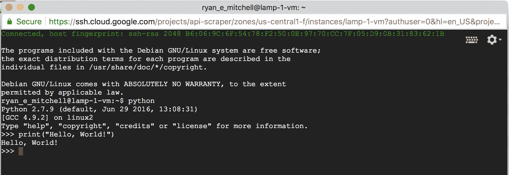

# 第二十章 网络抓取代理

这是本书的最后一章也算是相当合适的。到目前为止，您一直在命令行中运行所有 Python 应用程序，限制在您的家用计算机的范围内。正如谚语所说：“如果你爱某物，请释放它。”

尽管您可能会因为目前不“需要”此步骤而推迟此步骤，但当您停止尝试从笔记本电脑上运行 Python 网络爬虫时，您可能会惊讶于生活变得多么容易。

此外，自 2015 年第一版本书出版以来，一个专门的网络抓取代理公司行业已经兴起并蓬勃发展。支付某人为您运行网络爬虫曾经是支付云服务器实例和在其上运行爬虫的事情。现在，您可以通过 API 请求基本上说“获取此网站”，一个远程程序将处理详细信息，处理任何安全问题，并将数据返回给您（当然要收费！）。

在本章中，我们将介绍一些方法，可以通过远程 IP 地址路由您的请求，将软件托管和运行在其他地方，甚至完全将工作转移到网页抓取代理。

# 为什么要使用远程服务器？

尽管在推出面向广大用户使用的网络应用程序时，使用远程服务器似乎是一个显而易见的步骤，但程序员为自己目的构建的工具通常仍然在本地运行。在没有将程序移至其他地方的动机的情况下，为什么要做任何事情？通常将其移到其他地方的原因可以分为两大类：需要替代 IP 地址（要么是因为您的 IP 被阻止了，要么是为了防止被阻止），以及需要更强大和灵活性。

## 避免 IP 地址阻塞

在构建网络爬虫时，一个经验法则是：几乎一切都可以伪造。您可以从您不拥有的地址发送电子邮件，从命令行自动化鼠标移动数据，甚至通过发送来自 Internet Explorer 9.0 的网站流量来惊吓网站管理员。

唯一无法伪造的是您的 IP 地址。在现实世界中，任何人都可以寄给您一封信，署名是：“总统，华盛顿特区 1600 号宾夕法尼亚大道，20500 号。”然而，如果这封信的邮戳是从新墨西哥州的阿尔伯克基寄出的，您几乎可以确定您并没有在与美国总统通信。¹

大多数阻止网络爬虫访问网站的方法集中在检测人类和机器人之间的差异。将 IP 地址封锁起来有点像农民放弃喷洒杀虫剂，而选择火烧田地。这是一种最后的但有效的丢弃来自问题 IP 地址发送的数据包的方法。但是，这种解决方案存在问题：

+   IP 地址访问列表的维护非常痛苦。尽管大型网站通常有自己的程序自动化管理这些列表的一些常规工作（机器人阻止机器人！），但仍然需要有人偶尔检查它们，或者至少监控它们的增长以便及时发现问题。

+   每个地址在接收数据包时都会增加一小段处理时间，因为服务器必须根据列表检查接收到的数据包以决定是否批准它们。许多地址乘以许多数据包可能会迅速累加。为了节省处理时间和复杂性，管理员通常将这些 IP 地址分组成块，并制定诸如“这个范围内的所有 256 个地址都被阻止”的规则，如果有几个严密聚集的违规者的话。这导致我们到达第三点。

+   IP 地址阻止可能会导致“好人”也被阻止访问。例如，我曾在 Olin College of Engineering 读本科时，有一名学生编写了一些软件，试图操纵当时流行的[*http://digg.com*](http://digg.com/)网站上的内容投票。这个软件被阻止了，而那个被阻止的单个 IP 地址导致整个宿舍无法访问该网站。学生简单地将他的软件移动到了另一台服务器；与此同时，Digg 失去了许多主要目标受众的常规用户页面访问量。

尽管它有缺点，但 IP 地址阻止仍然是服务器管理员阻止怀疑的网络爬虫访问服务器的极为常见的方法。如果一个 IP 地址被阻止，唯一的真正解决办法就是从不同的 IP 地址进行爬取。这可以通过将爬虫移动到新的服务器或者通过像 Tor 这样的服务将流量路由到不同的服务器来实现。

## 可移植性和可扩展性

一些任务对家用计算机和互联网连接来说太大了。虽然你不想给任何单个网站带来大负载，但你可能正在跨越广泛的网站收集数据，因此需要比你当前设置提供的带宽和存储空间多得多。

此外，通过将计算密集型处理转移，你可以释放出家用机器的周期来完成更重要的任务（*魔兽世界*，有人？）。你不必担心维持电力和互联网连接。你可以在星巴克启动你的应用程序，收拾好笔记本电脑，离开时仍然知道一切都在安全运行。同样，在以后只要有互联网连接的地方，你都可以访问你收集的数据。

如果你有一个需要大量计算能力的应用程序，单个亚马逊超大型计算实例无法满足你的需求，你也可以考虑*分布式计算*。这允许多台机器并行工作以完成你的目标。举个简单的例子，你可以让一台机器爬取一组网站，另一台爬取另一组网站，并让它们都将收集到的数据存储在同一个数据库中。

当然，正如前几章所指出的，许多人可以复制 Google 搜索的功能，但很少有人能够复制 Google 搜索的规模。分布式计算是计算机科学的一个广阔领域，超出了本书的范围。然而，学习如何将你的应用程序部署到远程服务器是必要的第一步，你可能会对现在计算机的功能感到惊讶。

# Tor

洋葱路由器网络，更为人熟知的是缩写为*Tor*的网络，是一组志愿者服务器，设置为通过许多层次（因此有洋葱参考）的不同服务器来路由和重新路由流量，以模糊其起源。数据在进入网络之前被加密，以便如果任何特定服务器被监听，通信的性质就无法被揭示。此外，尽管任何特定服务器的入站和出站通信可能会被破坏，但为了解密通信的真实起点和终点，你需要知道沿通信路径的*所有*服务器的入站和出站通信的详细信息——这几乎是不可能的壮举。

Tor 通常被人权工作者和政治告密者用于与记者交流，并且它的大部分资金来自美国政府。当然，它也经常被用于非法活动，因此仍然是政府监视的持续目标——尽管目前尚不清楚这种监视的有用性。

# Tor 匿名性的限制

尽管你在本书中使用 Tor 的原因是为了更改你的 IP 地址，而不是实现完全的匿名性，但值得花一点时间来讨论 Tor 匿名流量的一些优点和限制。

尽管在使用 Tor 时你可以假设你的 IP 地址对于网站服务器来说是不可追踪的，但你与该网站分享的任何信息都可能暴露你的身份。例如，如果你登录自己的 Gmail 账户然后进行具有指控性的 Google 搜索，这些搜索现在就可以与你的身份联系起来。

除了显而易见的之外，甚至登录 Tor 的行为本身可能对你的匿名性构成危险。2013 年 12 月，一名哈佛大学本科生试图逃避期末考试，通过 Tor 网络向学校发送了一封炸弹威胁邮件，使用了匿名邮件账户。当哈佛的 IT 团队查看他们的日志时，他们发现在发送炸弹威胁时，只有一台机器注册了一个已知学生的 Tor 网络流量。尽管他们无法确定这些流量的最终目的地（只知道它是通过 Tor 发送的），但时间上的匹配以及在该时间段内只有一台机器登录的事实已足以起诉这名学生。²

登录 Tor 并不是一个自动的隐形斗篷，也不会让您在互联网上随意行事。虽然它是一个有用的工具，但请确保谨慎使用，智慧使用，当然还有道德。

安装和运行 Tor 是使用 Python 与 Tor 的必备条件，正如你将在下一节看到的那样。幸运的是，Tor 服务安装和启动非常简单。只需访问[Tor 下载页面](https://www.torproject.org/download)，下载、安装、打开并连接即可。请注意，使用 Tor 时你的互联网速度可能会变慢。耐心一点——可能它要绕地球几次！

## PySocks

PySocks 是一个非常简单的 Python 模块，能够通过代理服务器路由流量，并且与 Tor 一起工作效果非常好。您可以从[其网站](https://pypi.python.org/pypi/PySocks/1.5.0)下载它，或者使用任何第三方模块管理器来安装它。

尽管对于此模块并不存在太多的文档，但使用它非常简单。运行此代码时，Tor 服务必须在端口 9150 上运行（默认端口）：

```py
import socks
import socket
from urllib.request import urlopen

socks.set_default_proxy(socks.PROXY_TYPE_SOCKS5, "localhost", 9150)
socket.socket = socks.socksocket
print(urlopen('http://icanhazip.com').read())

```

网站[*http://icanhazip.com*](http://icanhazip.com)仅显示连接到服务器的客户端的 IP 地址，对于测试目的可能很有用。运行此脚本时，应显示一个不是您自己的 IP 地址。

如果您想要使用 Selenium 和 ChromeDriver 与 Tor，您完全不需要 PySocks——只需确保 Tor 当前正在运行，并添加可选的`proxy-server` Chrome 选项，指定 Selenium 应该连接到端口 9150 上的 socks5 协议：

```py
from selenium import webdriver
from selenium.webdriver.chrome.service import Service
from selenium.webdriver.chrome.options import Options
from webdriver_manager.chrome import ChromeDriverManager

CHROMEDRIVER_PATH = ChromeDriverManager().install()
driver = webdriver.Chrome(service=Service(CHROMEDRIVER_PATH))
chrome_options = Options()
chrome_options.add_argument('--headless')
chrome_options.add_argument('--proxy-server=socks5://127.0.0.1:9150')
driver = webdriver.Chrome(
    service=Service(CHROMEDRIVER_PATH),
    options=chrome_options
)

driver.get('http://icanhazip.com')
print(driver.page_source)
driver.close()

```

再次强调，这应该打印出一个不是您自己的 IP 地址，而是您当前正在使用的 Tor 客户端的 IP 地址。

# 远程托管

虽然在您使用信用卡时完全匿名性会丢失，但远程托管您的网络爬虫可能会显著提高其速度。这是因为你可以购买比你拥有的大得多的机器时间，但也因为连接不再需要通过多层 Tor 网络到达目的地。

## 从网站托管账户运行

如果你有个人或商业网站，你可能已经拥有从外部服务器运行网络爬虫的手段了。即使在相对封闭的 Web 服务器上，你无法访问命令行，也可以通过 Web 界面触发脚本的启动和停止。

如果您的网站托管在 Linux 服务器上，服务器很可能已经运行 Python。如果您在 Windows 服务器上托管，您可能没有运气；您需要具体检查 Python 是否已安装，或者服务器管理员是否愿意安装它。

大多数小型 Web 托管提供商配备了称为*cPanel*的软件，用于提供基本管理服务以及有关您的网站和相关服务的信息。如果您可以访问 cPanel，您可以通过转到 Apache Handlers 并添加新处理程序（如果尚不存在）来确保 Python 已设置为在服务器上运行：

```py
Handler: cgi-script
Extension(s): .py
```

这告诉您的服务器，所有 Python 脚本都应作为*CGI 脚本*执行。CGI 代表*通用网关接口*，是可以在服务器上运行并动态生成显示在网站上的内容的任何程序。通过明确将 Python 脚本定义为 CGI 脚本，您正在授权服务器执行它们，而不仅仅是在浏览器中显示或向用户发送下载。

编写您的 Python 脚本，将其上传到服务器，并将文件权限设置为 755 以允许执行。要执行脚本，请通过浏览器导航到您上传的位置（或者更好地编写一个爬虫来代劳）。如果您担心一般公众能够访问和执行脚本，您有两个选择：

+   将脚本存储在不常见或隐藏的 URL，并确保从任何其他可访问 URL 中不链接到脚本，以避免搜索引擎索引它。

+   用密码保护脚本，或要求在执行之前发送密码或秘密令牌。

当然，从专门设计用于显示网站的服务运行 Python 脚本有些取巧。例如，您可能会注意到您的网络爬虫兼网站加载速度有点慢。事实上，页面实际上并没有加载（包括您可能编写的所有`print`语句的输出），直到整个抓取完成为止。这可能需要几分钟、几小时或根本不会完成，这取决于编写的方式。虽然它确实完成了工作，但您可能希望获得更多实时输出。为此，您需要一个不仅仅是为 Web 设计的服务器。

## 从云端运行

回到计算机的旧时代，程序员为了执行其代码而支付或预留了计算机上的时间。随着个人计算机的出现，这变得不再必要——您只需在自己的计算机上编写和执行代码。现在，程序员们再次转向按小时支付的计算实例。

然而，这一次，用户不是为单一物理机器的时间付费，而是为其等效计算能力付费，通常分布在多台机器之间。这种系统的模糊结构允许计算能力根据高峰需求时段定价。例如，亚马逊允许在低成本更重要的情况下对“竞价实例”进行竞标。

计算实例还更专业化，可以根据应用程序的需求进行选择，例如“高内存”、“快速计算”和“大容量存储”。虽然 Web 爬虫通常不使用太多内存，但对于您的爬取应用程序，您可能希望考虑大容量存储或快速计算，而不是选择更通用的实例。如果您进行大量的自然语言处理、OCR 工作或路径搜索（例如维基百科的六度分隔问题），快速计算实例可能非常适合。如果您正在爬取大量数据、存储文件或进行大规模分析，您可能需要选择一个具有存储优化的实例。

虽然支出可以无限制地增加，但截至目前，最便宜的 Google 实例 f1-micro 每小时仅需 0.9 美分（不到一分钱），相当于 Amazon EC2 微型实例的每小时 0.8 美分。由于规模经济效应，购买大公司的小型计算实例几乎总是比购买自己的物理专用机器便宜。因为现在您不需要雇佣 IT 人员来保持其运行。

当然，本书不涵盖逐步设置和运行云计算实例的详细说明，但您可能会发现并不需要逐步说明。Amazon 和 Google（更不用说行业中无数的小公司了）为争夺云计算市场份额，已经使得设置新实例就像按照简单的提示操作、考虑一个应用程序名称并提供信用卡号码那样简单。截至目前，Amazon 和 Google 还提供价值数百美元的免费计算小时，以进一步吸引新客户。

如果您是云计算的新手，DigitalOcean 也是一个提供计算实例（他们称之为 droplets）的优秀供应商，起价每小时仅为 0.6 美分。他们拥有非常简单的用户界面，并通过电子邮件向您发送任何新创建的 droplet 的 IP 地址和凭据，以便您登录并开始运行。虽然他们更专注于 Web 应用程序托管、DNS 管理和负载均衡，但您可以从您的实例运行任何您想要的东西！

一旦您设置好实例，您将成为一个有 IP 地址、用户名和公私钥的自豪新机主，这些可以用于通过 SSH 连接到您的实例。从那里开始，一切都应该和操作您自己的服务器一样——当然，您不再需要担心硬件维护或运行自己的各种高级监控工具。

对于快速且简单的任务，特别是如果你没有处理 SSH 和密钥对的经验，我发现 Google 的 Cloud 平台实例可以更容易地立即启动和运行。它们有一个简单的启动器，甚至在启动后还提供一个按钮，可以在浏览器中查看 SSH 终端，如图 20-1 所示。



###### 图 20-1\. 来自正在运行的 Google Cloud 平台 VM 实例的基于浏览器的终端

## 展望未来

互联网在不断变化。为我们带来图像、视频、文本和其他数据文件的技术正在不断更新和重新发明。为了跟上步伐，从互联网抓取数据所使用的技术集合也必须发生变化。

谁知道呢？未来版本的本文可能完全省略 JavaScript，因为它是过时且很少使用的技术，而转而专注于 HTML8 全息解析。然而，不会改变的是成功地抓取任何网站（或者未来用于“网站”的东西）所需的思维方式和一般方法。

在任何网页抓取项目中，你应该始终问自己：

+   我想要回答的问题是什么，或者我想要解决的问题是什么？

+   什么数据可以帮助我实现这一目标？它在哪里？

+   网站如何显示这些数据？我能否准确地识别出网站代码的哪一部分包含这些信息？

+   如何隔离数据并获取它？

+   为了使其更有用，需要进行哪些处理或分析？

+   如何使这个过程更好、更快、更强大？

此外，你不仅需要理解如何独立使用本书中介绍的工具，还要理解它们如何共同解决更大的问题。有时数据很容易获取且格式良好，可以使用简单的抓取器来完成。其他时候，你需要多加思考。

在第十六章中，例如，你结合了 Selenium 库来识别亚马逊上加载的 Ajax 图像，并使用 Tesseract 进行 OCR 读取。在“维基百科六度分离问题”中，你使用正则表达式编写了一个爬虫，将链接信息存储在数据库中，然后使用图解算法回答了“凯文·贝肯与埃里克·爱德尔之间的最短链接路径是什么”的问题。

在自动化数据收集方面，几乎没有无法解决的问题。只要记住：互联网就是一个巨大的 API，其用户界面相对较差。

# 网络抓取代理

本书讨论了许多产品和技术，重点放在自由和开源软件上。在讨论付费产品的情况下，通常是因为不存在免费替代品，不切实际，和/或者付费产品非常普及，如果不提及会感到有所遗漏。

网页抓取代理和 API 服务行业是一个有点奇怪的行业。它是新兴的、相对小众的，但仍然极度拥挤，入门门槛较低。正因为如此，目前还没有任何大家都会同意需要讨论的大型“家喻户晓的名字”。是的，有些名字比其他的大，有些服务比其他的更好，但这个行业确实相当混乱。

另外，因为网页抓取代理需要大量设备和电力运行，目前不存在可行的免费替代方案，未来也不太可能存在。

这让我处于一个棘手的位置，需要写一些你可能没有听说过但却想要你的钱的公司。请放心，虽然我对这些公司有自己的看法，但我没有因此被付费。我曾使用过它们的服务，与它们的代表交谈过，并且在几种情况下因研究目的而获得了免费的账户积分，但我没有任何推广它们的动机。我对这些公司没有任何财务或情感投资。

当您阅读本节时，我建议您更广泛地考虑网页抓取代理和 API 服务的属性、它们的特长、您的预算以及项目需求。这些档案被设计为案例研究和“市场上有什么”的示例，而不是特定的认可。如果您确实想要向其中某些公司付款，那就是您和它们之间的事情！

## ScrapingBee

ScrapingBee 是这份清单中最小的公司。它专注于 JavaScript 自动化、无头浏览器和外观不起眼的 IP 地址。其 API 文档完善，但如果您不喜欢阅读，ScrapingBee 网站还提供了 API 请求生成工具，可以通过按钮点击和复制/粘贴来解决问题。

在评估代理服务时需要考虑的一个重要特性是返回请求数据所需的时间。请求不仅需要从您的计算机路由到它们的服务器再到目标服务器，然后再返回，而且代理服务可能会在其端口缓冲这些请求，不会立即发送出去。请求返回需要一分钟甚至更长时间并不罕见。在正式评估过程中，重要的是在一天中的不同时间测量这些请求，并对可能要使用的任何功能进行多次请求。

直接使用 ScrapingBee 的 API，我们可以抓取产品页面并打印结果及其获取所需时间：

```py
import requests
import time 

start = time.time()
params = {
    'api_key': SCRAPING_BEE_KEY,
    'url': 'https://www.target.com/p/-/A-83650487',
}
response = requests.get('https://app.scrapingbee.com/api/v1/', params=params)

print(f'Time: {time.time() - start}')
print(f'HTTP status: {response.status_code}')
print(f'Response body: {response.content}')

```

ScrapingBee 还有一个可以通过 pip 安装的[Python 包](https://pypi.org/project/scrapingbee/)：

```py
$ pip install scrapingbee
```

这是一个软件开发工具包（SDK），它让您以稍微更方便的方式使用 API 的各种功能。例如，上述请求可以编写为：

```py
from scrapingbee import ScrapingBeeClient

start = time.time()
client = ScrapingBeeClient(api_key=SCRAPING_BEE_KEY)
response = client.get('https://www.target.com/p/-/A-83650487')

print(f'Time: {time.time() - start}')
print(f'HTTP status: {response.status_code}')
print(f'Response body: {response.content}')

```

请注意，响应是 Python requests 响应，可以像前面的示例一样使用。

抓取 API 服务通常以“积分”为单位，其中一个基本 API 请求花费一个积分。使用无头浏览器进行 JavaScript 渲染或居住 IP 地址等功能可能需要从 5 个积分到 75 个积分不等。每个付费账户级别每月提供一定数量的积分。

尽管有 1,000 个免费试用积分，ScrapingBee 的付费订阅从每月 $50 起，可获得 150,000 个积分，即每美元 3,000 个积分。与大多数这类服务一样，有大量的量级折扣 —— 每月支出增加，积分可以降低到每美元 13,000 个或更少。

如果您想最大化请求，请注意，ScrapingBee 对 JavaScript 渲染收取 5 个积分，并默认打开。这意味着上述请求每个都将花费 5 个积分，而不是 1 个。

这对于可能没有阅读本书 第十四章 的客户来说非常方便，他们不理解为什么在他们的网页浏览器中看到的数据在从 ScrapingBee 返回的抓取结果中没有出现。如果这些客户阅读了 第十五章，他们还会了解如何在完全不使用 JavaScript 渲染的情况下获取他们想要的数据。如果您已经阅读了这两章，可以关闭 JavaScript 渲染并将请求成本降低 80% 使用：

```py
client = ScrapingBeeClient(api_key=SCRAPING_BEE_KEY)
params = {'render_js': 'false'}
response = client.get('https://www.target.com/p/-/A-83650487', params=params)
```

像许多这类服务一样，ScrapingBee 提供使用“高级” IP 地址的选项，这可能会防止您的爬虫被警惕频繁使用的 IP 地址的网站屏蔽。这些 IP 地址被报告为由较小的电信公司拥有的住宅地址。如果这还不够，ScrapingBee 还提供每次请求 75 个积分的“隐身”IP 地址。我得到的隐身 IP 地址被列为数据中心和 VPN 服务器，所以目前尚不清楚隐身 IP 地址具体是什么，以及相对于高级地址提供了什么真正的优势。

## ScraperAPI

如其名，ScraperAPI 拥有大多数清洁和符合 REST 原则的 API，具有大量功能。它支持异步请求，允许您发出抓取请求，并在稍后的 API 调用中获取结果。或者，您可以提供一个 Webhook 端点，在请求完成后将结果发送到该端点。

ScraperAPI 的简单一积分调用如下所示：

```py
import requests
import time 

start = time.time()
params = {
    'api_key': SCRAPER_API_KEY,
    'url': 'https://www.target.com/p/-/A-83650487'
}
response = requests.get('http://api.scraperapi.com', params=params)
print(f'Time: {time.time() - start}')
print(f'HTTP status: {response.status_code}')
print(f'Response body: {response.content}')

```

ScraperAPI 还有一个可以用 pip 安装的 SDK：

```py
$ pip install scraperapi-sdk
```

与大多数这类 SDK 一样，它只是 Python requests 库的一个非常薄的包装。与 ScrapingBee API 一样，返回一个 Python Requests 响应：

```py
from scraper_api import ScraperAPIClient

client = ScraperAPIClient(SCRAPER_API_KEY)
start = time.time()
result = client.get('https://www.target.com/p/-/A-83650487')
print(f'Time: {time.time() - start}')
print(f'HTTP status: {response.status_code}')
print(f'Response body: {response.content}')

```

在评估网络爬取服务时，可能会倾向于偏爱围绕其 API 构建 Python SDK 的服务。然而，您应该仔细考虑它将减少多少编程工作量或提供多少便利。技术上，可以轻松地围绕任何爬取 API 编写 Python “SDK”，包括您自己的。此示例 SDK 仅围绕想象中的 API 编写了几行代码：

```py
class RyansAPIClient:
    def __init__(self, key):
        self.key = key
        self.api_root = 'http://api.pythonscraping.com/ryansApiPath'

    def get(url):
        params = {'key': self.key, 'url': url}
        return requests.get(self.api_root, params=params)

```

但 ScraperAPI 的一个独特功能是其自动解析工具，适用于亚马逊产品和谷歌搜索结果。请求亚马逊产品页面或亚马逊或谷歌搜索结果页面的成本为 5 个积分，而大多数请求只需 1 个积分。尽管文档确实提到了对亚马逊产品端点的显式调用 [*https://api.scraperapi.com/structured/amazon/product*](https://api.scraperapi.com/structured/amazon/product)，但此服务似乎默认已打开：

```py
from scraper_api import ScraperAPIClient

client = ScraperAPIClient(SCRAPER_API_KEY)
start = time.time()
result = client.get('https://www.amazon.com/Web-Scraping-Python-Collecting\
-Modern/dp/1491985577')
print(f'Time: {time.time() - start}')
print(f'HTTP status: {response.status_code}')
print(f'Response body: {response.text}')

```

有了响应：

```py
Time: 4.672130823135376
HTTP status: 200
Response body: {"name":"Web Scraping with Python: Collecting More 
Data from the Modern Web","product_information":{"publisher":
"‎O'Reilly Media; 2nd edition (May 8, 2018)","language":"‎English",
"paperback":"‎306 pages","isbn_10":"‎1491985577","isbn_13":
"‎978-1491985571","item_weight":"‎1.21 pounds" ...
```

虽然编写亚马逊产品解析工具并不是一项难以克服的挑战，但在多年的测试和维护解析工具责任上进行卸载可能是非常值得的成本。

如前所述，ScraperAPI 还允许您对其 API 发出异步请求，并在稍后的时间获取结果。此请求在返回时少于`100 ms`：

```py
start = time.time()
params = {
    'apiKey': SCRAPER_API_KEY,
    'url': 'https://www.target.com/p/-/A-83650487'
}
response = requests.post('https://async.scraperapi.com/jobs', json=params)
print(f'Time: {time.time() - start}')
print(f'HTTP status: {response.status_code}')
print(f'Response body: {response.content}')
```

请注意，这是一个 `POST` 请求，而不是前面示例中的 `GET` 请求。在某种意义上，我们正在向 ScraperAPI 的服务器发布用于创建存储实体的数据。此外，用于发送密钥的属性从 `api_key` 变更为 `apiKey`。

响应主体仅包含可以获取作业的 URL：

```py
Time: 0.09664416313171387
HTTP status: 200
Response body: b'{"id":"728a365b-3a2a-4ed0-9209-cc4e7d88de96",
"attempts":0,"status":"running","statusUrl":"https://async.
scraperapi.com/jobs/728a365b-3a2a-4ed0-9209-cc4e7d88de96",
"url":"https://www.target.com/p/-/A-83650487"}'
```

调用它不需要 API 密钥——UUID 在这里足够作为安全措施——并且假设他们端已完成请求，则返回目标的主体：

```py
response = requests.get('https://async.scraperapi.com/jobs/\
 728a365b-3a2a-4ed0-9209-cc4e7d88de96')
print(f'Response body: {response.content}')

```

这些异步请求的结果将存储最多四个小时，或直到您检索数据。虽然您可以在家里通过多线程爬虫和少量代码实现类似的结果，但在旋转住宅和移动 IP 地址、更改原始国家、管理会话数据、呈现所有 JavaScript（这会快速使机器变慢）并在仪表板中跟踪所有成功和失败时，您不能轻松地做到这一点。

异步请求和 Webhooks（代理服务将结果返回到您提供的 URL）是 API 服务中的出色功能，特别适用于较大和长时间运行的爬取项目。ScraperAPI 提供此功能，每次请求均不需额外费用，这尤为方便。

## Oxylabs

Oxylabs 是一家总部位于立陶宛的大型公司，专注于搜索引擎结果页面（SERP）和产品页面的抓取。其产品生态系统和 API 有一定的学习曲线。创建账户后，您必须激活（使用一周试用或付费订阅）您想要使用的每个“产品”，并创建与每个产品特定的用户名/密码凭据。这些用户名/密码凭据有点类似于 API 密钥。

Web Scraper API 产品允许您进行如下调用，使用 Web Scraper API 用户名和密码：

```py
import requests
import time

start = time.time()
data = {
    'url': 'https://www.target.com/p/-/A-83650487',
    'source': 'universal',
}

response = requests.post(
    'https://realtime.oxylabs.io/v1/queries',
    auth=(OXYLABS_USERNAME, OXYLABS_PASSWORD),
    json=data
)

response = response.json()['results'][0]

print(f'Time: {time.time() - start}')
print(f'HTTP status: {response["status_code"]}')
print(f'Response body: {response["content"]}')

```

但是，如果目标 URL 切换为 amazon.com 域，则用户可能会感到惊讶：

```py
data = {
    'url': 'https://www.amazon.com/Web-Scraping-Python-Collecting-Modern\
-dp-1491985577/dp/1491985577',
    'source': 'universal',
}

response = requests.post(
    'https://realtime.oxylabs.io/v1/queries',
    auth=(OXYLABS_USERNAME, OXYLABS_PASSWORD),
)
print(response.json())

```

此代码打印出错误消息：

```py
{'message': 'provided url is not supported'}
```

类似于 ScraperAPI，Oxylabs 还有专门设计用于网站如 Amazon 和 Google 的解析工具。然而，要解析这些域名，无论是否使用特殊的解析工具，您都必须专门订阅 SERP Scraper API 产品（用于抓取 Google、Bing、百度或 Yandex）或 E-Commerce Scraper API 产品（用于抓取 Amazon、Aliexpress、eBay 等）。

如果订阅了 E-Commerce Scraper API 产品，则可以通过将 `source` 属性更改为 `amazon` 并传递特定于电子商务的凭据成功抓取 Amazon 域：

```py
data = {
    'url': 'https://www.amazon.com/Web-Scraping-Python-Collecting-Modern\
-dp-1491985577/dp/1491985577',
    'source': 'amazon',
}

response = requests.post(
    'https://realtime.oxylabs.io/v1/queries',
    auth=(OXYLABS_USERNAME_ECOMMERCE, OXYLABS_PASSWORD),
    json=data
)

```

它并没有做任何特殊处理；它只是像往常一样返回页面内容。要使用产品信息格式化模板，我们还必须将属性 `parse` 设置为 `True`：

```py
data = {
    'url': 'https://www.amazon.com/Web-Scraping-Python-Collecting-Modern\
-dp-1491985577/dp/1491985577',
    'source': 'amazon',
    'parse': True
}
```

这会解析网站并返回格式化的 JSON 数据：

```py
...
'page': 1,
'price': 32.59,
'stock': 'Only 7 left in stock - order soon',
'title': 'Web Scraping with Python: Collecting More Data from the Modern Web',
'buybox': [{'name': 'buy_new', 'price': 32.59, 'condition': 'new'},
...

```

需要记住的是，解析工具本身并不专门针对 E-Commerce Scraper API 产品。我们也可以使用常规的 Web Scraper API 产品解析 target.com 域，将源设置回 universal 并使用 Web Scraper API 凭据：

```py
data = {
    'url': 'https://www.target.com/p/-/A-83650487',
    'source': 'universal',
    'parse': True
}

response = requests.post(
    'https://realtime.oxylabs.io/v1/queries',
    auth=(OXYLABS_USERNAME, OXYLABS_PASSWORD),
    json=data
)

```

这将返回 JSON 格式的产品数据：

```py
'url': 'https://www.target.com/p/-/A-83650487',
'price': 44.99,
'title': 'Web Scraping with Python - 2nd Edition by  Ryan Mitchell (Paperback)',
'category': 'Target/Movies, Music & Books/Books/All Book Genres/Computers & Techn
ology Books',
'currency': 'USD',
'description': 'Error while parsing `description`: `(<class \'AttributeError\'>, 
AttributeError("\'NoneType\' object has no attribute \'xpath\'"))`.', 'rating_sco
re': 0, 'parse_status_code': 12004
```

因为它尝试自动解析目标域名为 target.com 的页面，所以可能会偶尔遇到错误，就像在描述中所做的那样。幸运的是，用户还可以编写自定义解析器，这些解析器与任何 API 产品类型兼容（Web Scraper API、SERP Scraper API、E-Commerce Scraper API 等）。这些自定义解析器采用由 Oxylabs 指定的 JSON 文件格式，定义了各种字段和收集数据的 XPath 选择器。

这些自定义解析器本质上就是网页抓取器的“业务逻辑”。值得考虑的是，如果您转移到另一个网页抓取 API 或代理平台，这些模板基本上将变得无用，并且需要进行大幅修改、重写，或者您的新代码库需要专门编写以使其与其它平台兼容。在 Oxylabs 特定语言中编写网页抓取模板可能会在选择其他平台时有所限制。

还需强调一点，这些不同的 API“产品”（实际上使用相同的 API 端点和调用结构）的定义，并非基于它们的特定功能，而是基于它们被允许发送请求的领域，这些领域随时可能发生变化。

特定产品管辖的领域可能并不一定得到该产品的良好支持。例如，Oxylab 的 SERP Scraping API 宣传支持百度和必应等网站，但并未为它们开发解析模板。这种“支持”可能仅仅是能够指定类似于以下搜索的能力：

```py
data = {
    'query': 'foo',
    'source': 'bing_search',
}
```

而不是完整写出 URL：

```py
data = {
    'url': 'https://bing.com?q=foo',
    'source': 'bing',
}
```

请注意，虽然我对 Oxylab 的某些 API 产品持批评态度，但这些批评并不针对公司本身，也不应被视为全面审查或推荐。我只是将其作为一个案例研究或供将来评估类似产品的人参考的例子。

在评估 API 和网络爬取服务时，始终要考虑广告宣传内容、实际提供内容以及目标受众是谁。API 调用的结构可能揭示关于产品实际构建的重要信息，甚至文档也可能具有误导性。

Oxylabs 也有许多优点。它是最佳代理 IP 地址提供商之一。Oxylabs 持续获取各种类型和大量 IP 地址，公开列出的类型包括住宅、移动和数据中心。与其他代理服务一样，这些 IP 地址的成本较高，具体费用根据类型而定。但是，Oxylabs 按 GB 计费这些代理服务，而不是按请求计费。目前，成本从每 GB 的低容量移动 IP 地址 22 美元到每 GB 的高容量住宅 IP 地址 8 美元不等。

## Zyte

Zyte，之前名为 Scrapinghub，是另一家大型网络爬虫代理和 API 服务公司。成立于 2010 年，也是最早之一。虽然我对这些公司没有特别的偏好，但如果说作为 Scrapy 的维护者，Zyte 在某种程度上确实脱颖而出。自 2019 年起，它还主办[Web 数据抽取峰会](https://www.extractsummit.io)。

作为一家大公司，Zyte 拥有前述公司的大多数功能，甚至更多。与大多数其他公司不同的是，它还直接销售数据。例如，如果你需要职位发布信息、房地产数据或产品信息，它可以提供这些数据集，或提供能够构建定制数据集的顾问。

Zyte 维护着 Scrapy，并将其以 Scrapy Cloud 的形式纳入其产品线。这个工具允许你从 GitHub 仓库或本地机器使用[Scrapinghub 命令行客户端](https://pypi.org/project/shub/)在云中部署和运行 Scrapy 项目。这使得你的网络爬虫可以跨平台且可移植，同时与 Zyte 生态系统紧密集成。

一旦部署了一个 Scrapy 项目，Zyte 会找到项目中的所有蜘蛛类，并自动加载到您的仪表板中。您可以使用 Zyte 的仪表板 UI 启动和监视这些蜘蛛在云中运行，然后查看或下载生成的数据。

当然，Zyte 还有一个 API。它在某种程度上类似于其他 API，因为它大量依赖于 Python 的 requests 包。它也类似于 Oxylab 的 API，因为它完全使用 POST 方法以及 HTTP 基本身份验证。然而，与 Oxylab 不同的是，只有一个 Zyte 密钥通过基本身份验证发送，而不是用户名和密码：

```py
import time
from base64 import b64decode
import requests

json_data = {
    'url': 'https://www.target.com/p/-/A-83650487',
    'httpResponseBody': True,
}
start = time.time()
response = requests.post('https://api.zyte.com/v1/extract',
    auth=(ZYTE_KEY, ''), json=json_data)

response = response.json()
print(f'Time: {time.time() - start}')
print(f'HTTP status: {response["statusCode"]}')
body = b64decode(response["httpResponseBody"])
print(f'Response body: {body}')

```

所有响应主体都以 base64 编码字符串返回，而不是 HTML 或 JSON 文本。使用 Python 的`base64`包处理这一点非常简单。它还允许您像处理任何其他请求响应一样通过简单解码响应来检索二进制数据、图像和其他文件。

如果您不想使用 Scrapy 并且有一个相当简单的项目，Zyte 的自动提取 API 使用 AI 检测页面上的各种字段，并将它们作为 JSON 格式数据返回。目前，它适用于文章和产品类型。显然，它不需要使用 base64 编码，因为它解析的所有页面必须是文本：

```py
json_data = [{
    'url': 'https://www.target.com/p/-/A-83650487',
    'pageType': 'product',
}]

response = requests.post(
    'https://autoextract.zyte.com/v1/extract',
    auth=(ZYTE_KEY, ''),
    json=json_data
)

print(response.json())

```

Zyte 的自动提取 API 文档提供了 URL *https://autoextract.scrapinghub.com/v1/extract*，作为其之前名称 ScrapingHub 的一个遗物。如果您看到这一点，请知道您通常可以用`zyte.com`替换`scrapinghub.com`，如果 Zyte 决定关闭旧域名，则可以为您的代码提供一些向后兼容性。

Zyte 的产品主要面向在企业环境中工作的开发人员，他们希望完全透明和控制他们的爬虫。然而，Zyte 更倾向于通过其 Zyte 智能代理管理器将 IP 地址管理权从用户手中拿走。Zyte 控制通过哪些 IP 地址进行代理流量。IP 地址在会话之间保持不变，但如果一个 IP 地址被阻止，则会切换 IP 地址。Zyte 尝试使用 IP 地址切换来创建一个看起来有机的流量流向站点，避免引起怀疑。

使用智能代理管理器很简单，尽管在您的计算机上安装证书可能会增加复杂性：

```py
response = requests.get(
    'https://www.target.com/p/-/A-83650487',
    proxies={
        'http': f'http://{ZYTE_KEY}:@proxy.crawlera.com:8011/',
        'https': f'http://{ZYTE_KEY}:@proxy.crawlera.com:8011/',
    },
    verify='/path/to/zyte-proxy-ca.crt' 
)
print(response.text)
```

如果您不想使用证书（尽管这不推荐），您可以在请求模块中关闭验证：

```py
response = requests.get(
    ...
    verify=False
)
```

当然，Zyte 还有关于如何将其[代理服务与 Scrapy 集成](https://scrapy-zyte-smartproxy.readthedocs.io/en/latest/)的说明，然后可以在其 Scrapy Cloud 中运行。

代理请求大约每美元 1600 个（或者更昂贵的月度计划更少），API 请求从每美元开始约 12000 个。Scrapy Cloud 计划相对廉价，有一个慷慨的免费层和一个每月 9 美元的“专业”层。这很可能鼓励使用 Scrapy 并促进与 Zyte 平台的集成。

# 其他资源

许多年前，“云计算”主要是那些愿意费时阅读文档并且已经具备一定服务器管理经验的人的领域。如今，由于云计算服务的普及和竞争加剧，工具得到了显著改进。

然而，如果要构建大规模或更复杂的网页抓取器和网络爬虫，你可能需要更多关于创建数据收集和存储平台的指导。

[*Google Compute Engine*](http://oreil.ly/1FVOw6y) 由马克·科恩、凯瑟琳·赫利和保罗·纽森（O'Reilly）撰写，是一本关于使用 Google 云计算的简明资源，涵盖了 Python 和 JavaScript。它不仅涵盖了 Google 的用户界面，还包括了命令行和脚本工具，可以让你的应用程序拥有更大的灵活性。

如果你更喜欢使用亚马逊，米奇·加纳特的[*Python and AWS Cookbook*](http://oreil.ly/VSctQP)（O'Reilly）是一本简短但非常实用的指南，可以帮助你开始使用 Amazon Web Services，并展示如何运行可扩展的应用程序。

¹ 从技术上讲，IP 地址可以伪造出站的数据包，这是分布式拒绝服务攻击中使用的技术，攻击者并不关心是否接收返回的数据包（如果发送的话，会发送到错误的地址）。但网页抓取定义上是一种需要从网络服务器获取响应的活动，因此我们认为 IP 地址是无法伪造的一个因素。

² 参见尼古拉斯·P·范多斯，“哈佛大学二年级学生被指控炸弹威胁”，*哈佛深红报*，2023 年 12 月 17 日，[*https://www.thecrimson.com/article/2013/12/17/student-charged-bomb-threat*](https://www.thecrimson.com/article/2013/12/17/student-charged-bomb-threat)。
